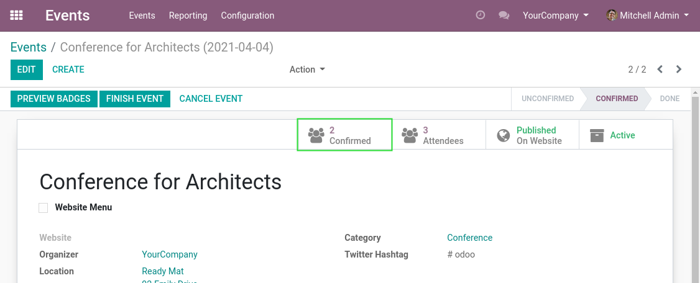
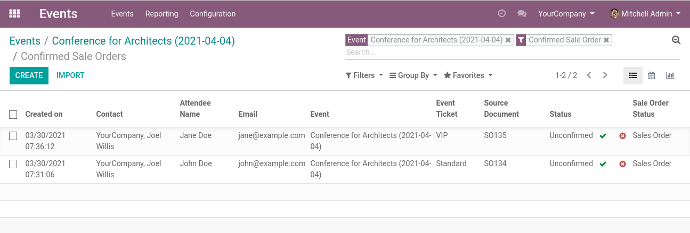
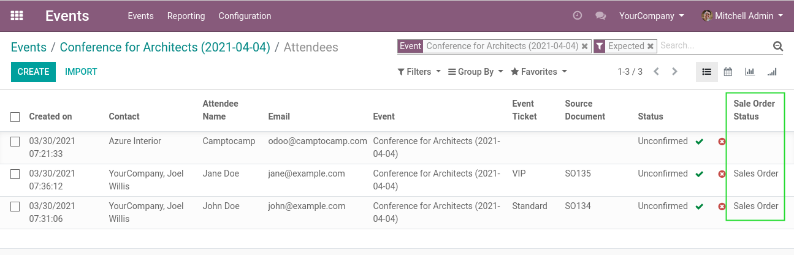
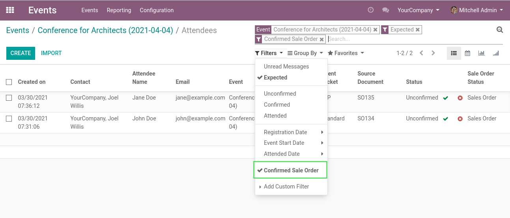

Event Sale Order Status
=======================

.. contents:: Table of Contents

Event Smart Button
------------------
This module adds a smart button ``Confirmed`` on events.

When clicking on the button, the list of participants with a confirmed sale order is shown.

Participant List
----------------
In the list view of participants, a column is added to show the status of the sale order.

I can filter to see only participants with a confirmed order.

Contributors
------------
* Numigi (tm) and all its contributors (https://bit.ly/numigiens)

More information
----------------
* Meet us at https://bit.ly/numigi-com
