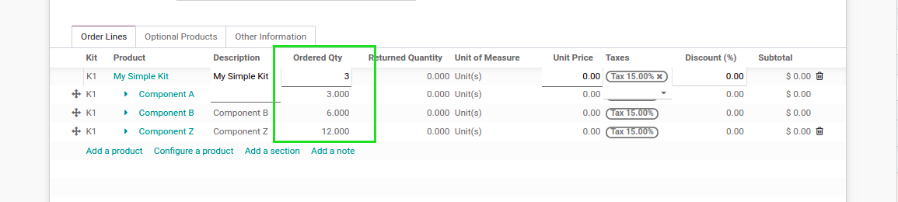

Sale Kit
========
This module adds kits to sale orders.

.. contents:: Table of Contents

Overview
--------
A product of type ``Kit`` is defined in the module `product_kit <https://github.com/Numigi/odoo-product-addons/tree/12.0/product_kit>`_.

This module defines the behavior on a sale order when a user selects a kit.

.. image:: static/description/overview__sale_order.png

When a kit is selected, a new line is added for each component.

Basic Usage
-----------
I create a new kit with 3 components:

* Two important components
* Two optional components

.. image:: static/description/product_form.png

I create a new sale order.

In a new sale order line, I select my kit.

Automatically, 4 new lines are added below the kit.

.. image:: static/description/sale_order_form__kit_components.png

Changing the Kit
----------------
Once a kit is selected on a sale order line, the product can not be changed.

However, you may delete the line and recreate it.

.. image:: static/description/sale_line__kit_trash.png

Once deleted, all components for this kit are deleted as well.

Components
----------

Important Components
~~~~~~~~~~~~~~~~~~~~
You may not delete an important component:

.. image:: static/description/important_component_trash.png

You may neither change the product, nor the quantity:

.. image:: static/description/important_component_fields.png

You may move the line, but you may not move it to another kit.

Non-Important Components
~~~~~~~~~~~~~~~~~~~~~~~~
You may delete a non-important component:

You may change its product and quantity:

.. image:: static/description/non_important_component_fields.png

You may move it:

You may move the line to another kit:

.. image:: static/description/non_important_component_kit_reference.png

Moving a Kit
~~~~~~~~~~~~
A kit can me moved.

When moving a kit, all components are automatically moved as well.

.. image:: static/description/kit_after_reordering.png

Adding a Component
~~~~~~~~~~~~~~~~~~
To add a component to a kit, you have to select the proper ``Kit Reference``.

Custom Quantity
---------------
Since version ``1.1.0`` of the module, it is possible to change the quantity on a kit.

When changing the quantity on the ``Kit`` line, component quantities are updated.

.. image:: static/description/kit_quantity_editable_2.png

Behind the scene, the quantities on each line are multipled by a factor determined
by the previous kit quantitiy and the new kit quantity.

If the quantity was previously 2 and the new quantity is 3, quantities on components are multiplied by 1.5.

..

    Watch out if you manually change the quantities on a component and then change the quantity on the kit,
    you may end up with odd quantities on the component.

Delivered Quantities
--------------------
A kit is a product of type ``Service``.

It is not moved through inventory. Only the components are.

However, the delivered quantity of a kit is based on the delivered quantity of
its first important component (in order of sequence).

In the above example, the first important component (``Component A``) has 3 units delivered over 4.
This component is delivered at 75%.

The delivered quantity on the kit is therefore:

..

    2.000 x 75% = 1.500

Sale Prices
-----------
Since version ``1.1.0`` of the module, the unit prices are only defined on the components.
The kit itself has no price.

On the kit, you may define a global discount to apply to the components.

On the sale order, this discount is applied by default on each component.

..

    If a price-excluded discount was defined on a pricelist item
    for one of the component, the discount defined on the kit is prioritized
    by the system.

Component Descriptions
----------------------
Since version ``1.1.0`` of the module, you may define custom descriptions for
the components of a kit.

If the description is let empty, the standard behavior of Odoo is applied.

Contributors
------------
* Numigi (tm) and all its contributors (https://bit.ly/numigiens)

More information
----------------
* Meet us at https://bit.ly/numigi-com
