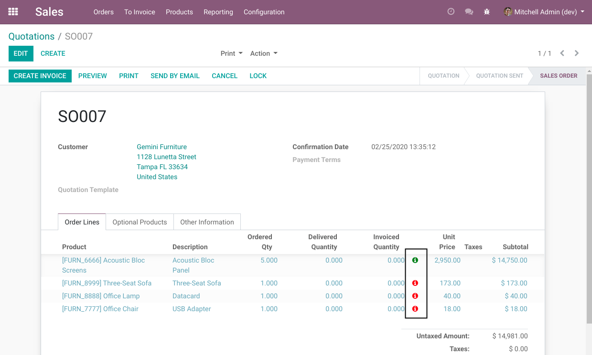
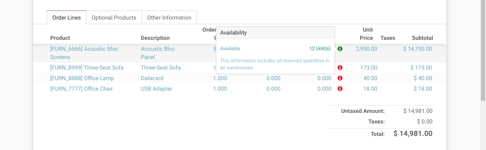
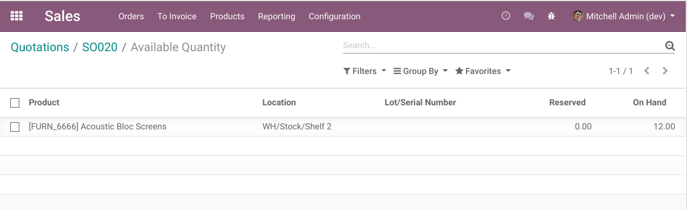
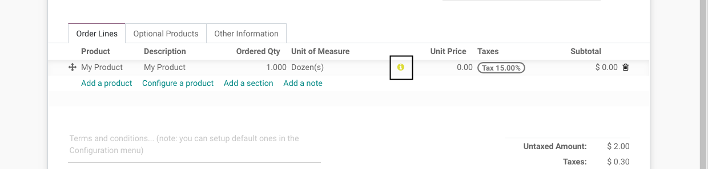
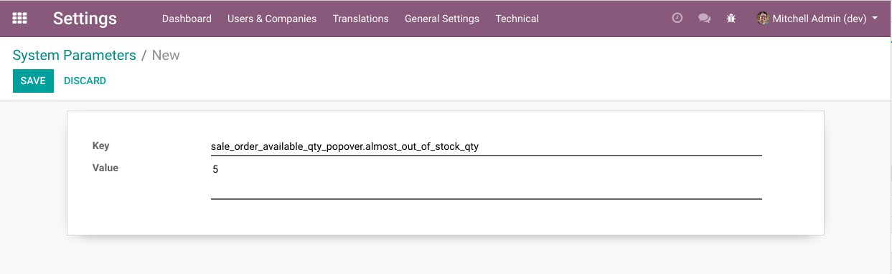

Sale Order Available Qty Popover
================================
This module adds a widget view the available qty in stock from a sale order line.

The color of the icon is:

* Red if the product is completely out of stock.
* Green if the product is in stock in some warehouse.
* Yellow if the product is `Nearly Out Of Stock`_.

When clicking on the quantity, the list of stock quants is shown.

Nearly Out Of Stock
-------------------
By default, a product is nearly out of stock if it has a quantity of 2 or less in stock
(whathever the unit of measure).

This quantity is always expressed in the default unit of measure of the product.

This value is parametrizable with the system parameter ``sale_order_available_qty_popover.almost_out_of_stock_qty``.

Contributors
------------
* Numigi (tm) and all its contributors (https://bit.ly/numigiens)

More information
----------------
* Meet us at https://bit.ly/numigi-com
