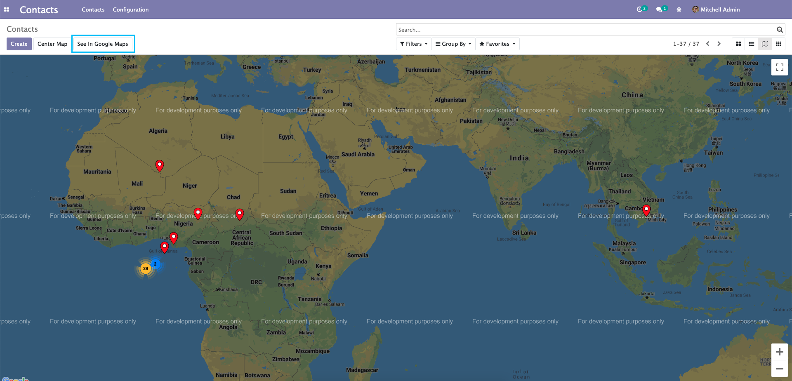
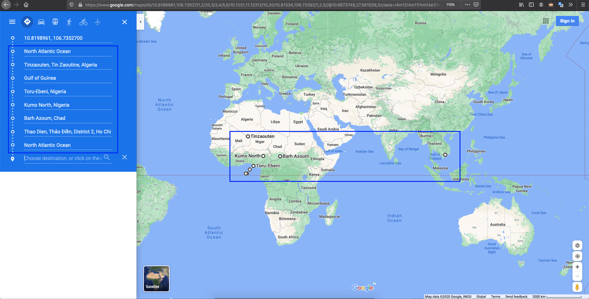

Web View Google Map Itinerary
=============================
This module adds a button in map view to open a route in Google Maps with the location of selected and filtered
partners, leads, or opportunities to build a visit itinerary.

Usage
-----
- I go to a map view.
- I see a new button SEE IN GOOGLE MAPS

- This button opens Google Maps in route mode with different locations.

Partners without location:

- If some partners don't have a location, they are ignored and are not included in the Google Maps URL.

Configuration
-------------
The partner's latitude and longitude must be calculated/filled

Contributors
------------
* Numigi (tm) and all its contributors (https://bit.ly/numigiens)
* Komit (https://komit-consulting.com)

More information
----------------
* Meet us at https://bit.ly/numigi-com
