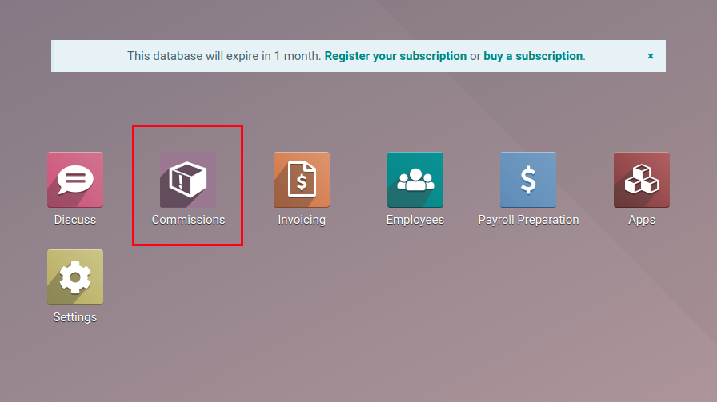
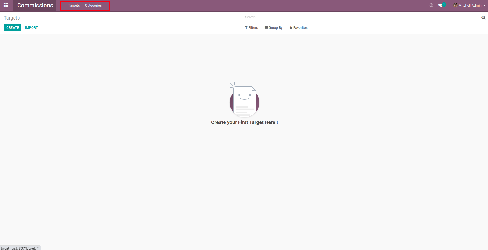
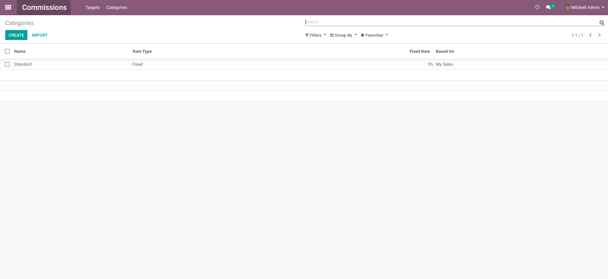
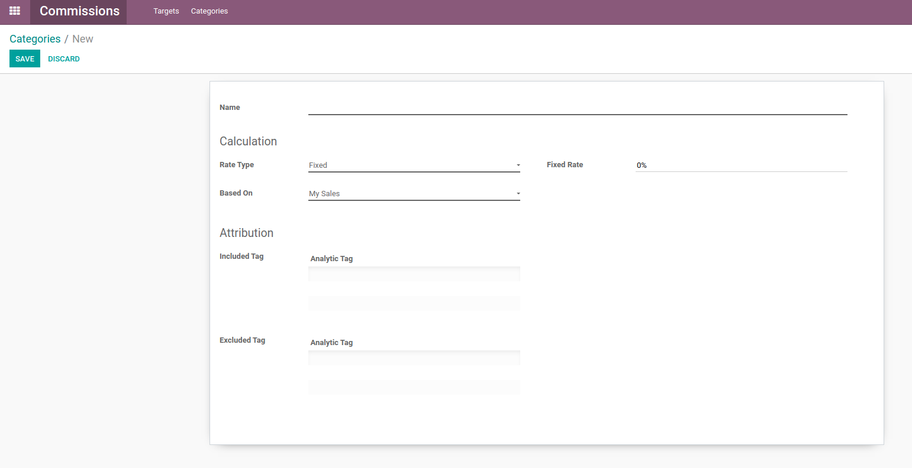
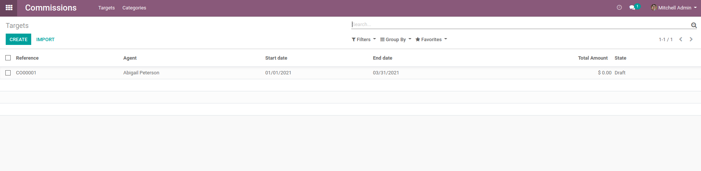
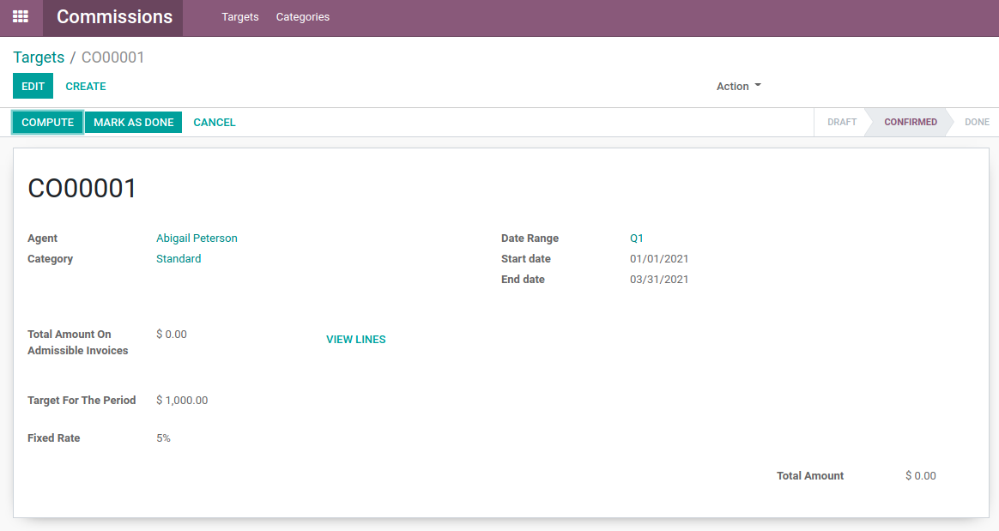
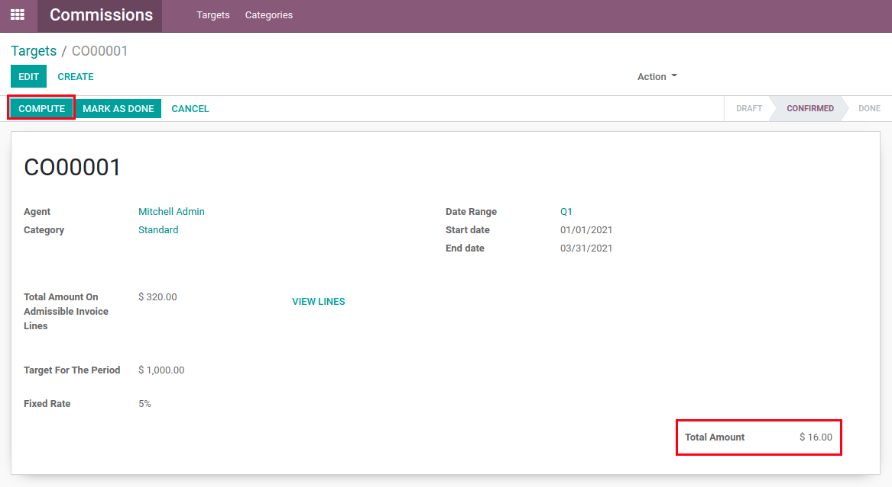
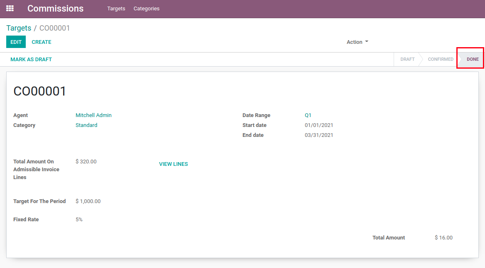

Commission
==========
This module adds commissions functionality for employee sales.

.. contents:: Table of Contents

Module
------
This module adds a "Commissions" app to the Odoo apps selection menu.

This app contains 2 main menus: Targets and Categories.

Categories
----------
The "Categories" menu allows category creation.

Categories are templates for the commissions targets.

Clicking on "Create" brings up the Category creation menu, allowing you to select different options that will function as a template for targets.

* Name: Name of the category for easier grouping
* Rate Type: Type of rate used to calculate commissions

  * Fixed: Fixed percentage rate
  * Interval: Different rates for certain completion intervals

* Based On: Basis for the commissions calculation

  * My Sales: Commissions calculated on the basis of personal sales
  * My Team Commissions: Commissions calculated on the basis of the user's team's total commissions

For categories based on personal sales, you have the option to select included or excluded tags to help with invoice filtering.

For categories based on team sales, you have the option to select other categories to help with invoice filtering.

Targets
-------
The "Targets" menu allows target creation.

Targets are the commissions goals than can be created for the employees.

Clicking on "Create" brings up the Target creation menu, allowing you to select different options that will change the target's behavior.

* Agent: The agent for who we want to create a commissions target
* Category: The category which we want to use as a template
* Date Range: The date interval for the target
* Target For The Period: The target amount of sales for the Period

Once the correct details are entered, you can "Confirm" the target.

This then unlocks the "Compute" action button, which will update the total commissions based on the selected settings.

When finished, you can "Mark as Done" the target, which disables the "Compute" button. You can then put the target back as draft if you need to reverse the termination.

Read/Write Permissions
----------------------

Configuration
-------------
No configuration is required after installation.

Contributors
------------
* Numigi (tm) and all its contributors (https://bit.ly/numigiens)

More information
----------------
* Meet us at https://bit.ly/numigi-com
