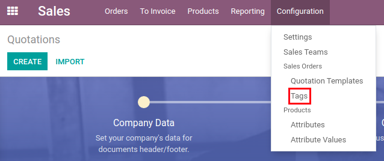
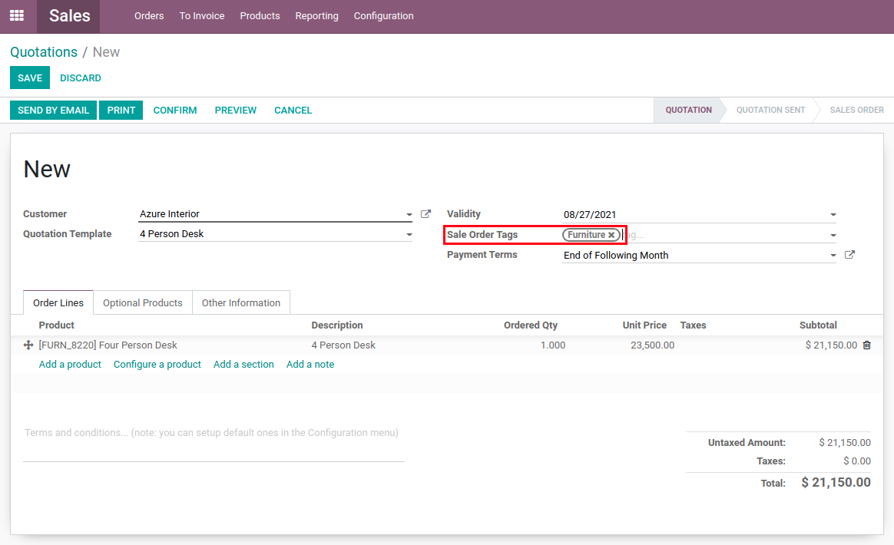
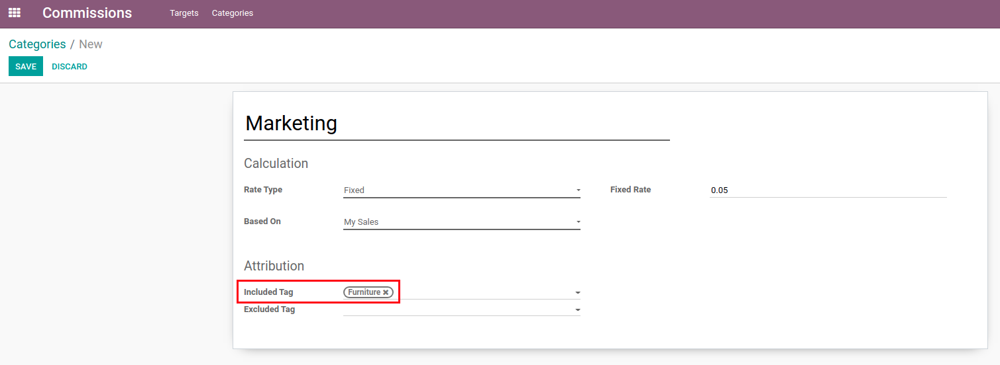
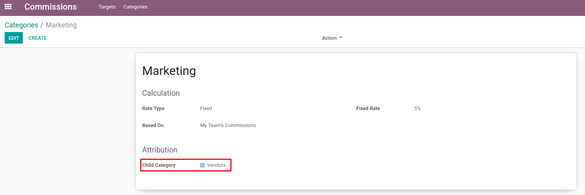
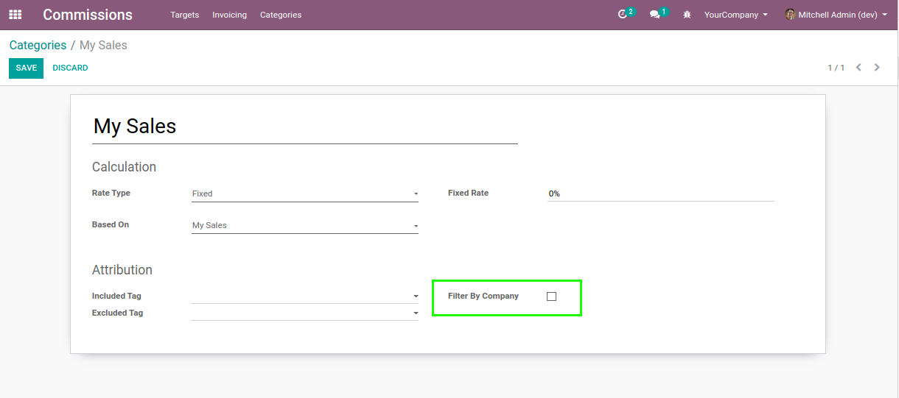

Commission
==========
This module adds commissions functionality for employee sales.

.. contents:: Table of Contents

Context
-------
As of version ``12.0``, there is no module in vanilla Odoo that allows you to manage sales commissions.

However, a `series of modules <https://github.com/OCA/commission>`_ already exists on OCA.
These modules are designed to manage commissions based on extra data entered on sale order lines and invoice lines.

Overview
--------
This module implements sales commissions based on targets by period.

This means that the commissions earned by an employee are not computed for each product sold,
but rather globally for the sold amount of a given period.

With this module, you do not need to enter extra information on invoices.
However, you need to create targets for your employees for each period (week, month, trimester, etc).

Module
------
This module adds a "Commissions" app to the Odoo apps selection menu.

.. image:: static/description/app.png

This app contains 2 main menus: Targets and Categories.

.. image:: static/description/menu.png

Categories
----------
The "Categories" menu allows category creation.

Categories are templates for the commissions targets.

.. image:: static/description/category_menu.png

Clicking on "Create" brings up the Category creation menu, allowing you to select different options that will function as a template for targets.

Fields
~~~~~~
* Name: Name of the category for easier grouping
* Rate Type: Type of rate used to calculate commissions

  * Fixed: Fixed percentage rate
  * Interval: Different rates for certain completion intervals

* Based On: Basis for the commissions calculation

  * My Sales: Commissions calculated on the basis of personal sales
  * My Team Commissions: Commissions calculated on the basis of the user's team's total commissions

Tags
~~~~
For categories based on personal sales, you have the option to select included or excluded tags to help with invoice filtering.

If only included tags are added, then only invoices linked with a sale order with the selected tags will be taken into account.

If only excluded tags are added, then all invoices will be taken into account except those with the selected tag.

If both types of tags are added, then only included invoices that are not linked with a sale order with the selected excluded tags will be taken into account.

You cannot put a tag both as included and excluded.

You can create these tags in the "Configuration" menu of the "Sales" module.

These tags are then applied on sale orders. The filtering will occur through the lines of the sale order, which are linked to the invoices themselves.

Child Categories
~~~~~~~~~~~~~~~~

For categories based on team sales, you have the option to select other categories to help with invoice filtering.

You cannot add a category as its own child category.

Multi Company Filter
~~~~~~~~~~~~~~~~~~~~
Since version ``12.0.1.1.0`` of the module, it is possible to enable (or disable) multi-company filters
for the computation of a commission target.

If the box is unchecked, invoices from all companies are included in order to compute the total of a target.

Before version ``12.0.1.1.0``, only invoices from the same company would be included.

Targets
-------
The "Targets" menu allows target creation.

Targets are the commissions goals than can be created for the employees.

.. image:: static/description/target_menu.png

Clicking on "Create" brings up the Target creation menu, allowing you to select different options that will change the target's behavior.

**Fields**

* Agent: The agent for who we want to create a commissions target
* Category: The category which we want to use as a template
* Date Range: The date interval for the target
* Target For The Period: The target amount of sales for the Period

Once the correct details are entered, you can "Confirm" the target.

.. image:: static/description/target.png

This then unlocks the "Compute" action button, which will update the total commissions based on the selected settings.

.. image:: static/description/computed.png

When finished, you can "Mark as Done" the target, which disables the "Compute" button. You can then put the target back as draft if you need to reverse the termination.

.. image:: static/description/done.png

Read/Write Permissions
----------------------
Users with the manager role have access to create, view and update commission targets and categories.

Users with the team manager role can only view the commission targets of the members of their team.

Users the with user role can only view their own commission targets.

Contributors
------------
* Numigi (tm) and all its contributors (https://bit.ly/numigiens)

More information
----------------
* Meet us at https://bit.ly/numigi-com
