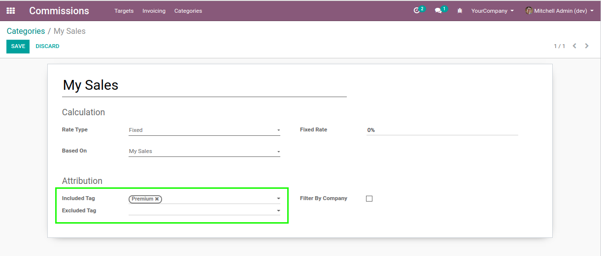
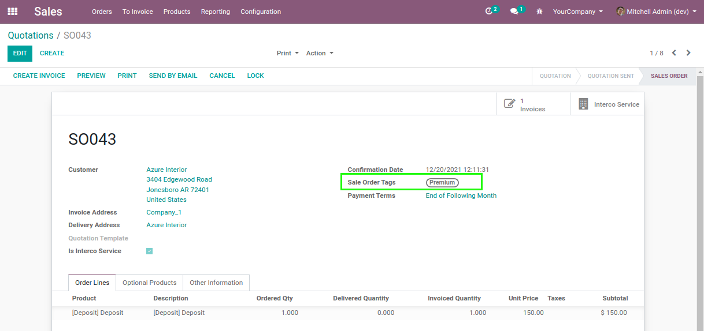
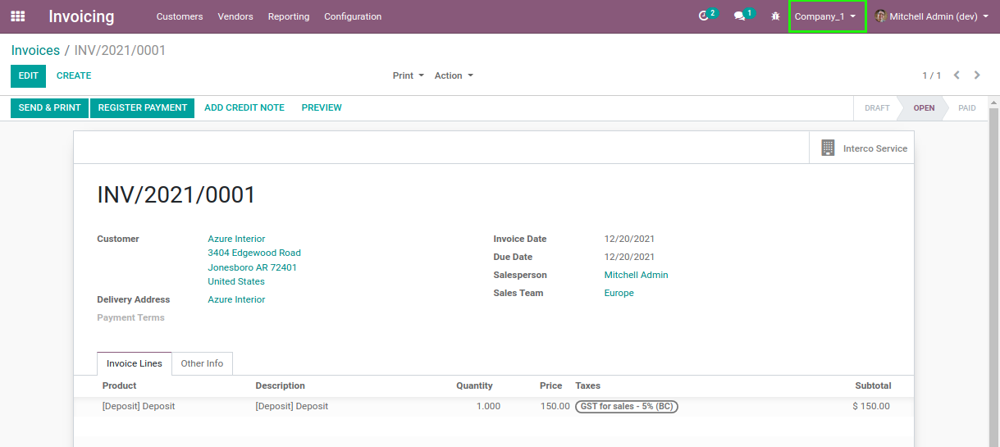
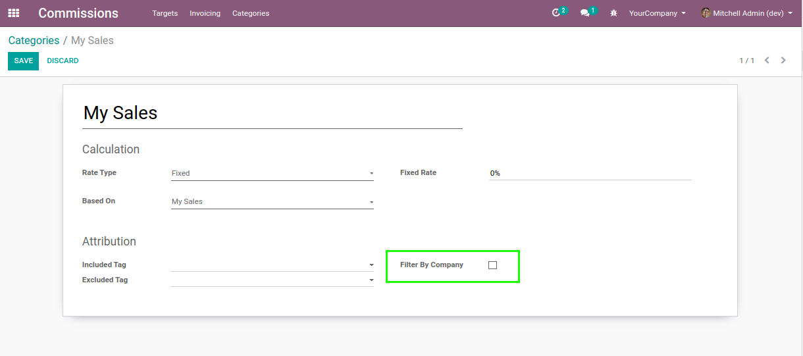

Commission Intercompany Service
===============================

.. contents:: Table of Contents

Context
-------
The module ``commission`` adds commissions based on periodic sales targets.

The module ``sale_intercompany_service`` allows to sale products on behalf of another company.

When a commission is computed based on invoices,
it is possible to filter invoice lines based on tags of the related sale order.

In the workflow of an intercompany service, the final invoice to the customer is in a distinct company
from the origin sale order.

Also, the link between the sale order and this invoice is not standard.

Overview
--------
After installing this module, when computing a commission, the link between the invoice and the
origin sale order is adjusted to take into account intercompany sales.

Note that for invoices in all companies to be included in the computation,
the ``Filter By Company`` box on the commission category must be unchecked.

The module also prevents intercompany invoices to be included in the computation of commissions.
Only the final invoice to the customer is included.

Contributors
------------
* Numigi (tm) and all its contributors (https://bit.ly/numigiens)

More information
----------------
* Meet us at https://bit.ly/numigi-com
