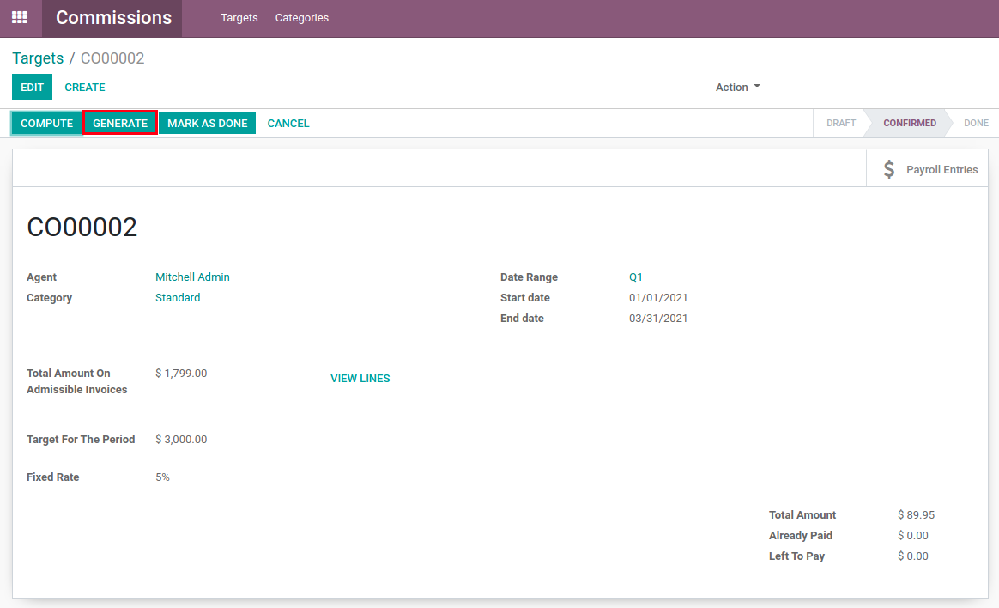
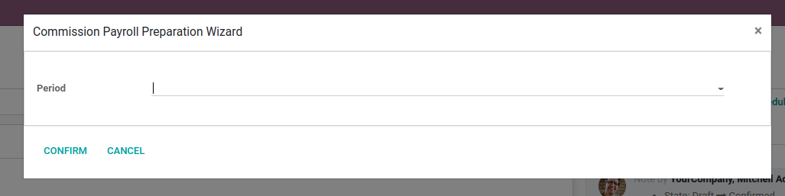
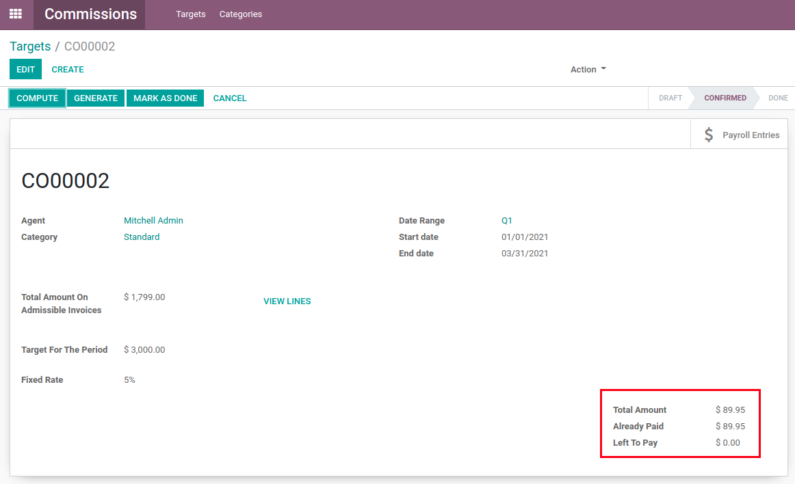
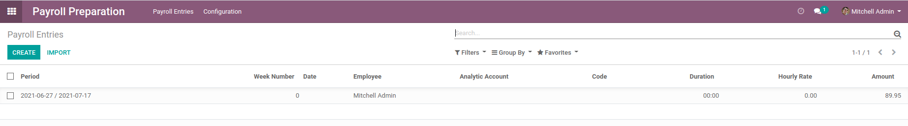

Commission Payroll Preparation
==============================
This module adds payroll generation to the commissions module.

.. contents:: Table of Contents

Usage
-----
On a given target, a new "Generate" button will appear.

When clicked, the user will be prompted with a payroll period selection to select where the generated payroll entry should be added.

After confirmation, the proper fields will be updated payroll entry will be generated.

Contributors
------------
* Numigi (tm) and all its contributors (https://bit.ly/numigiens)

More information
----------------
* Meet us at https://bit.ly/numigi-com
