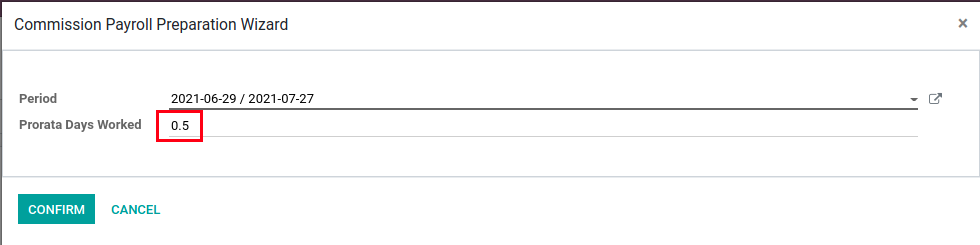
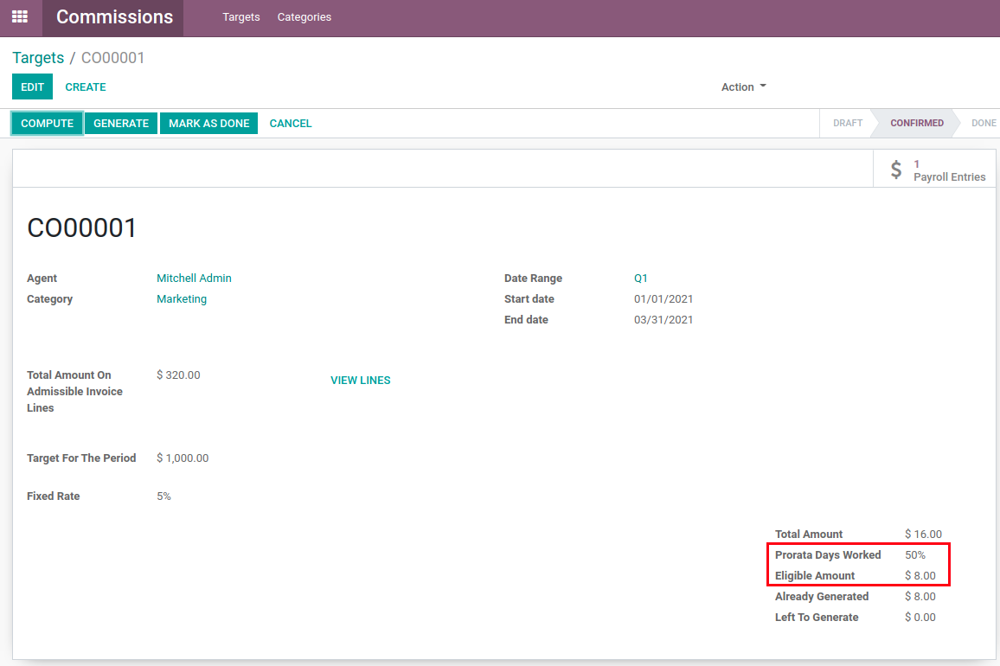
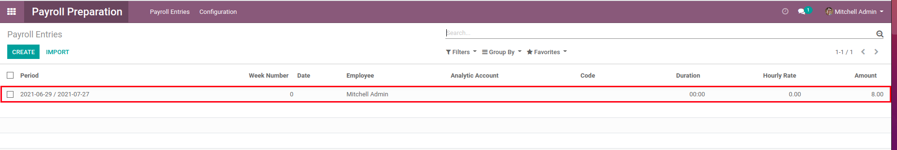

Commission Prorata
==================
This module adds prorata functionality to commission invoice generation.

.. contents:: Table of Contents

Usage
-----
When generating a commission payroll entry, you will be able to enter a prorata amount (as a decimal which will then be automatically converted into a percentage).

The target fields will then be updated appropriately.

A payroll entry will be created with the amount taking into account the prorata.

Contributors
------------
* Numigi (tm) and all its contributors (https://bit.ly/numigiens)

More information
----------------
* Meet us at https://bit.ly/numigi-com
