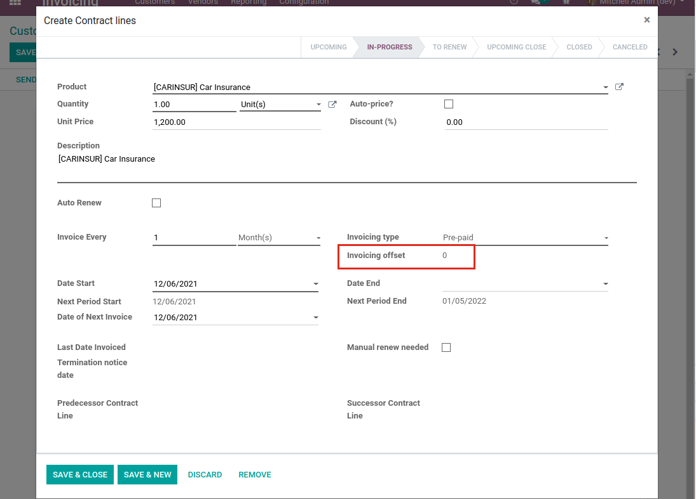
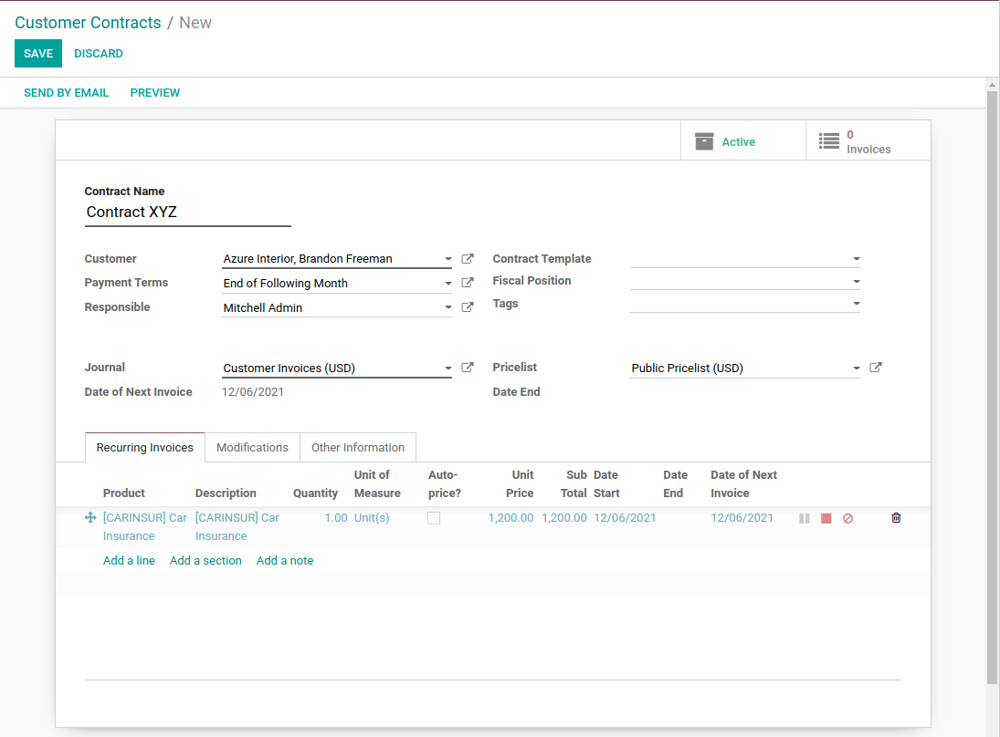
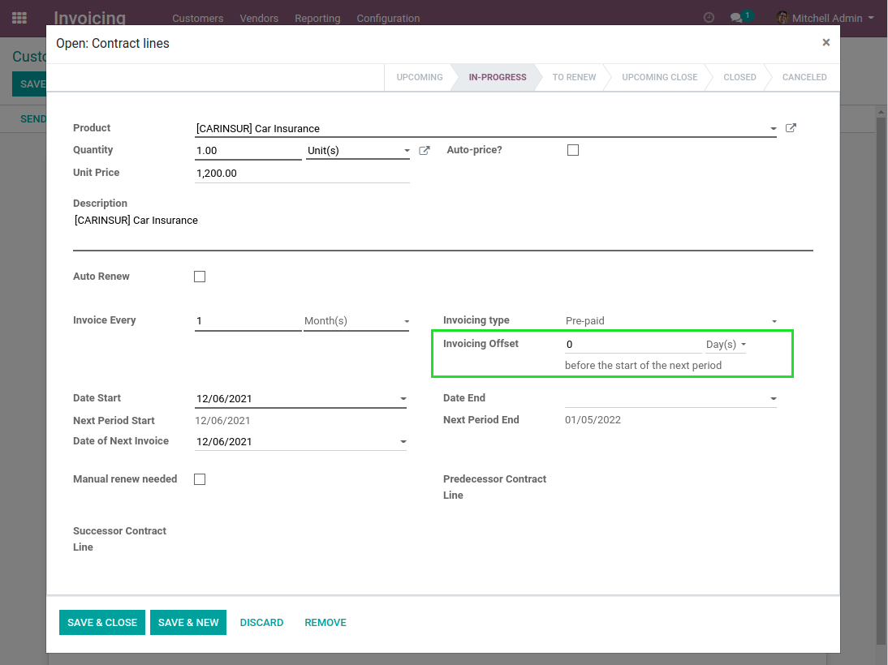
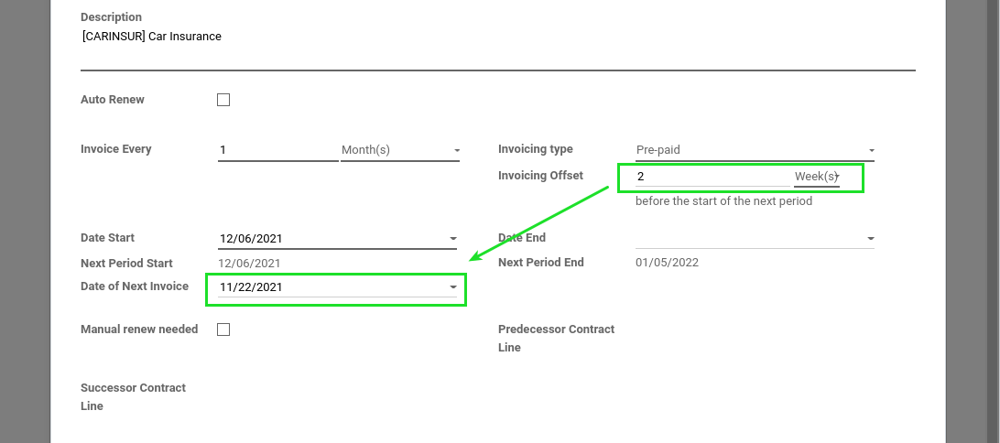
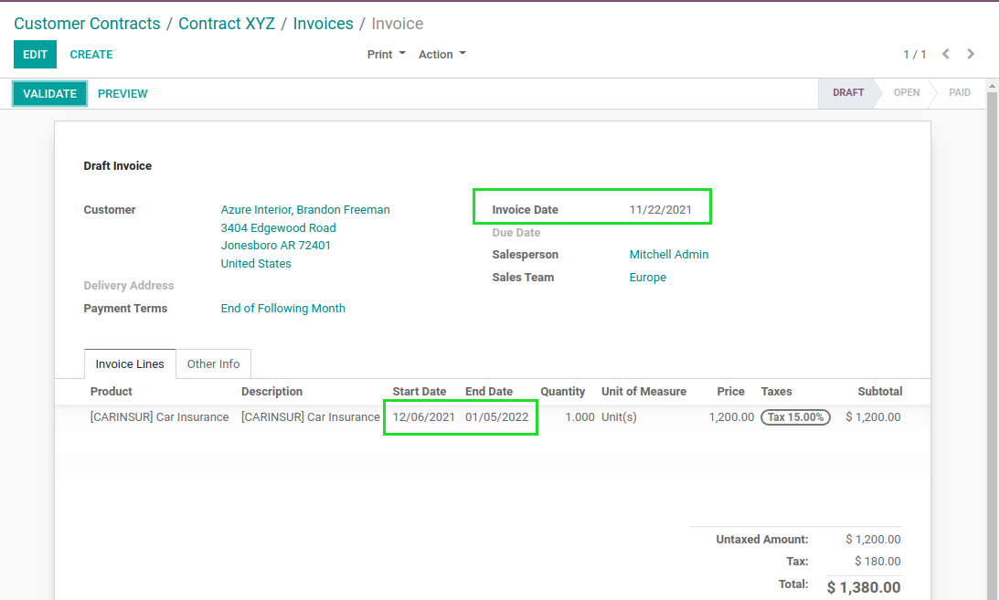

Contract Invoice Offset
=======================

.. contents:: Table of Contents

Context
-------
The module `contract <https://github.com/OCA/contract/tree/12.0/contract>`_ allows to manage contracts
with recurring invoices.

The module `account_invoice_start_end_dates <https://github.com/OCA/account-closing/tree/12.0/account_invoice_start_end_dates>`_ adds
the start and end dates on invoice lines.

The module `contract_invoice_start_end_dates <https://github.com/OCA/contract/tree/12.0/contract_invoice_start_end_dates>`_ propagates the
start and end dates from the contract line to the invoice line.

Invoicing Offset Field
~~~~~~~~~~~~~~~~~~~~~~
In a contract, there is a field ``Invoicing Offset``.

This field is mostly technical and confusing for the end user.
It allows to have a difference between the invoiced period and the invoice date.

The value is computed. It is either ``1`` or ``0`` depending other fields of the contract line.

Contraint On Invoicing Date
~~~~~~~~~~~~~~~~~~~~~~~~~~~
The module comes with a constraint that prevent having an invoicing date prior to the invoiced period.

This contraint is arbitrary.

It might be relevant in some countries or for some kind of companies.
However, it is not relevant for all companies.

Overview
--------
This module allows recurring invoices with an invoicing date prior to the invoiced period.

Usage
-----
I create a new contract with one recurring item.

In the recurring item, I notice a new field ``Invoicing Offset``.

This field allows to enter a number of months. I enter ``2`` months.

This number of months is then used to determine the ``Date of Next Invoice``.

After creating the invoices for this contract,
I notice that the date of invoice is ``2`` months prior to the invoiced period.

Contributors
------------
* Numigi (tm) and all its contributors (https://bit.ly/numigiens)
* Komit (https://komit-consulting.com)

More information
----------------
* Meet us at https://bit.ly/numigi-com
