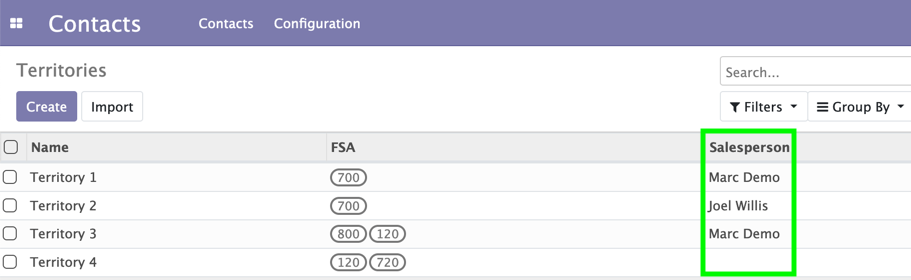
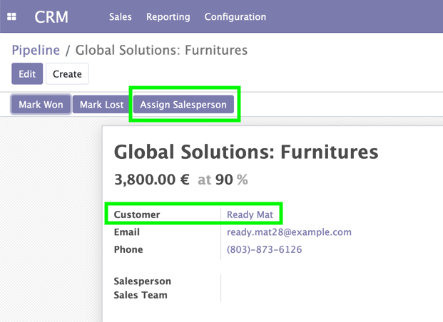
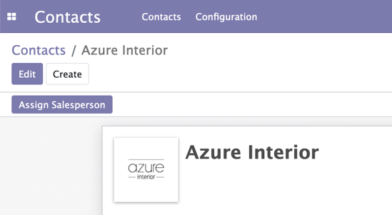
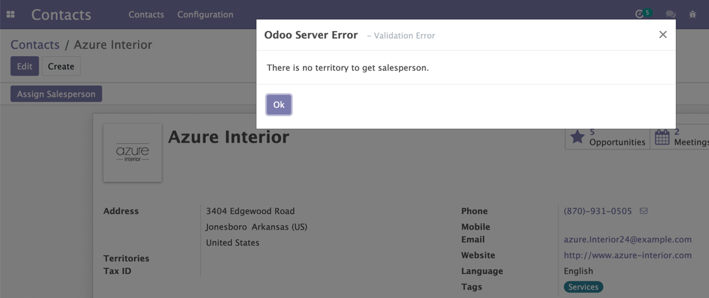
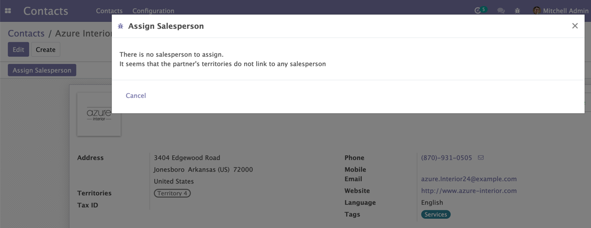
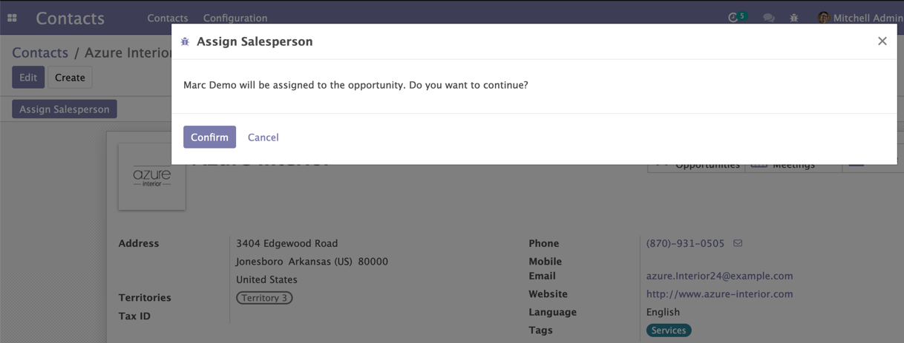
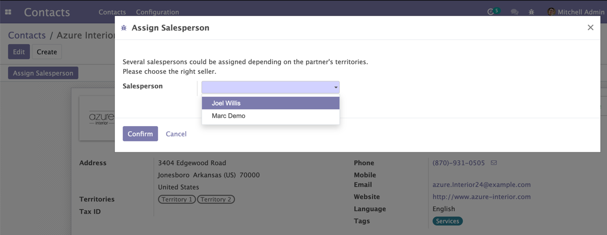

CRM Assign By Area
==================
This module adds ability to assign salesperson to crm pipeline and contact

New field Salesperson on territory

Usage
=====

- Set value for sales person on territories, and value for territories on contacts

- On pipeline form after select a customer, or on contact form, I see the button "Assign Salesperson" appear

- I press the button

- If the customer(contact) has no territory, this popup will appear:

- If there is no salesperson to assign, this popup will appear:

- If there is only one salesperson to assign, this popup will appear:

- If there are several salespersons to assign, this popup will appear:

- After I press confirm, I see the Salesperson value is set

Contributors
------------
* Numigi (tm) and all its contributors (https://bit.ly/numigiens)
* Komit (https://komit-consulting.com)

More information
----------------
* Meet us at https://bit.ly/numigi-com
