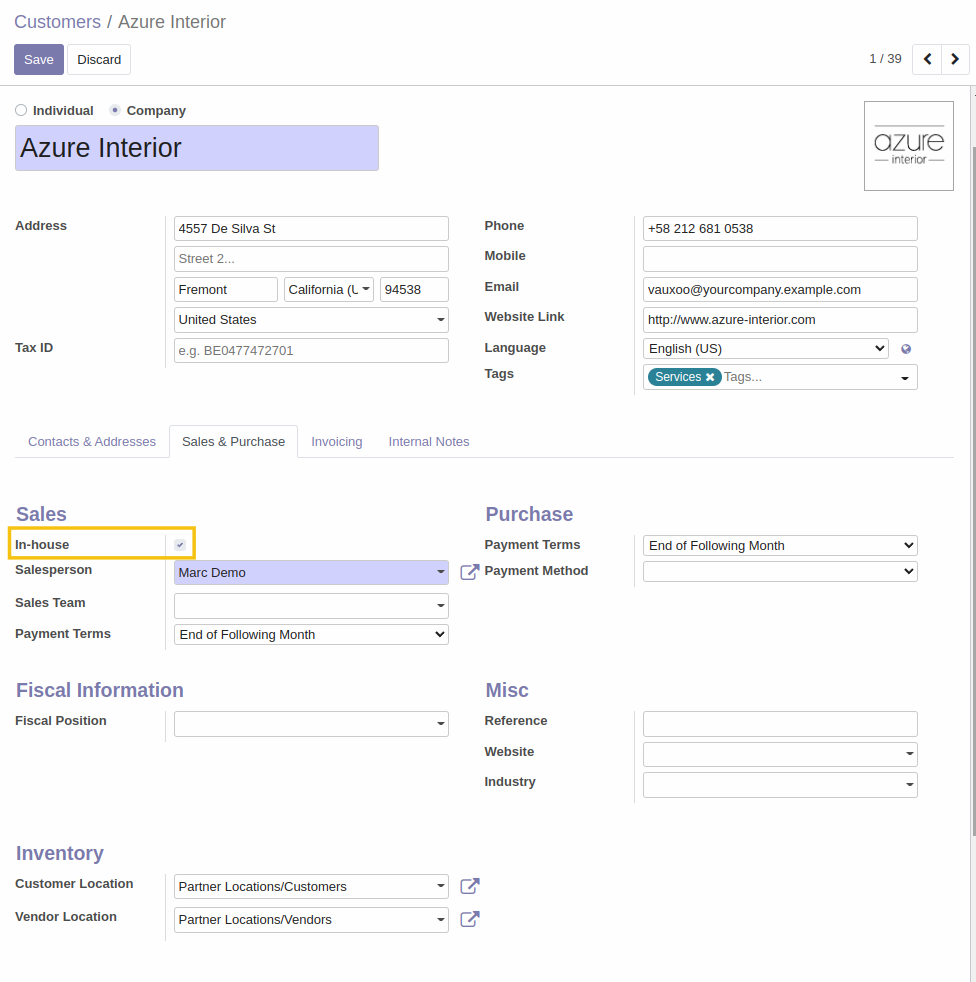
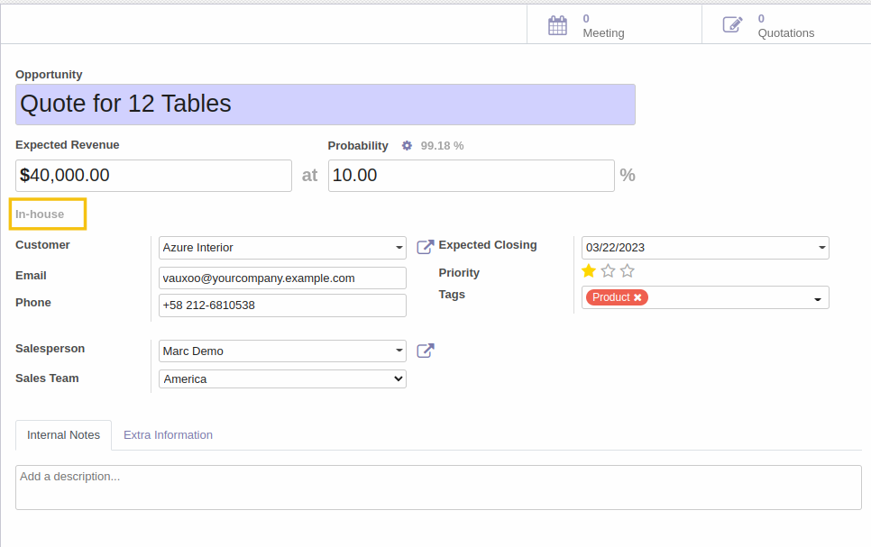

CRM Assign In House
===================
This module assigns customer's salesperson to CRM when select In-house customer

New field In-house on partner

On CRM, when user select an In-house customer, a grey label "In-house" will appear

Contributors
------------
* Numigi (tm) and all its contributors (https://bit.ly/numigiens)
* Komit (https://komit-consulting.com)

More information
----------------
* Meet us at https://bit.ly/numigi-com
