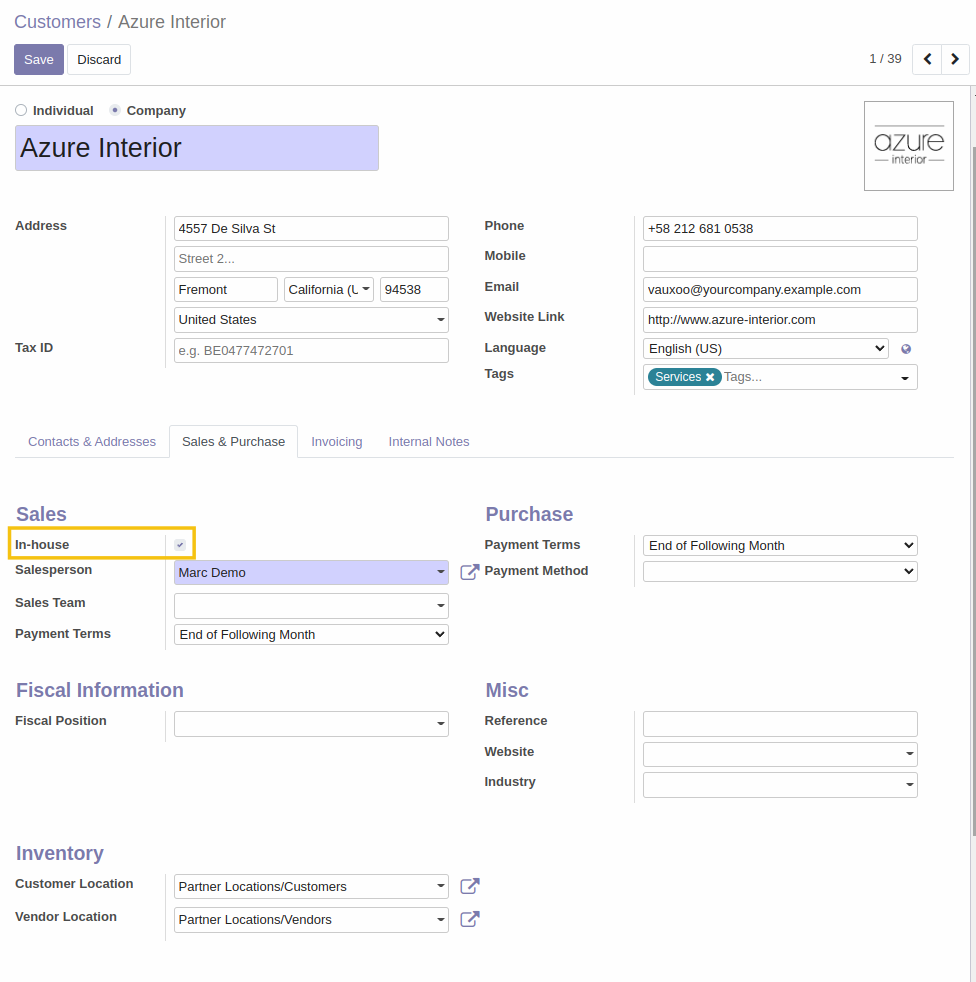
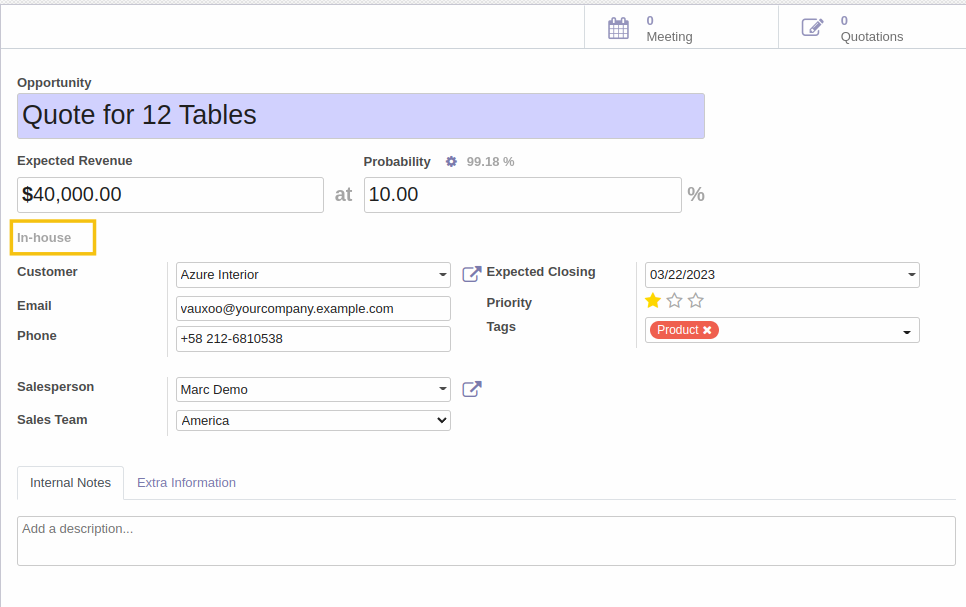

CRM Assign In House
===================
This module assigns customer's salesperson to CRM when select In-house customer

New field In-house on partner

On CRM, when user select an In-house customer, a grey label "In-house" will appear

Contributors
------------

* The `Numigi <https://numigi.com/r/home>`_ team is the contributor to this project. We help Quebec companies implement Odoo and Konvergo ERP.
* Komit (https://komit-consulting.com)

