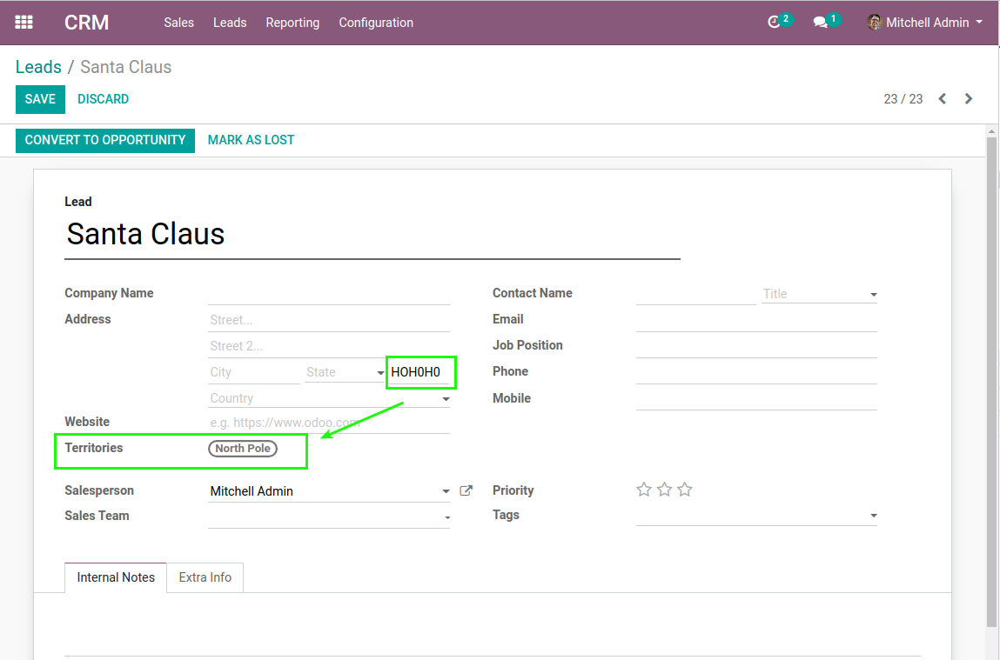

CRM Forward Sortation Area
==========================

Context
-------
The module `Forward Sorting Area <https://github.com/Numigi/odoo-partner-addons/tree/12.0/forward_sorting_area>`_ adds Canada territories and sortation areas on partners.

Overview
--------
This module adds territories and sortation areas to CRM leads and opportunities.

Usage
-----
I go to the form view of a lead.

I notice a new field `Territories`. This field is computed based on the postal code.

Contributors
------------
* Numigi (tm) and all its contributors (https://bit.ly/numigiens)

More information
----------------
* Meet us at https://bit.ly/numigi-com
