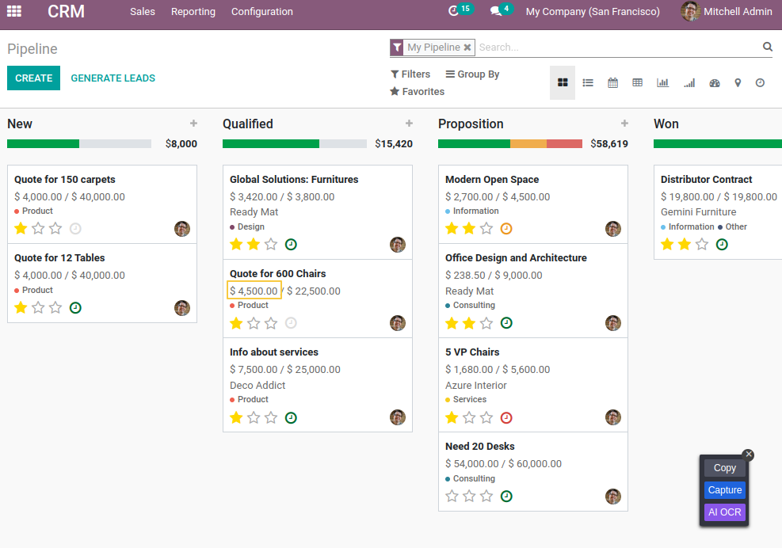

CRM Kanban Prorated Revenue
===========================
This module display the `Prorated Revenue` in CRM Kanban View Instead of the `Expected Revenue`.

The `Prorated Revenue` is equal to `Expected Revenue` * `Probability`.

In this example, we can see the `Expected Revenue` and `Probability` values in the CRM Form View.
Then the `Prorated Revenue` displayed in the CRM Kanban View.

Since the version 1.0.1, this module replaces the `Expected Revenue` by the `Prorated Revenue` in the sum of the progress bar.

Contributors
------------
* Numigi (tm) and all its contributors (https://bit.ly/numigiens)

More information
----------------
* Meet us at https://bit.ly/numigi-com
