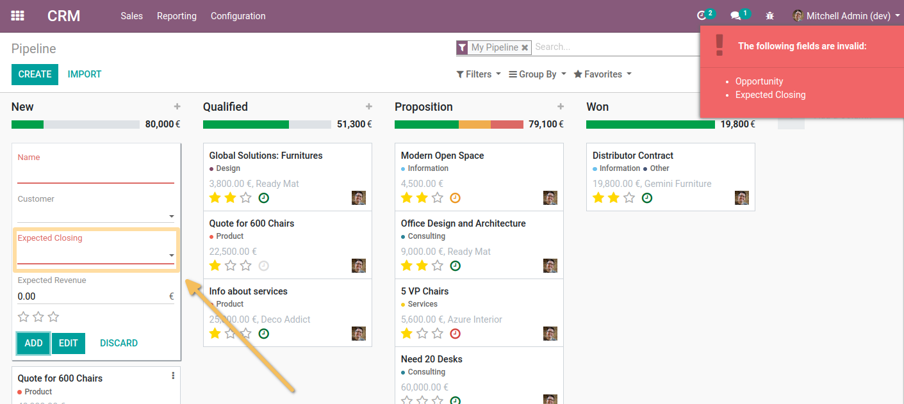

CRM Quick Create Date Deadline
==============================
This module blocks the creation of an opportunity from the kanban view (quick creation) 
of opportunities if no planned closing date is entered.

Contributors
------------
* Numigi (tm) and all its contributors (https://bit.ly/numigiens)
