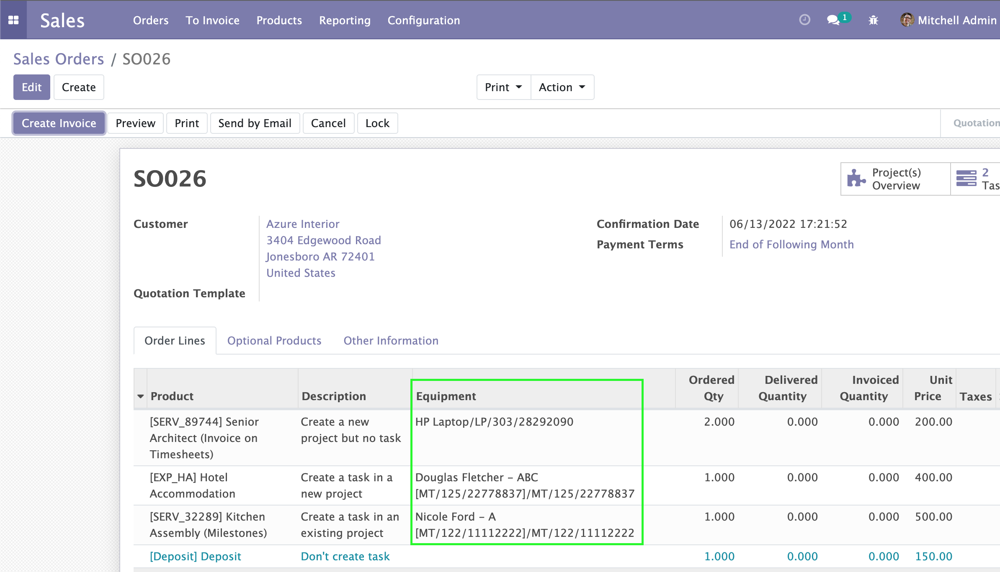
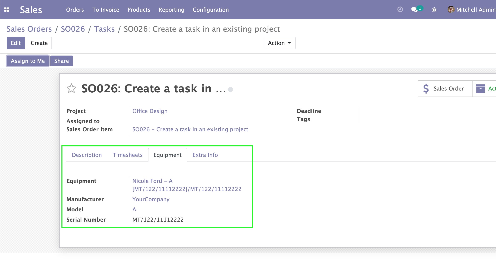

Maintenance Sale Service
========================
This module adds propagation of Equipment from the sale order line to the task when the sales line creates a task

Sale order line's equipment

Task's equipment

Task's manufacturer, model, serial number get value from task's equipment.

Contributors
------------
* Numigi (tm) and all its contributors (https://bit.ly/numigiens)
* Komit (https://komit-consulting.com)

More information
----------------
* Meet us at https://bit.ly/numigi-com
