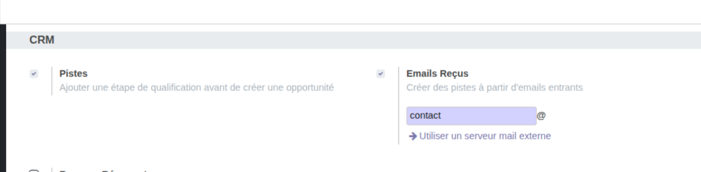
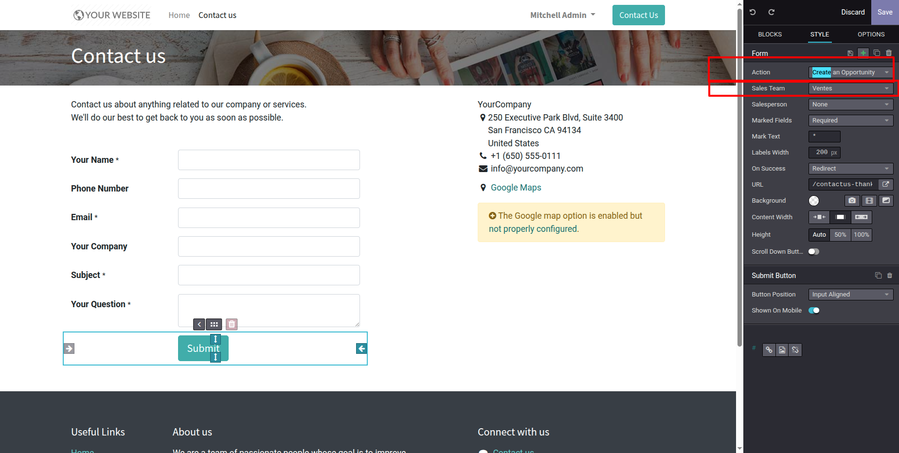

# Numigi Test Crm Ben Othmen Ichrak

Description
Ce module Odoo personnalise le module CRM pour répondre à des besoins spécifiques de gestion des équipes commerciales, des opportunités et des pistes. 
Il ajoute des fonctionnalités avancées de notification, de visibilité des champs, d'assignation automatique et de configuration d'équipes.

Fonctionnalités

1. Champ emails dans l'équipe commerciale
Ajout d'un champ emails qui liste tous les emails des membres de l'équipe, séparés par des virgules.

2. Chef d'équipe automatiquement un membre
Le chef d'équipe est automatiquement ajouté comme membre de l'équipe commerciale dès qu'il est désigné.

3. Création d'équipes commerciales par défaut
Création de trois équipes commerciales via un fichier de données :

Équipe Support Technique

Équipe Ventes

Équipe SAV (avec pipeline acceptant uniquement les emails des partenaires authentifiés)

4. Configuration automatique à l'installation
Coche automatiquement les paramètres de configuration CRM spécifiés lors de l'installation du module.

5. Notification pour opportunités anciennes
Envoi d'une notification à tous les membres de l'équipe si une opportunité reste plus de 10 jours sans changer de statut (autre que "brouillon").

Le message inclut un lien cliquable vers l'opportunité.

6. Restriction de visibilité du champ "Revenu espéré"
Le champ Revenu espéré n'est visible que pour le groupe Administrateur des ventes dans :

La vue Kanban

La vue Formulaire

La vue Liste

7. Assignation automatique des pistes web
Les pistes créées via le formulaire de contact public sont automatiquement assignées à l'Équipe de vente par défaut.
DEVZONE International

Nécessite l'installation du module website_crm et cette assignation paramétrable comme indique l'image .

Versions compatibles
Odoo Community 14
Odoo Enterprise 14

Dépendances
crm

sales_team

website_crm 

Licence
Ce module est publié sous licence AGPLv3.

Auteur
Ben Othmen Ichrak
