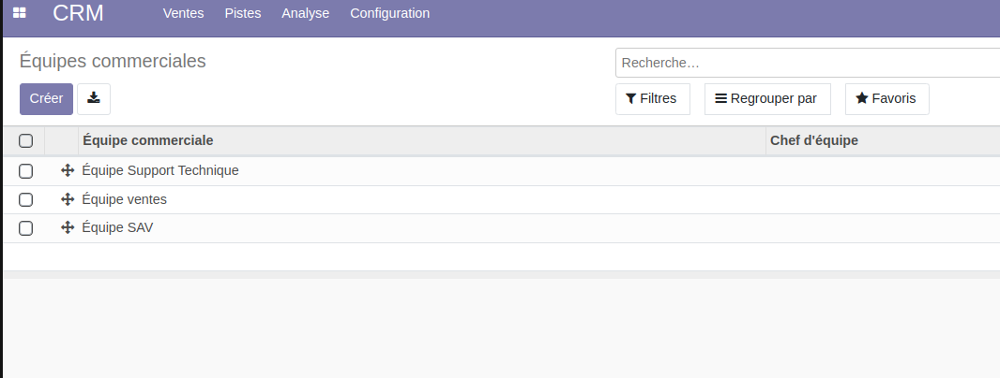

NUMIGI TEST CRM PAR Clauvis MINOUMISSEK
========================================

Ce module permet :

1- Ajouter un champ emails qui reprend tous les emails des membres de
l’équipe séparés par des virgules..

.. image:: static/description/.png

 2-Faire en sorte que le chef d’équipe soit toujours un membre de l’équipe commerciale.

 .. image:: static/description/crm_email_et_chef.png

3- Créer par un fichier de données, 3 équipes commerciales attachées à la société existante.
Les équipes commerciales sont:
● Équipe Support Technique
● Équipe ventes
● Équipe SAV

4- Le module doit cocher les paramètre de configuration  à
l’installation  comme sur l'image ci-dessous: 

.. image:: static/description/crm_default_settings.png

