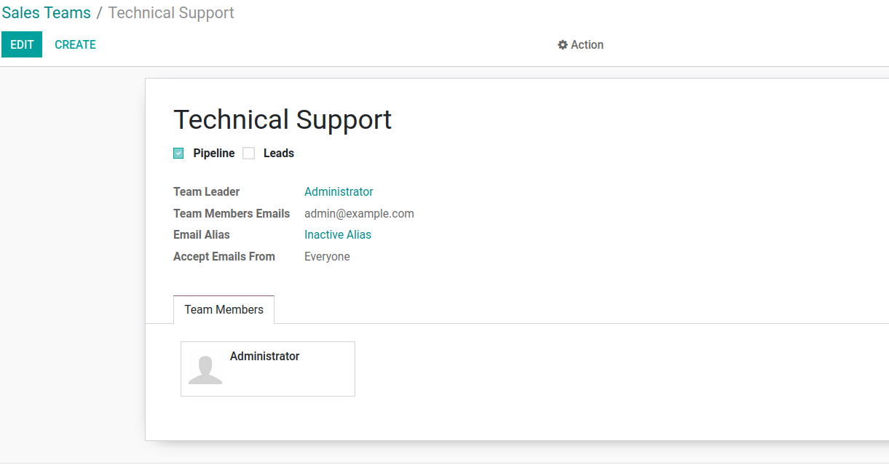
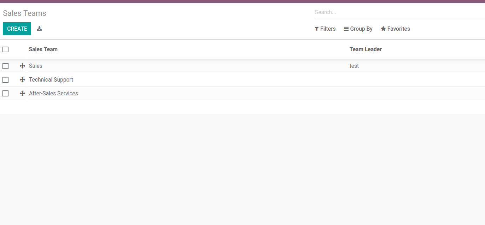
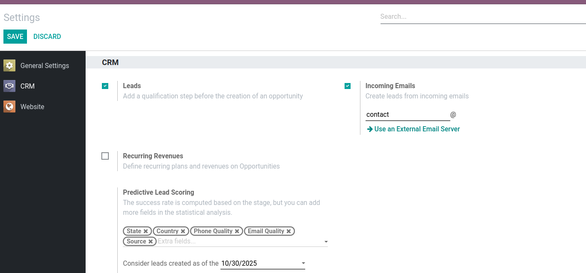
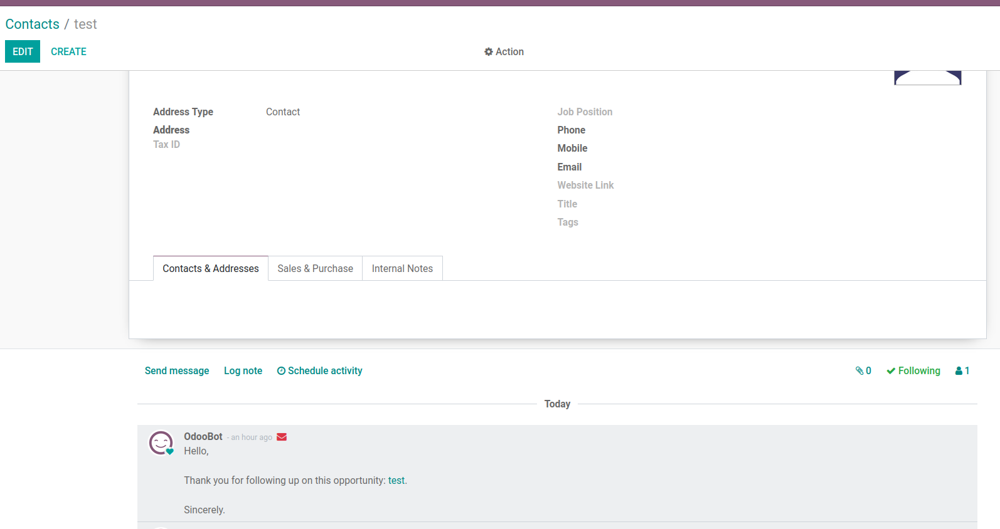
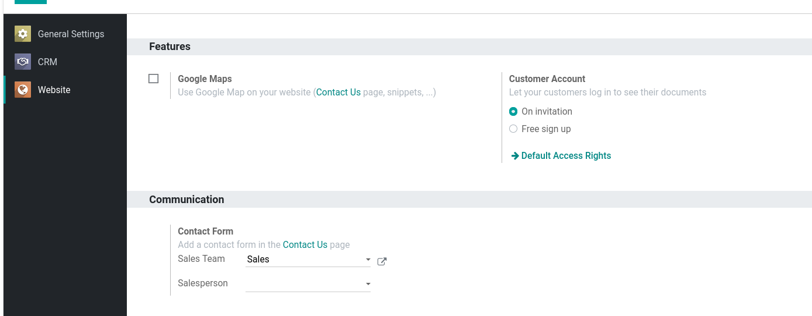
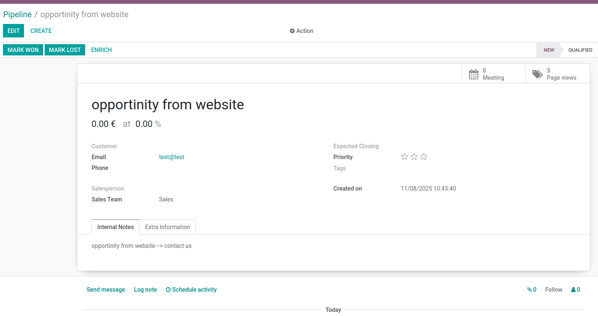

Description
-------
The Module adds CRM functionalities for Numigi.

Fonctionalities
-------
1) Add a new field in crm team 'Team Members Emails' to group the emails of all members.

2) Team Leader should be added to list of members if a team created or the user id changed.

3) Add 2 new teams and team:sales that already added by sales team module .

4) Set to true the parameters Leads and Incoming Emails as defaults in install of module.

5) Send a notification to all team members associated with the opportunity
    that exceeds 10 without changing status from draft.

6) The expected revenue should appears just for the sales managers.
7) The functionality is already exists 

Authors
-------

* Yamna Azzirari

