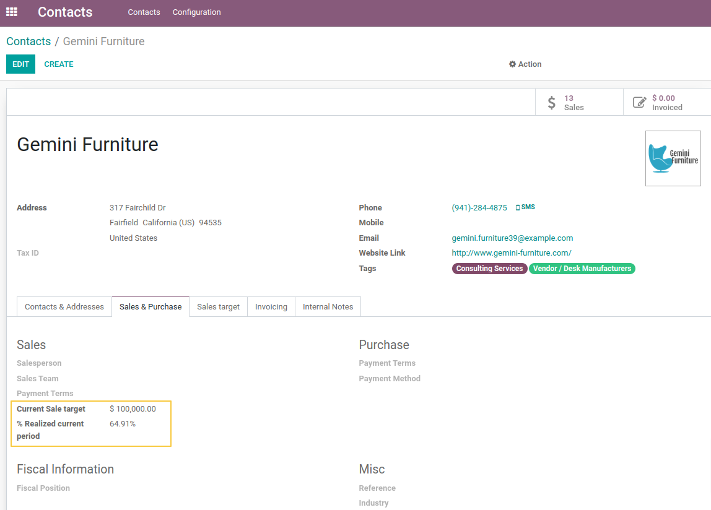

Partner Sale Target
===================

This module allows managing sales objectives per Partner.

Description
-----------

This module adds new access rights to manage sales targets:

As a user with the access right `manage Sales Target`, I can see a new tab on the partner form view:

I can also see 2 new fields `Current Sale target` and `% Realized current period` added to the tab `Sales & Purchase`:

The two fields are added to the list view of contacts, and they are optional:

The tab `Sales target` and the new fields are visible only if the contact is of a company type or an individual type not associated with a company.

Usage
-----

As a user with the access right `manage Sales Target`, I create a sales target line by entering the start date, the end date, and the sales target. The system will automatically calculate the realized target and the realized percentage from all confirmed sale orders between the start and end dates.

If the end date has passed (end_date < today), the line becomes not editable and is colored in gray.

Only one sales target is allowed for a period. When I try to create two lines with overlapping dates, I receive a blocking message:

In the tab `Sales & Purchase`, I notice that the fields `Current Sale target` and `% realized current period` are automatically filled.
- `Current Sale target` takes the target value of the current period,
- `% realized current period` is calculated as follows: Total amount excluding sales tax for the current period / Sales target for the current period * 100

If I try to attach an “individual” type contact with a sales target to a company, then an alert message is displayed:

Contributors
------------
* Numigi (tm) and all its contributors (https://bit.ly/numigiens)

More information
----------------
* Meet us at https://bit.ly/numigi-com
