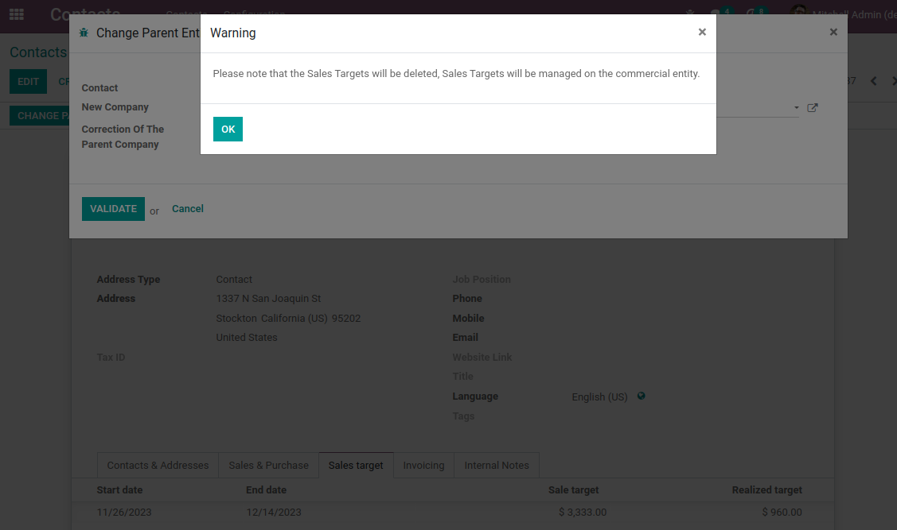

Sale Target Partner Change Parent Binding
=========================================

.. contents:: Table of Contents

Summary
-------
This module is a binding between the module `partner_change_parent <https://github.com/Numigi/odoo-partner-addons/tree/14.0/partner_change_parent>`_ and `partner_sale_target <https://github.com/Numigi/odoo-sale-addons/tree/14.0/partner_sale_target>`_

The module display a warning if I try to attach an “individual” type contact with a sales target to a company from `Change parent entity` wizard:

Contributors
------------

* The `Numigi <https://numigi.com/r/home>`_ team is the contributor to this project. We help Quebec companies implement Odoo and Konvergo ERP.

