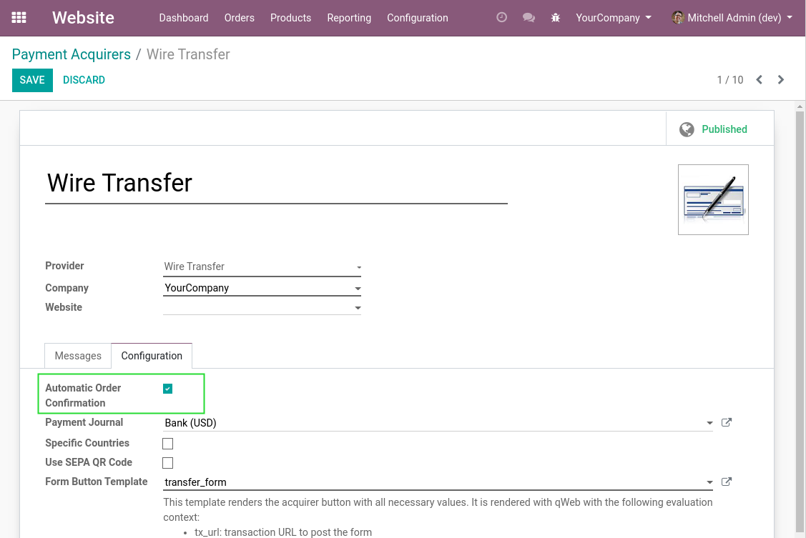
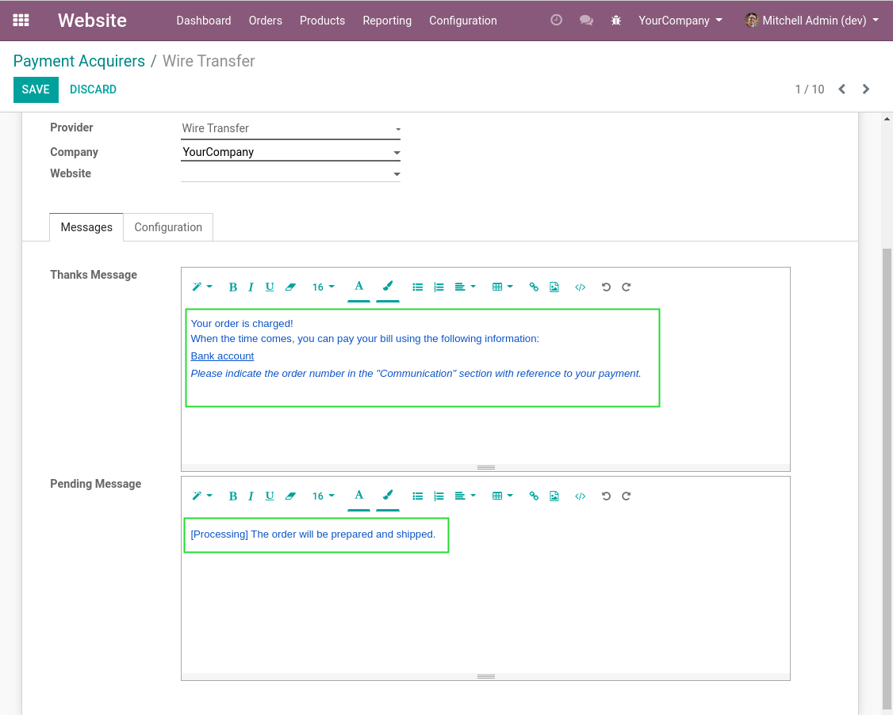
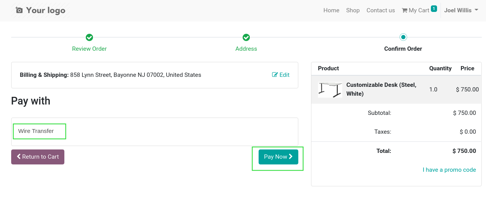
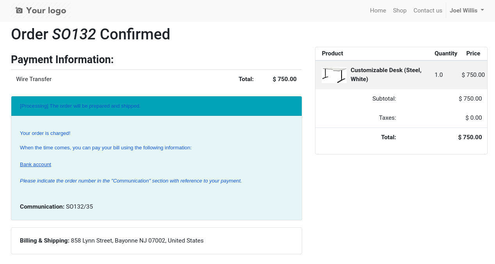
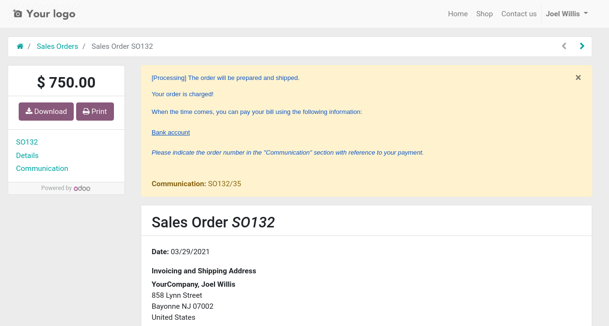

Payment Auto Confirm Sale Order
===============================
This module allows sale orders from the ecommerce to be confirmed automatically for a given payment method.

.. contents:: Table of Contents

Configuration
-------------
As ``Administrator``, I go to the form view of a payment method.

I notice a new checkbox ``Automatic Order Confirmation``.

When this box is checked, the sale order will be confirmed automatically when
checking out an order using this payment method.

I adjust the messages for this payment method in regard to this new feature.

Usage
-----
As a customer, I proceed to checkout.

I notice that my order is confirmed.

When I go to the portal view of my order, I notice that it is processing.

Contributors
------------
* Numigi (tm) and all its contributors (https://bit.ly/numigiens)

More information
----------------
* Meet us at https://bit.ly/numigi-com
