Purchase Sale Inter Company Route
=================================
This module adds a stock route for inter-company operations.

.. contents:: Table of Contents

Context
-------
The module `purchase_sale_inter_company <https://github.com/OCA/multi-company/tree/12.0/purchase_sale_inter_company>`_
allows to generate a sale order from purchase order in another company.

The problem is that this later module does not properly handle the case of serial numbers.

When receiving the stocks in the warehouse of the purchasing company, the quants moved from the selling company are not used.
Therefore, you find yourself having the same serial number with different quants at different locations.

Overview
--------
This module allows to define a special shipping route on the selling company.

Instead of shipping to a customer location, this route ships to a supplier location.

When receiving products on the purchasing warehouse, the quants created from the delivery are used
instead of generating new quants.

Configuration
-------------
There is no specific configuration required before using this module.

When installing the module, a new route ``Inter Company`` is added.

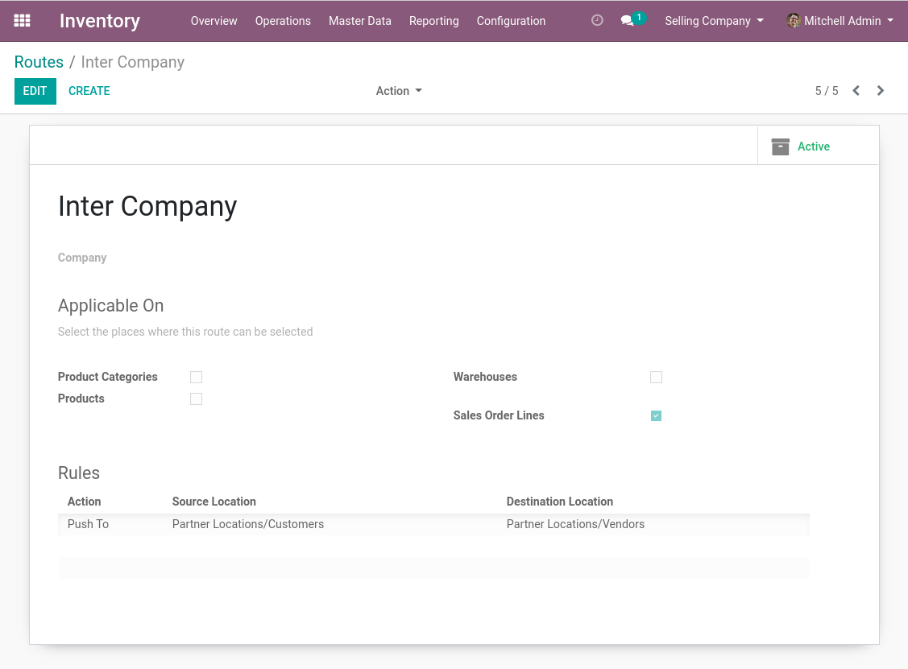

This route is automatically selected on intercompany sale orders.

It is combined with the delivery steps selected on the warehouse,
and adds an extra shadow step to push the stocks from customers to suppliers.

The behavior is therefore the same as a standard sale order, except that the destination
of the delivery picking is ``Suppliers`` instead of ``Customers``.

Usage
-----
With the purchasing company, I create a purchase order and select the selling company as vendor.

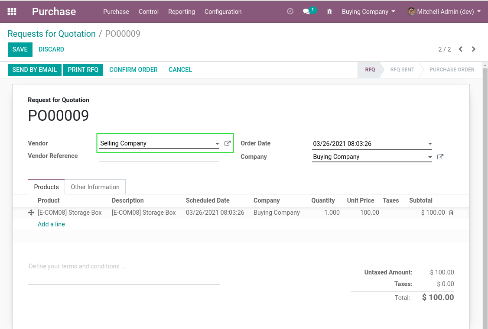

I confirm the purchase order.

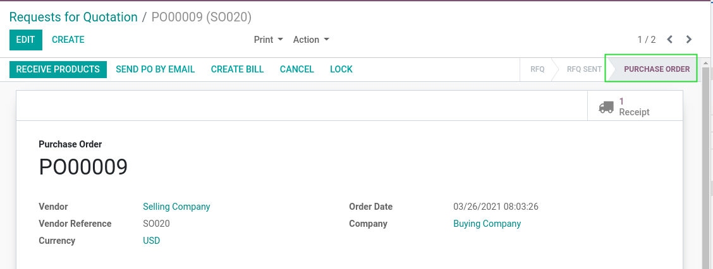

With the selling company, I go to the generated sale order.

I notice that the intercompany route was selected on the order.

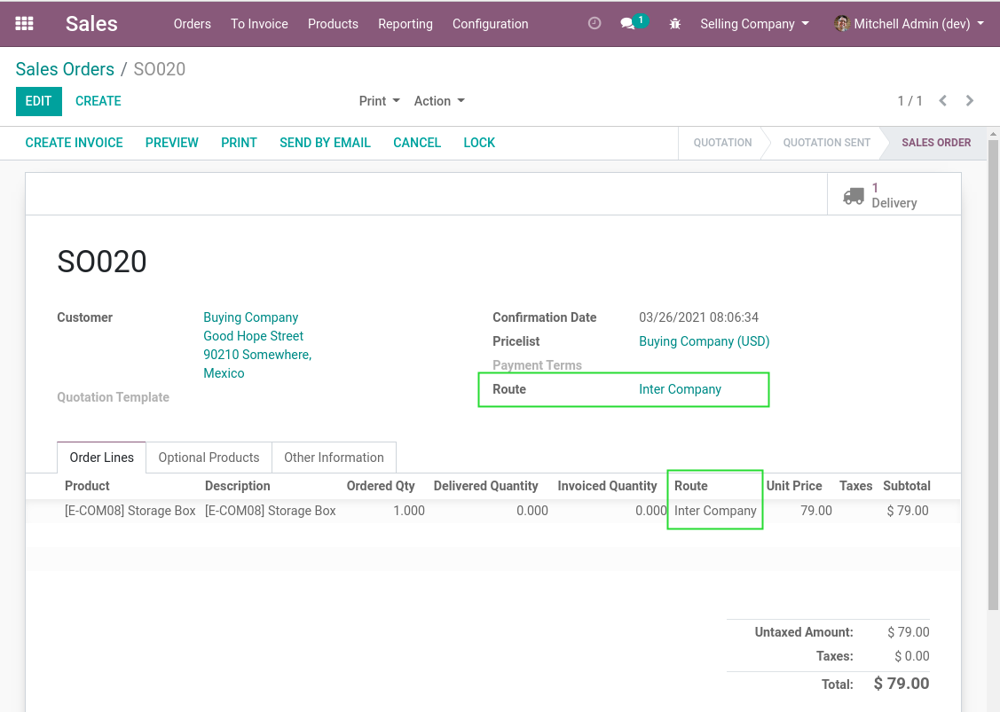

I go to the delivery order.

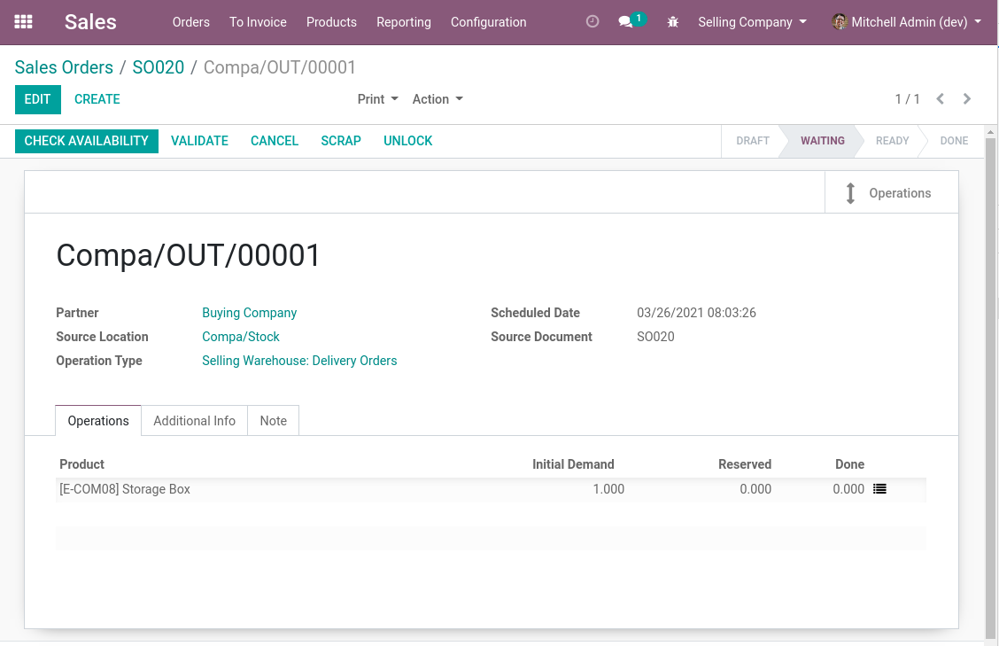

I select a serial number.

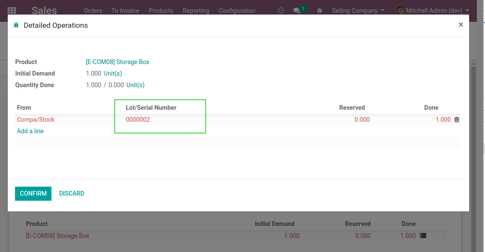

I process the delivery order.

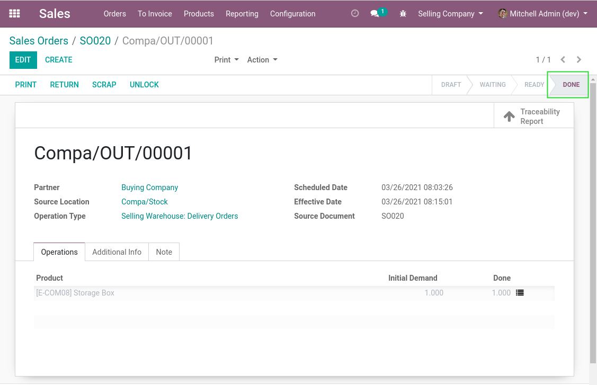

I notice that the destination is the supplier location.

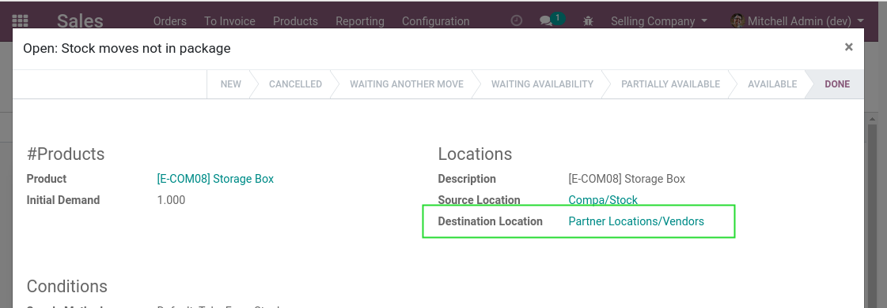

With the purchasing company, I go to the receipt picking.

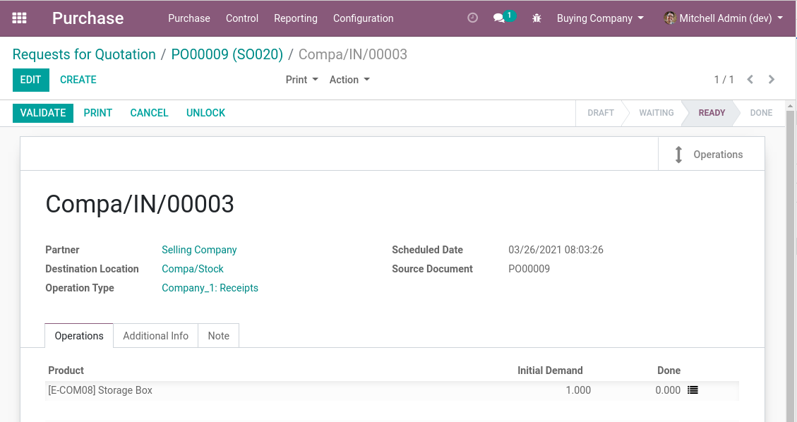

I select the same serial number.

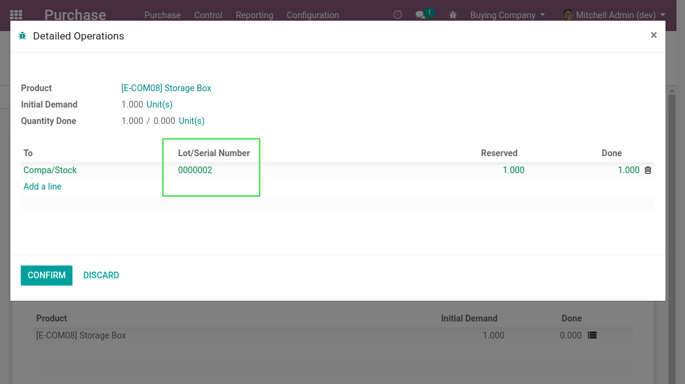

I process the receipt.

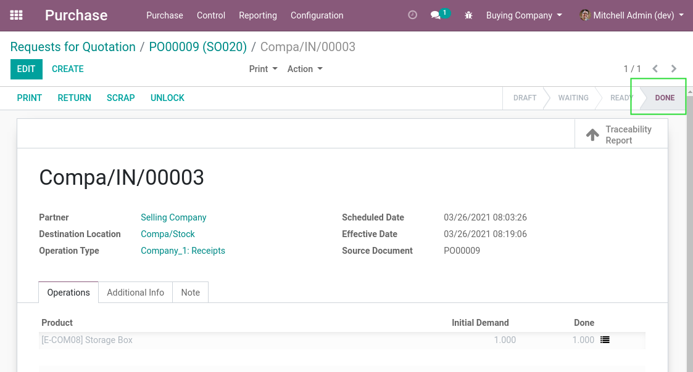

In the list view of quants, I notice that there is only one positive quant related to my serial number.

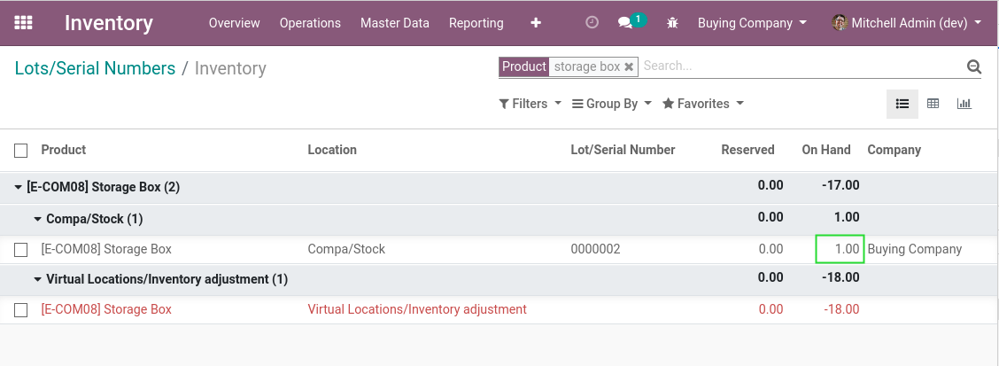

Recommendations
---------------

Constraints on Quants
~~~~~~~~~~~~~~~~~~~~~
Having multiple quants with the same serial number can be problematic.
You loose track of precisely where is a serial number.

This problem is amplified if you share serial numbers between companies.

The module `stock_serial_single_quant <https://github.com/Numigi/odoo-stock-addons/tree/12.0/stock_serial_single_quant>`_ prevents such cases.
This module is recommended when installing ``purchase_sale_inter_company_route``.

Contributors
------------
* Numigi (tm) and all its contributors (https://bit.ly/numigiens)

More information
----------------
* Meet us at https://bit.ly/numigi-com
