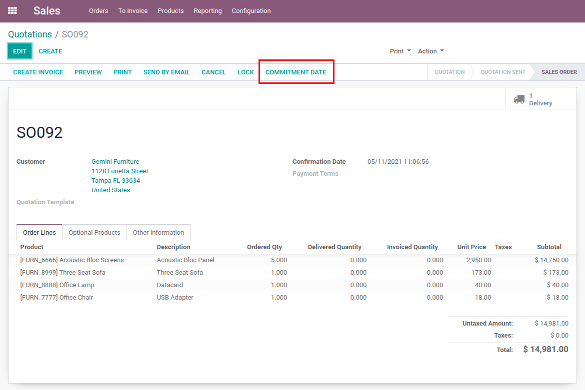
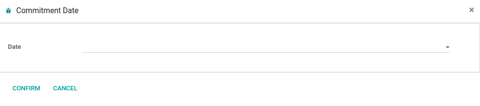
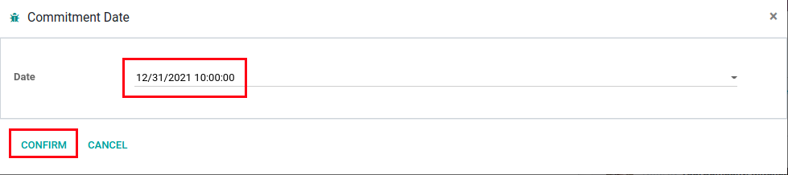
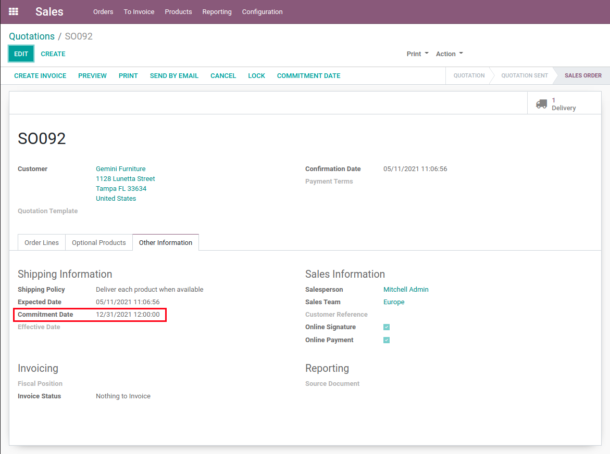
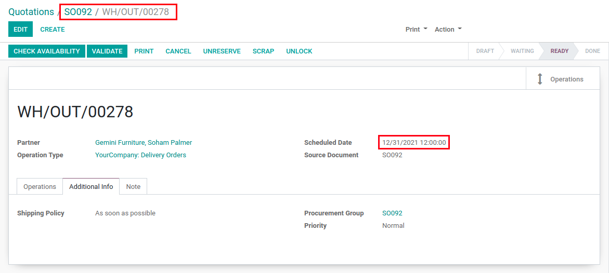

Sale Commitment Date Update
===========================
This module allows to change the commitment date of a sale order.

.. contents:: Table of Contents

Usage
-----
This module adds a button to the sale order.

When clicked, a window opens with a date selection field.

To confirm the new date, simply select it and press the 'Confirm' button.

The sale order commitment date will now be updated.

The sale order steps (pickings, deliveries etc..) will also be updated dynamically taking into account configured lead times.

Configuration
-------------
No configuration is required after installation.

Contributors
------------
* Numigi (tm) and all its contributors (https://bit.ly/numigiens)

More information
----------------
* Meet us at https://bit.ly/numigi-com
