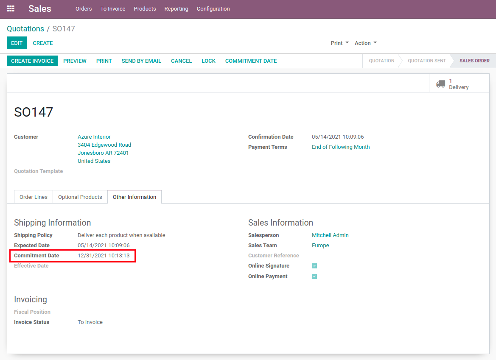

Sale Commitment Date Update Manufacturing
=========================================
This module spreads the change of a sale order commitment date to its manufacturing orders.

.. contents:: Table of Contents

Context
-------
This module depends from the `Sale Commitment Date Update <../sale_commitment_date_update/README.rst>`_ module.

Usage
-----
First, `update the commitment date <../sale_commitment_date_update/README.rst>`_.

.. image:: static/description/menu.png

The manufacturing order created by the sale order will also have its deadline updated.

Configuration
-------------
No configuration is required after installation.

Contributors
------------
* Numigi (tm) and all its contributors (https://bit.ly/numigiens)

More information
----------------
* Meet us at https://bit.ly/numigi-com
