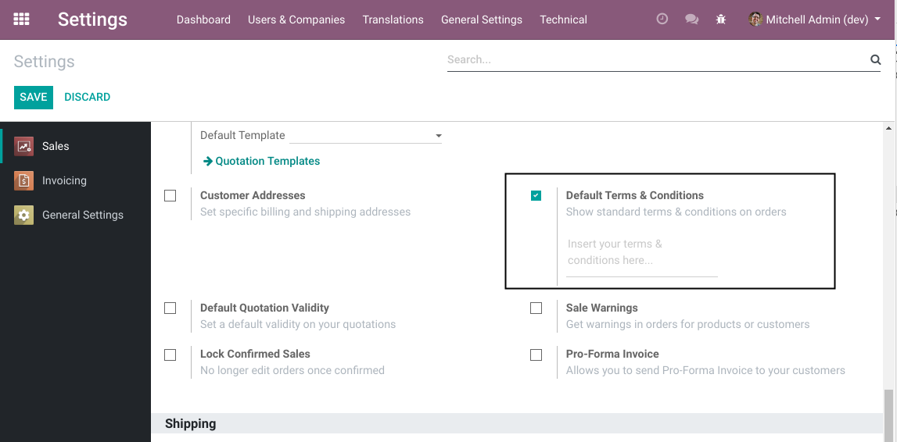
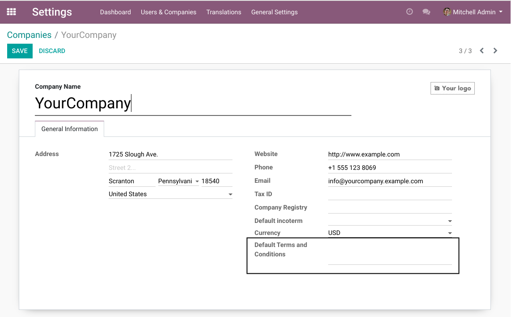

Sale Default Term On Company
============================
This module adds the field ``Default Terms and Condition`` on the form view of a company.

Context
-------
In vanilla Odoo, the default sale terms and conditions are configurable in the settings
of the sale application.

Usage
-----
After installing this module, the default terms and conditions are available on the company.

Contributors
------------
* Numigi (tm) and all its contributors (https://bit.ly/numigiens)

More information
----------------
* Meet us at https://bit.ly/numigi-com
