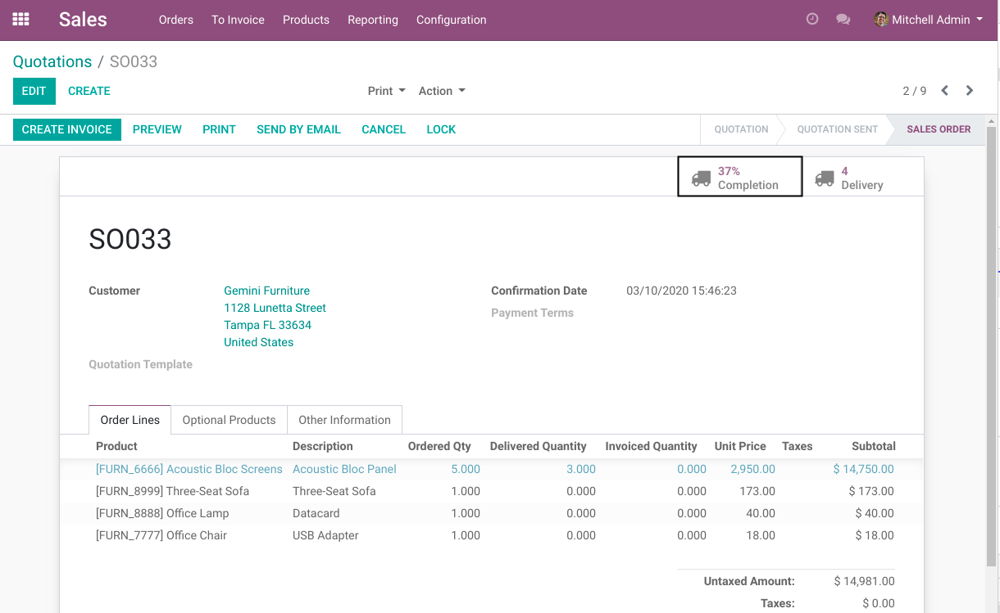
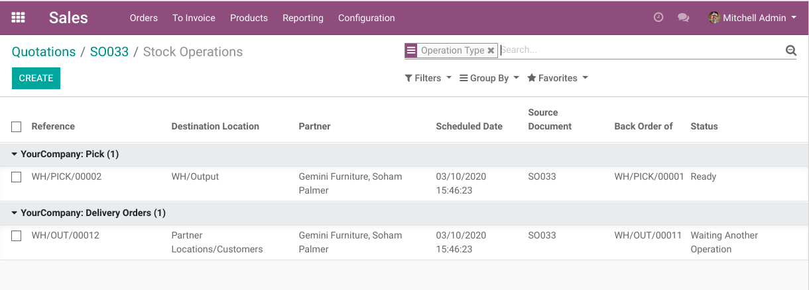
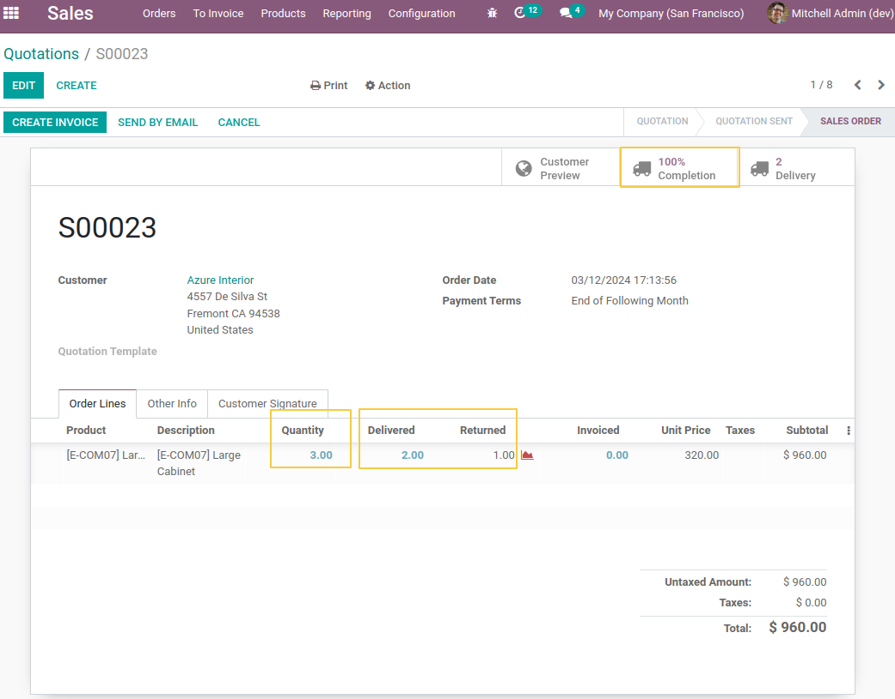

Sale Delivery Completion
========================

This module adds a smart button on the sale order.

This button shows the rate of completion of the order.

This rate represents the percentage of stockable (and consummable) products
that were delivered to the customer.

When clicking on the button, the list of unfinished stock pickings for this
order is displayed.

Since Version 1.1.0 the module maintains the completion rate even if there are delivery returns.

We use the community module `sale_line_returned_qty <https://github.com/OCA/stock-logistics-workflow/tree/14.0/sale_line_returned_qty>`_, to get 
the returned quantity in the sale order line.

The returned quantity is added to the rate of completion calculation. 

Contributors
------------
* Numigi (tm) and all its contributors (https://bit.ly/numigiens)

More information
----------------
* Meet us at https://bit.ly/numigi-com
