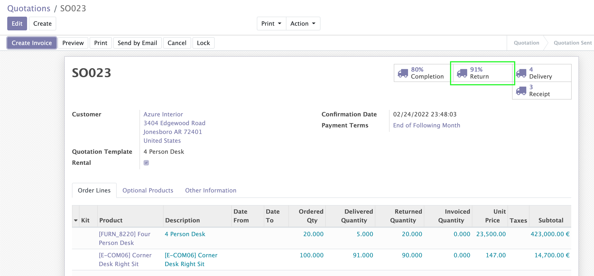
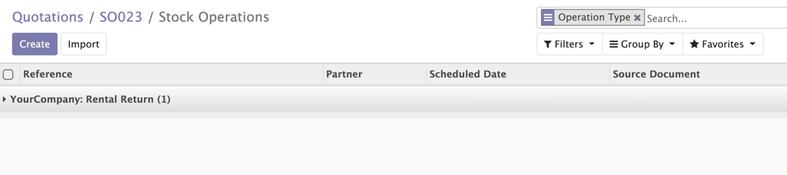

Sale Delivery Completion Rental
===============================

This module adds a smart button on the sale order.

This button shows the rate of return completion of the order.

This rate represents the percentage of stockable (and consummable) products
that were returned from the customer.

When clicking on the button, the list of unreturned stock pickings for this
order is displayed.

Contributors
------------

* The `Numigi <https://numigi.com/r/home>`_ team is the contributor to this project. We help Quebec companies implement Odoo and Konvergo ERP.
* Komit (https://komit-consulting.com)

