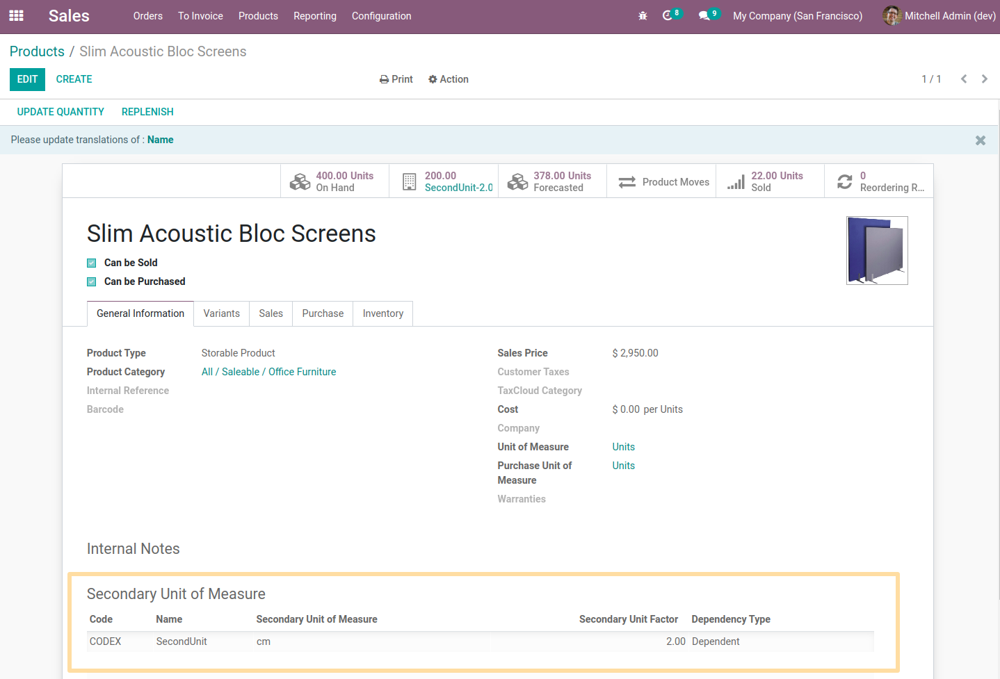
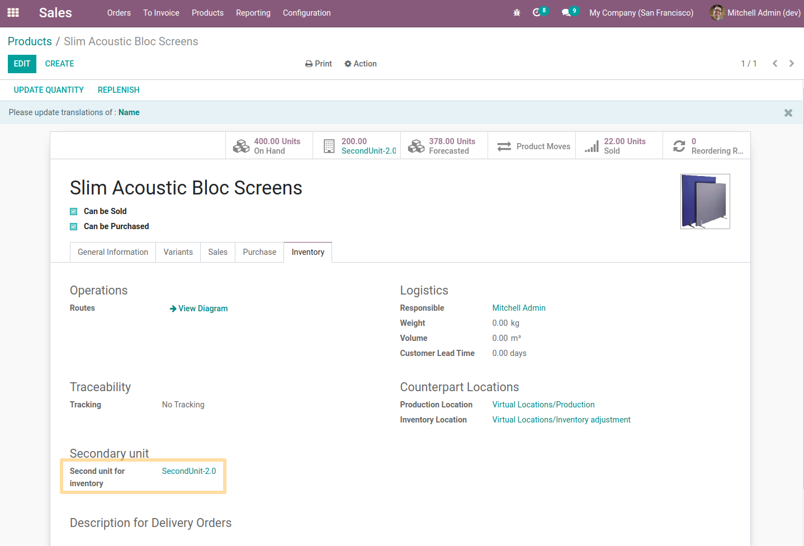
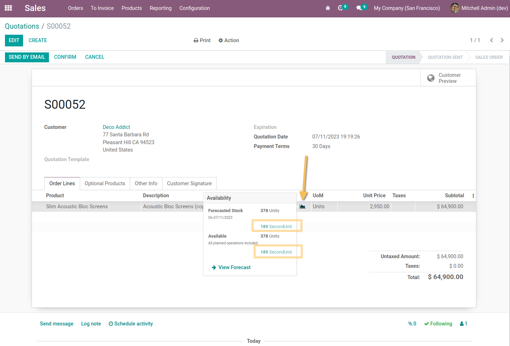
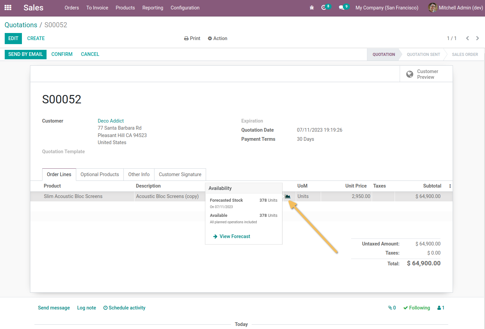

Sale Display Quantity Widget Secondary Unit
===========================================
This module allows to display the quantities in stock and forecasts in the 2 units of measurement.

Configuration
-------------
As a user with access to product management, I go to the form view of a product, define a secondary unit of measure and assign it as a secondary unit for inventory.

Usage
-----
As a Sales user, I go to a sales quote / order and select the previously configured product.

I then click on the available quantities widget and see that the Planned and Available Stock is displayed in the secondary unit for inventory.

* The quantities displayed are calculated according to the factor of the secondary unit defined.
* The value of the `Name` field of the secondary unit for the inventory is taken as the name of the unit of measure in the widget.

If I select a product for which no secondary unit for inventory is defined, then the quantities and the name of the secondary unit for inventory are not displayed.

Contributors
------------
* Numigi (tm) and all its contributors (https://bit.ly/numigiens)
