Sales Dynamic Price
===================
This module allows to compute the sale price of a product based on the product cost.

.. contents:: Table of Contents

Product Configuration
---------------------
As member of the group `Sales / Manager`, I go to the form view of a product.

In the `General Information` tab, I find a new block of fields related to the price.

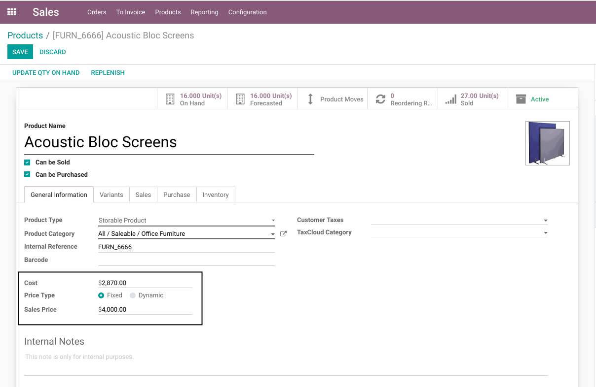

The field `Price Type` allows 2 options:

1- Fixed Price

..

    The product is set manually by the user.

    This is the standard behavior in Odoo.

2- Dynamic Price

..

    This option enables the dynamic price feature for the product.

I select the option `Dynamic`.

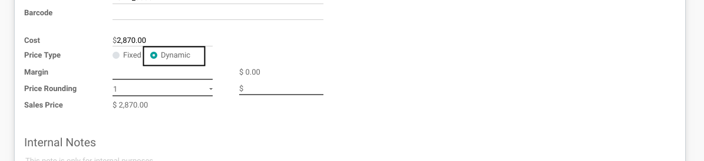

The sale price is now read-only and that 4 new fields have appeared:

1- Margin

..

    The `Margin` field allows to enter a markup rate.

    The amount can be either expressed as a:

    * Decimal number (i.e. 0.30)
    * Percentage (i.e. 30%).

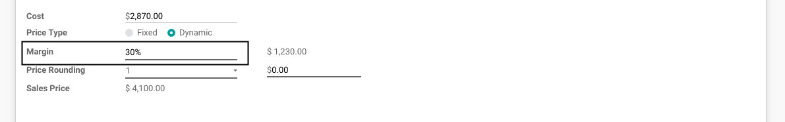

2- Margin Amount

..

    The `Margin Amount` is computed based on the cost and the margin in percent.

    The formula used is to compute the amount is:

        `Cost x ((1 / (1 - Margin) - 1))`

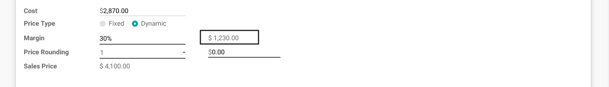

3- Rounding

..

    The `Rounding` is an amount used to round the sale price.

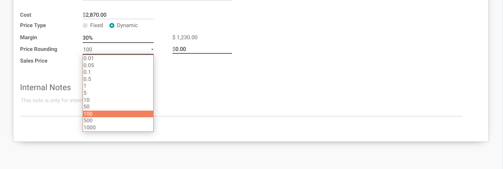

4- Surcharge

..

    The `Surcharge` is usually a negative amount (i.e. -0.01).

    It is added to the sale price to make it more marketing.

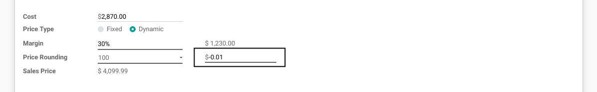

Pricelists
----------
The module does not affect how pricelists work. Thus, there is nothing specific to parametrize on pricelists for the module to work properly.

However, there are a few things to keep in mind when configuring a pricelist.

The pricelist should be based on the `Public Price` so that the dynamic price is used.

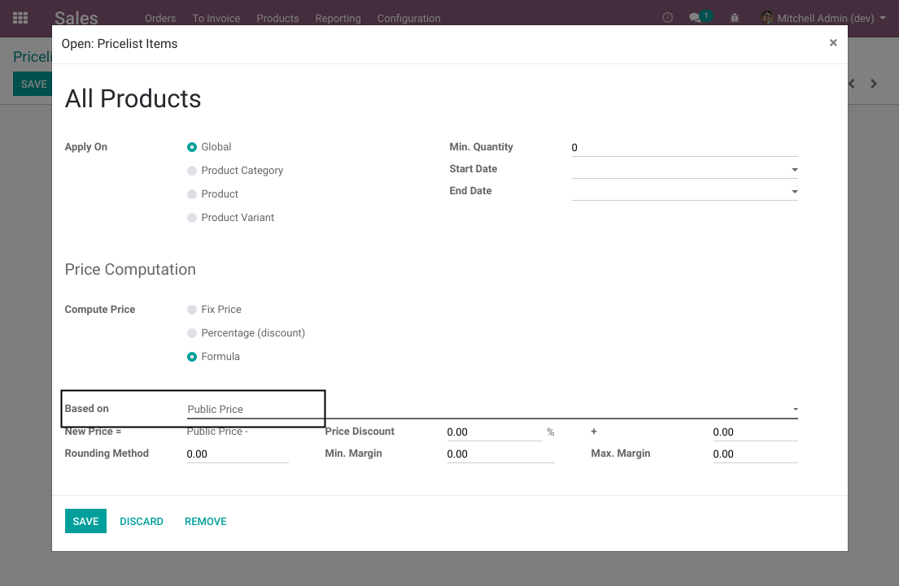

The rounding (1) and surcharge (2) defined on the pricelist are independent from the values defined on the product.

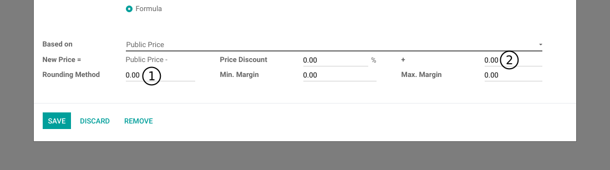

If you set a discount on the pricelist, the surcharge and rounding defined on the product
will be applied dynamically after the discount on the sale order.

Usage
-----
As member of the group `Sales / User`, I create a new draft quotation.

I select a pricelist with 10% discount.

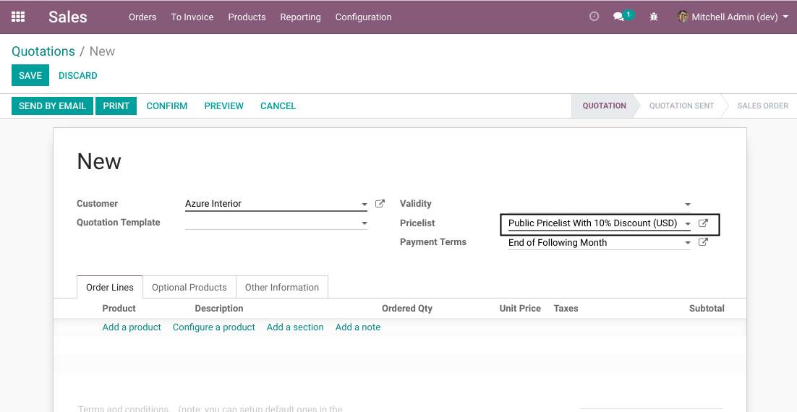

I setup a product with a dynamic price.

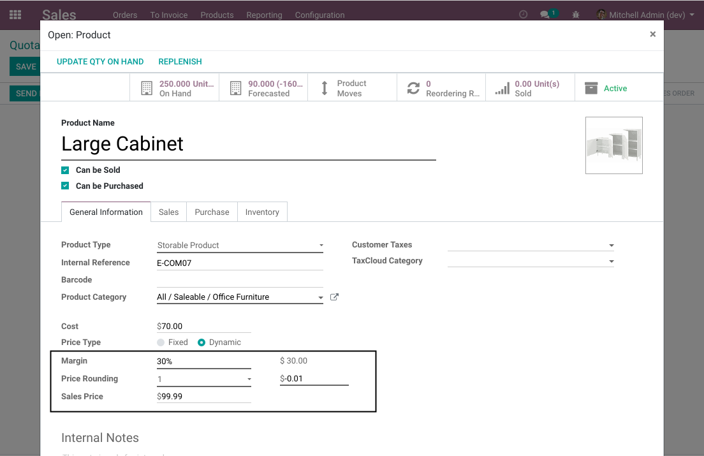

I add the product to the sale order. I notice that the 10% discount was applied.

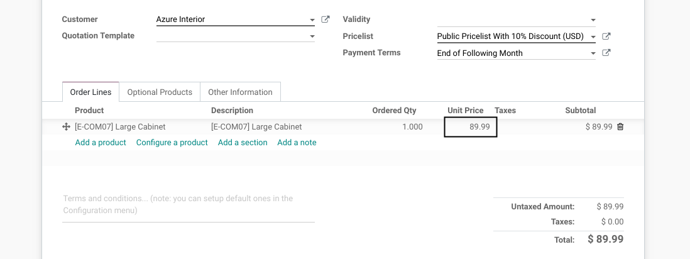

Multi-Currency
--------------
The feature works the same way for prices in different currencies.

The rounding and surcharge are applied after the exchange rate conversion.

Point of Sale
-------------
The following example is based on sale orders. However, the feature works the same way for other applications such as POS.

Extra Prices On Variants
------------------------
The module is incompatible with the `Extra Price` field on variants.
For this reason, the field is hidden from the web interface.

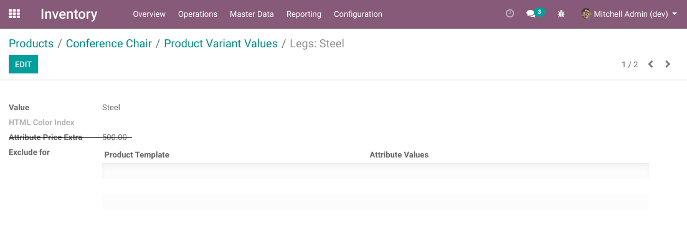

Price Update Cron
-----------------
The module adds a cron to update the sale prices periodically based on the cost.

The sale prices are not updated when the cost of a product changes.
Otherwise, the price could change multiple times in a day, which could create confusion for customers (and employees).

The cron is set to every week by default. This can be changed manually.

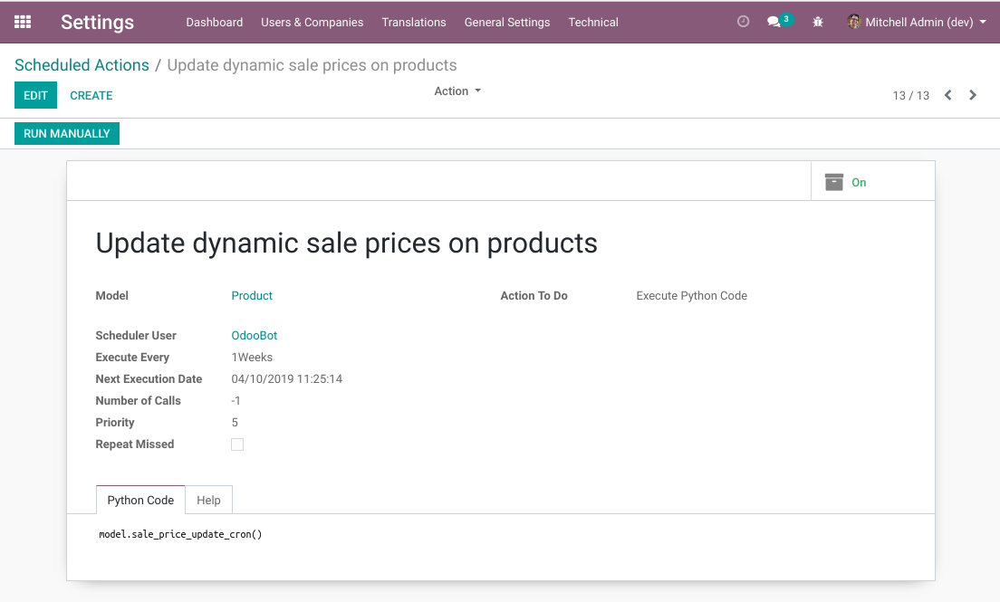

Contributors
------------
* Numigi (tm) and all its contributors (https://bit.ly/numigiens)

More information
----------------
* Meet us at https://bit.ly/numigi-com
