Sale Inter-Company Service
==========================

.. contents:: Table of Contents

Use Case
--------
Suppose you are managing multiple subsidiaries under a parent company.

When selling to a customer, a given subsidiary might not have sufficient inventory to fulfill an order.

When this situation happens, the subsidiary still delivers to the customer, using
the inventory of the parent company.

When doing so, the parent company charges a percent of the sold amount to the subsidiary.

Context
-------
In Odoo, implementing such functionality using inter-company sale and purchase orders
was discarded as an option.

This solution would require too many documents for a simple sale order.

Overview
--------
This module allows to generate a sale order from a company ``X`` on behalf of a company ``Y``.

* The company ``Y`` invoices the final client.
* The company ``X`` invoices the company ``Y``.

A discount in percent is applied to the Interco invoice.
This discount is the profit earned by ``Y`` for concluding the sale.

The inventory operations are entirely done in company ``X``,
therefore, ``Y`` does not even need to have a warehouse defined.

Configuration
-------------
As ``Administrator``, I go to the general settings.

I notice a new field ``Intercompany Service Discount``.

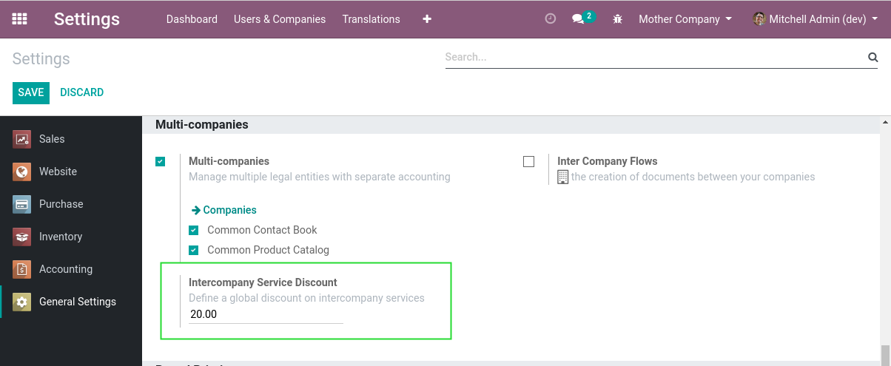

This field defines the percentage to use for this company when selling on behalf of another company.

Usage
-----

Create Sale Order
*****************
I create a sale order from the company ``Mother Company``.

I check ``Interco Service`` and select ``Sister Company`` as invoiced partner.

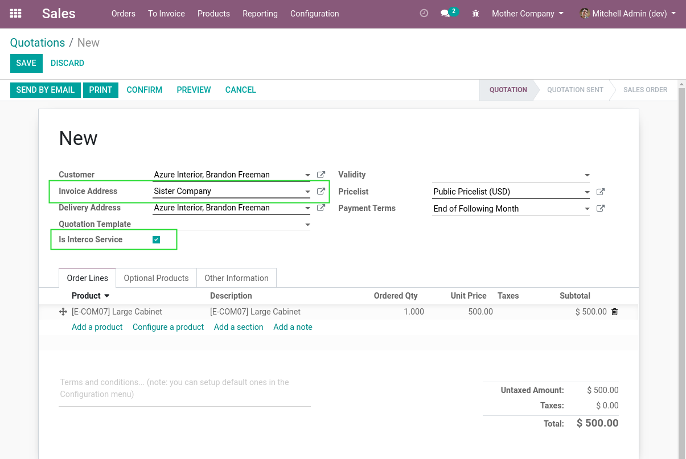

The remaining fields are the same as for a regular sale order.

Confirm Sale Order
******************
After confirming the sale order, I notice that a delivery order was created.

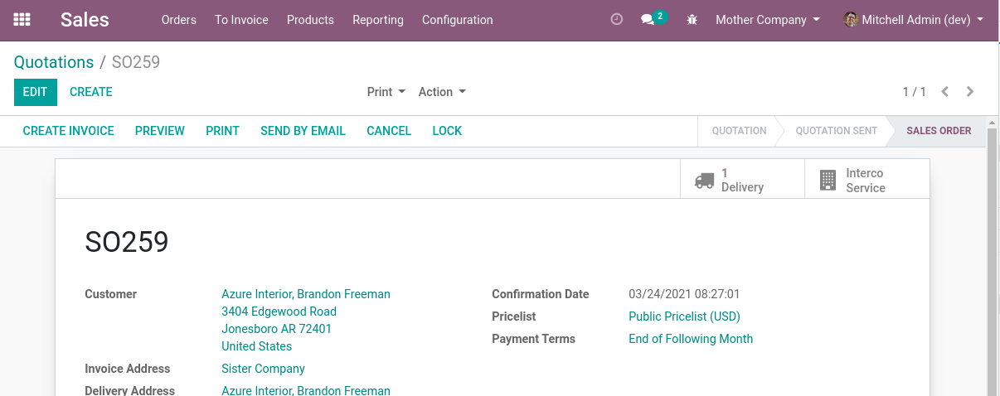

The picking is created as usual, shipping from the warehouse of ``Mother Company``.

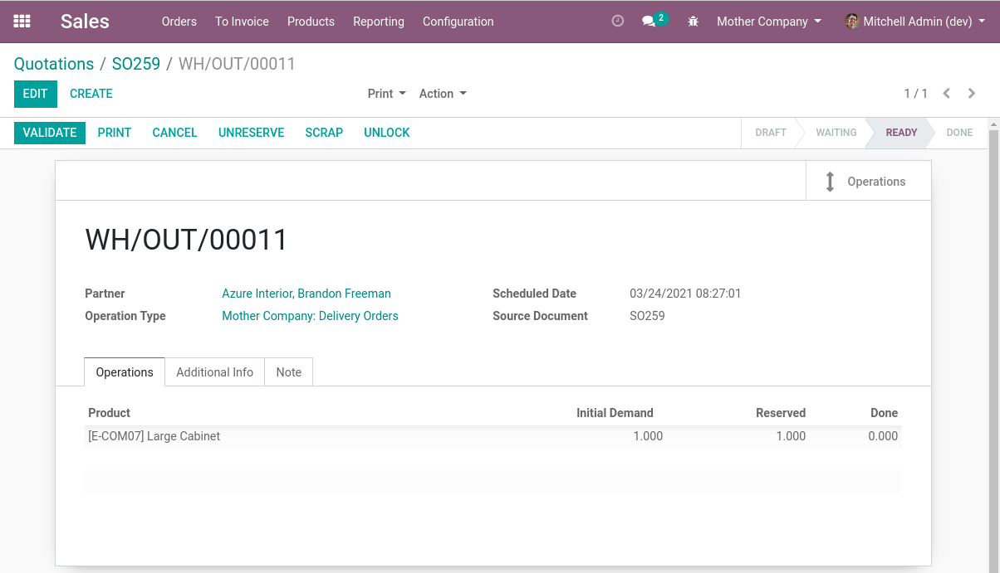

When using this module, it is therefore important to adapt your PDF documents (``Sale Order``, ``Quotation``, and ``Delivery Order``),
so that the company displayed on the header is the ``Sister`` company.

Create Invoices
***************
Back to the sale order, I click to create an invoice.

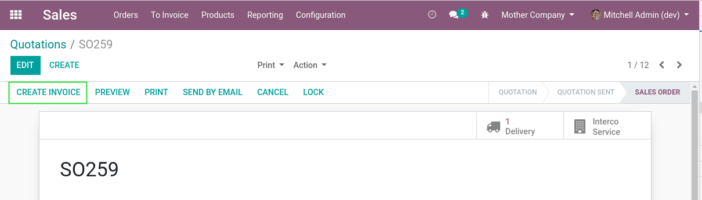

A wizard is opened.

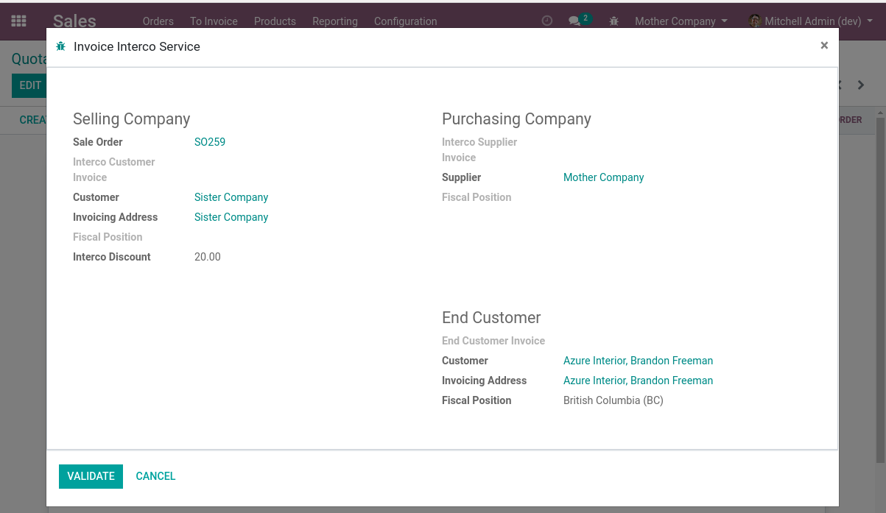

This wizard is different from the original one.
It is dedicated to the case of invoicing an ``Interco Service``.

When validating, 3 invoices are created.

1. One customer invoice on the ``Mother`` company (for invoicing the ``Sister`` company)

	.. image:: static/description/customer_invoice_mother_company.png

2. One supplier invoice on the ``Sister`` company

	.. image:: static/description/supplier_invoice_sister_company.png

3. One customer invoice on the ``Sister`` company (for invoicing the actual customer)

	.. image:: static/description/customer_invoice_sister_company.png

The invoices (1) and (2) are symetrical in both company and allow to register the intercompany invoicing.

On these 2 invoices, an extra discount is added.
This discount represents the profit earned by the ``Sister`` company for this sale.

Interco Service Summary
-----------------------
On the sale order, I notice a new smart button ``Interco Service``.

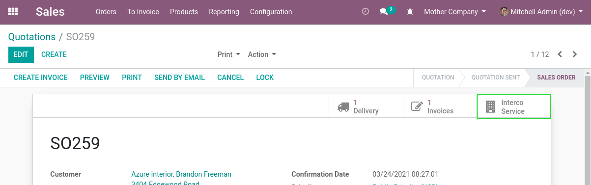

When I click on the button, the summary of the ``Interco Service`` is displayed.

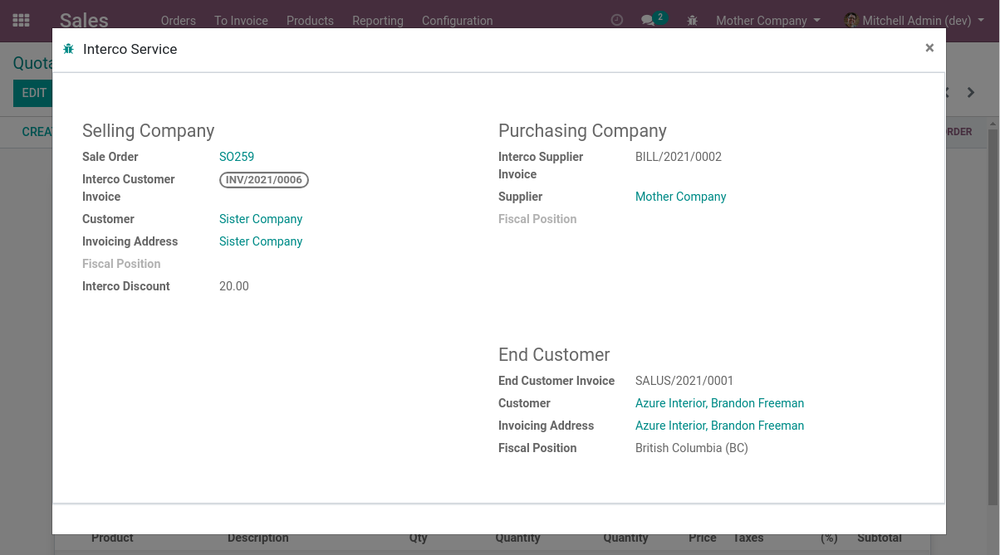

It shows the invoices on both companies that are linked to the sale order.

The smart button is available on each invoice (on both companies).

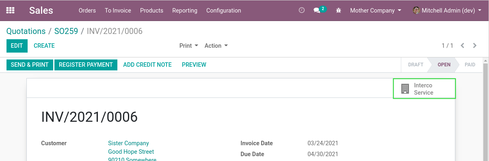

Multiple Invoices
-----------------
It is possible to run the invoicing wizard multiple times.

When doing so, each new invoice only contains the remaining quantities to invoice.

On the summary, all invoices are displayed.

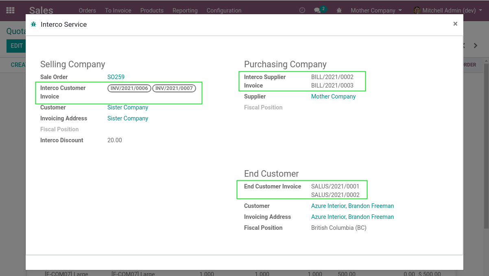

Invoiceable Lines Versus Downpayment
------------------------------------
In the standard invoicing wizard of a sale order, there is a choice between
either invoicing invoiceable lines or registering a down payment.

.. image:: static/description/sale_order_standard_wizard.png

This option did not make sense in the context of interco services.

For an ``Interco Service``, the invoicing is always done based on ``Invoiceable Lines``.

Fiscal Positions
----------------
The module uses fiscal positions defined on each partner to properly map taxes and accounts on each invoice.

For example, you may have a ``Company A`` in Quebec, selling to a customer in Manitoba, on behalf of ``Company B``
which is located in Ontario.

In such case:

* The fiscal position of Ontario is applied on the intercompany customer invoicing.
* The fiscal position of Quebec is applied on the intercompany supplier invoice.
* The fiscal position of Manitoba is applied to the invoice to the end customer.

End Customer Discount
---------------------
If a discount is defined on the sale order line, that discount represents a discount to the end customer.

In such case, the interco discount is combined with the end customer discount on the interco invoices.

The interco discount is computed based on the final price to the customer.

If the end customer discount is 10% and the interco discount is 20%,
the combined discount on the interco invoices is 28%.

..

	10% + (1 - 10%) * 20% = 28%

Intercompany Accounts
---------------------
Since version ``12.0.1.1.0`` of the module, 2 new accounts can be defined on product categories.

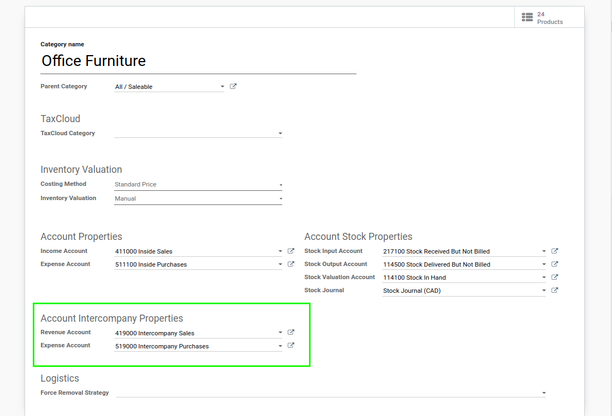

When these accounts are defined, they are used on intercompany invoices.

However, they are not used on the final invoice to the customer.

Known Issues
------------

Fiscal Positions
****************
In multi-company mode, when partners are shared between companies, one must be careful to parametrize fiscal positions
consistently between companies.

When loading a chart of account for a company, the fiscal positions are duplicated for this company.

On partners that are shared between companies, you must therefore reselect the fiscal position for each company.

One way to mitigate this issue is to not define specific fiscal positions on partners (when possible).
When doing so, Odoo automatically evaluates the proper fiscal position based on the partner's address.

Contributors
------------
* Numigi (tm) and all its contributors (https://bit.ly/numigiens)

More information
----------------
* Meet us at https://bit.ly/numigi-com
