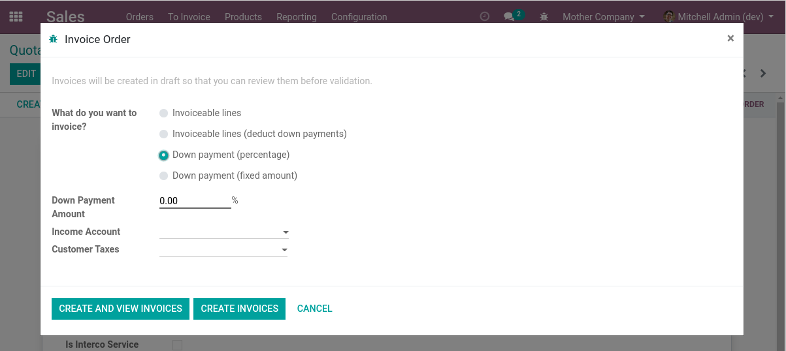

Sale Inter-Company Service
==========================

.. contents:: Table of Contents

Use Case
--------
Suppose you are managing multiple subsidiaries under a parent company.

When selling to a customer, a given subsidiary might not have sufficient inventory to fulfill an order.

When this situation happens, the subsidiary still delivers to the customer, using
the inventory of the parent company.

When doing so, the parent company charges a percent of the sold amount to the subsidiary.

Context
-------
In Odoo, implementing such functionality using inter-company sale and purchase orders
was discarded as an option.

This solution would require too many documents for a simple sale order.

Overview
--------
This module allows to generate a sale order from a company ``X`` on behalf of a company ``Y``.

* The company ``Y`` invoices the final client.
* The company ``X`` invoices the company ``Y``.

A discount in percent is applied to the Interco invoice.
This discount is the profit earned by ``Y`` for concluding the sale.

The inventory operations are entirely done in company ``X``,
therefore, ``Y`` does not even need to have a warehouse defined.

Configuration
-------------
As ``Administrator``, I go to the settings of the ``Sale`` application.

I notice a new section ``Interco Service``.

.. image:: static/description/sale_settings.png

The field ``Discount`` defines the percentage to use for this company when selling on
behalf of another company.

Usage
-----

Create Sale Order
*****************
A sale order is created from ``Company A`` (i.e. the ``Mother`` company).

This order is typed as ``Interco Service``.

.. image:: static/description/sale_order_interco_service.png

On the order, I select ``Company B`` (i.e. the ``Sister`` company) as the company on behalf of which the products are sold.

.. image:: static/description/sale_order_company.png

The remaining fields are the same as for a regular sale order.

Confirm Sale Order
******************
After confirming the sale order, I notice that a delivery order was created.

.. image:: static/description/sale_order_picking.png

The picking was created as if the sale where done from the ``Mother`` company.

.. image:: static/description/picking_form.png

When using this module, it is therefore important to adapt your PDF documents (``Sale Order``, ``Quotation``, and ``Delivery Order``),
so that the company displayed on the header is the ``Sister`` company.

Create Invoices
***************
Back to the sale order, I click to create an invoice.

.. image:: static/description/sale_order_create_invoice.png

A wizard is opened. This wizard is different from the original one.
It is dedicated to the case of invoicing an ``Interco Service``.

When validating, 3 invoices are created.

1. One customer invoice on the ``Mother`` company (for invoicing the ``Sister`` company)

	.. image:: static/description/customer_invoice_mother_company.png

2. One supplier invoice on the ``Sister`` company

	.. image:: static/description/supplier_invoice_sister_company.png

3. One customer invoice on the ``Sister`` company (for invoicing the actual customer)

	.. image:: static/description/customer_invoice_sister_company.png

The invoices (1) and (2) are symetrical in both company
and allow to register the intercompany invoicing.

On these 2 invoices, an extra discount is added.
This discount represents the profit earned by the ``Sister`` company for this sale.

Interco Service Summary
-----------------------
On the sale order, I notice a new smart button ``Interco Service``.

.. image:: static/description/sale_order_smart_button.png

When I click on the button, the summary of the ``Interco Service`` is displayed.

.. image:: static/description/interco_service_summary.png

It shows the invoices on both companies that are linked to the sale order.

The smart button is available on each invoice (on both companies).

Multiple Invoices
-----------------
It is possible to run the invoicing wizard multiple times.

When doing so, each new invoice only contains the remaining quantities to invoice.

On the summary, all invoices are displayed.

Invoiceable Lines Versus Downpayment
------------------------------------
In the standard invoicing wizard of a sale order, there is a choice between
either invoicing invoiceable lines or registering a down payment.

This option did not make sense in the context of interco services.

For an ``Interco Service``, the invoicing is always done based on ``Invoiceable Lines``.

Contributors
------------
* Numigi (tm) and all its contributors (https://bit.ly/numigiens)

More information
----------------
* Meet us at https://bit.ly/numigi-com
