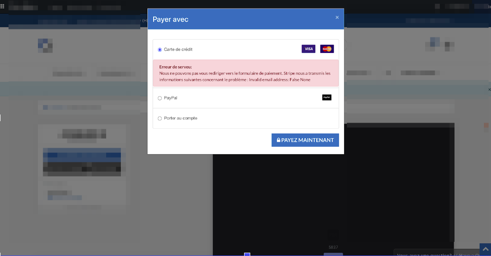
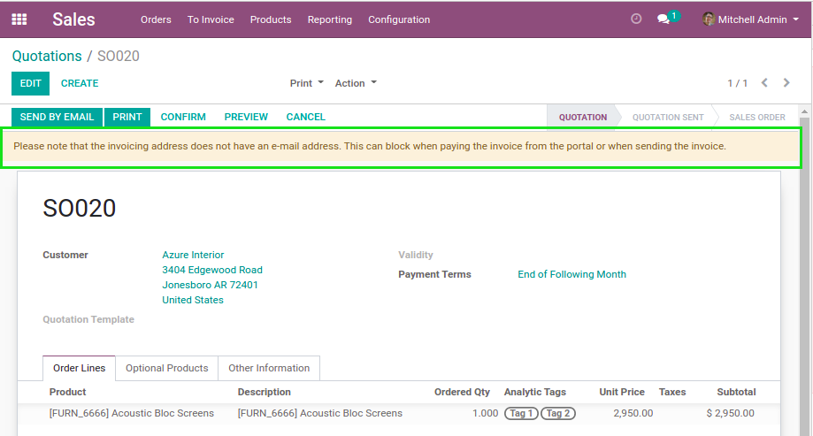
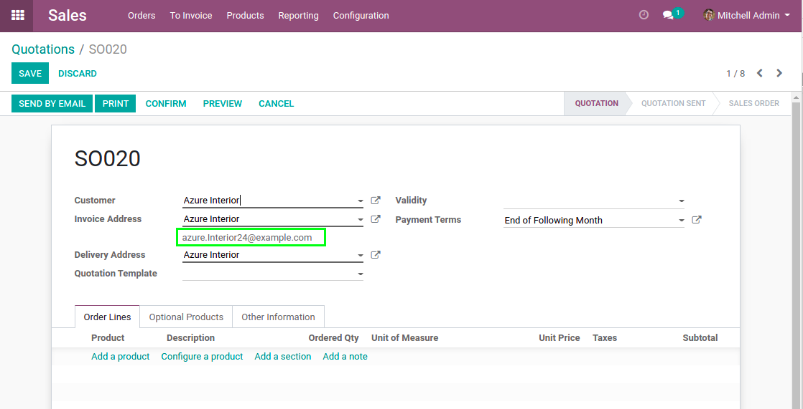

Sale Invoice Email Warning
==========================

.. contents:: Table of Contents

Context
-------
In vanilla Odoo, when checking out a website order using Stripe as payment method,
there is a server if the invoicing address has no email.

Overview
--------
This module adds a warning on a sale order when the invoiced partner does not have an email.

This allows to easily find the cause of the error when it happens for a given order. 

Invoicing Email
---------------
The module also adds the email address of the invoicing address on the sale order.

Contributors
------------

* The `Numigi <https://numigi.com/r/home>`_ team is the contributor to this project. We help Quebec companies implement Odoo and Konvergo ERP.

