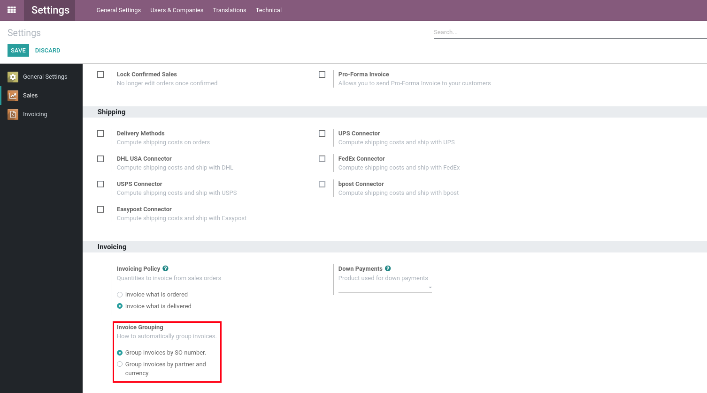

Sale Invoice Create Group By Origin
===================================
This module allows to automatically group invoices by origin instead of partner and currency.

.. contents:: Table of Contents

Usage
-----
There is now a new setting in the settings menu under the "Sales" submenu.

When the first option is selected, invoices will be grouped automatically by their SO number.

When the second option is selected, invoices will be grouped automatically by their partner and currency (this is the default behavior).

Configuration
-------------
No configuration is required after installation.

Contributors
------------

* The `Numigi <https://numigi.com/r/home>`_ team is the contributor to this project. We help Quebec companies implement Odoo and Konvergo ERP.

