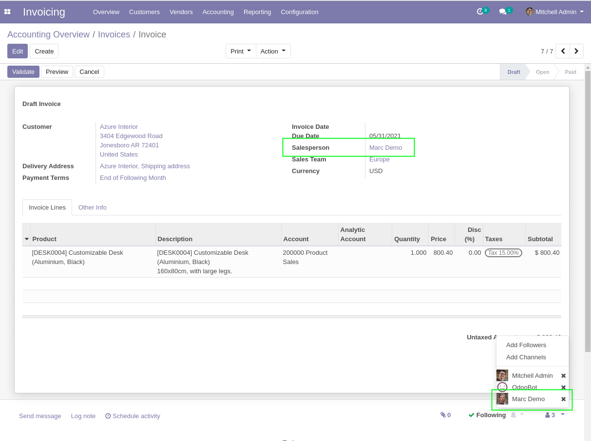

Sale Invoice No Follow
======================

.. contents:: Table of Contents

Context
-------
In vanilla Odoo, when an invoice is created, the salesperson is automatically added as follower.

Overview
--------
This module disables this feature.

The salesman is not automatically added as follower of the invoice.

Contributors
------------

* The `Numigi <https://numigi.com/r/home>`_ team is the contributor to this project. We help Quebec companies implement Odoo and Konvergo ERP.

