Sale Kit
========
This module adds kits to sale orders.

.. contents:: Table of Contents

Overview
--------
A product of type ``Kit`` is defined in the module `product_kit <https://github.com/Numigi/odoo-product-addons/tree/12.0/product_kit>`_.

This module defines the behavior on a sale order when a user selects a kit.

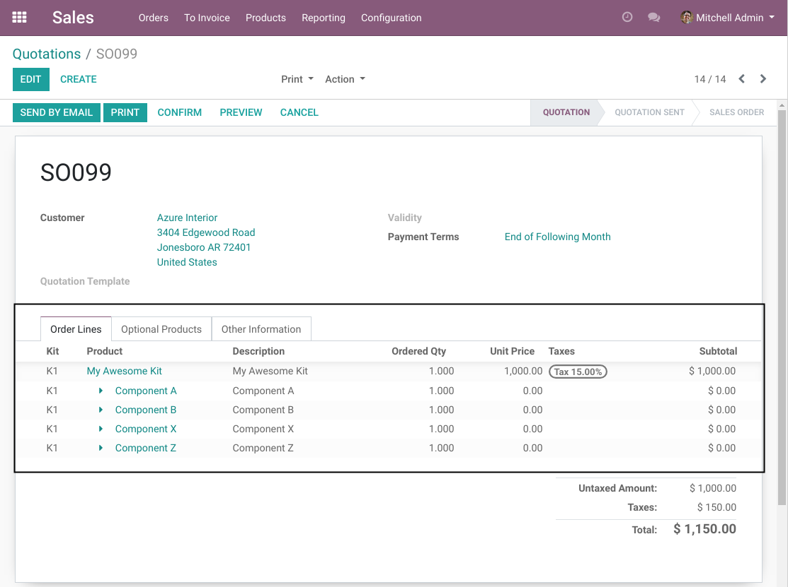

When a kit is selected, a new line is added for each component.

Basic Usage
-----------
I create a new kit with 3 components:

* Two important components
* Two optional components

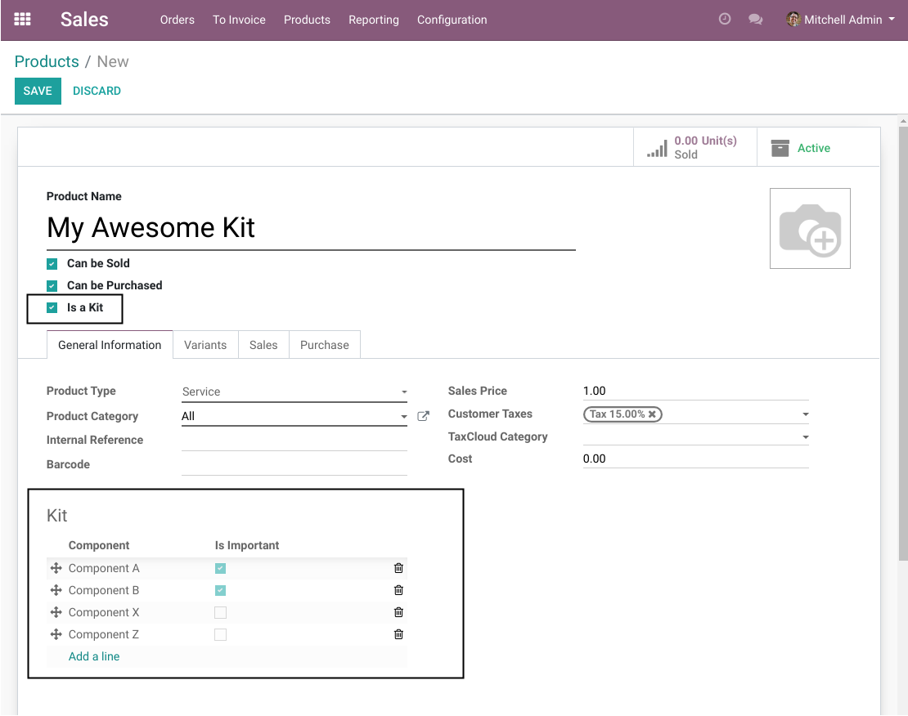

I create a new sale order.

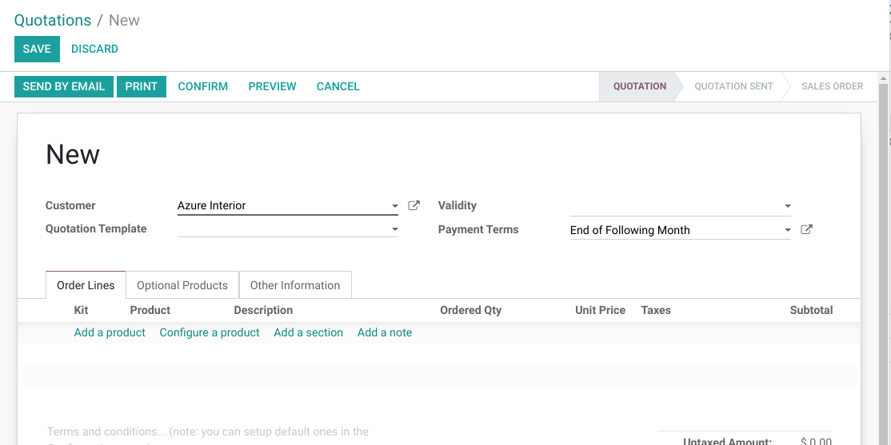

In a new sale order line, I select my kit.

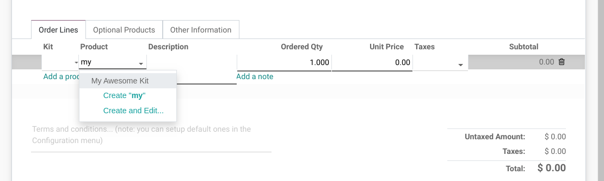

Automatically, 4 new lines are added below the kit.

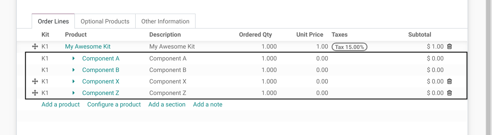

Changing the Kit
----------------
Once a kit is selected on a sale order line, the product can not be changed.

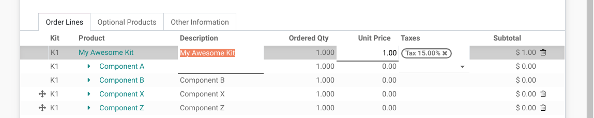

However, you may delete the line and recreate it.

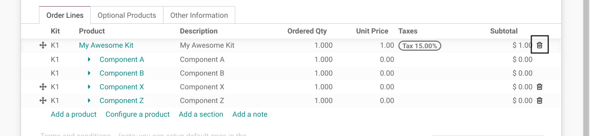

Once deleted, all components for this kit are deleted as well.

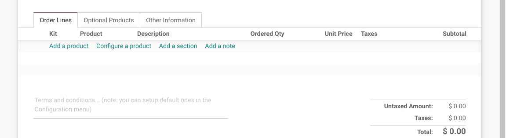

Components
----------

Important Components
~~~~~~~~~~~~~~~~~~~~
You may not delete an important component:

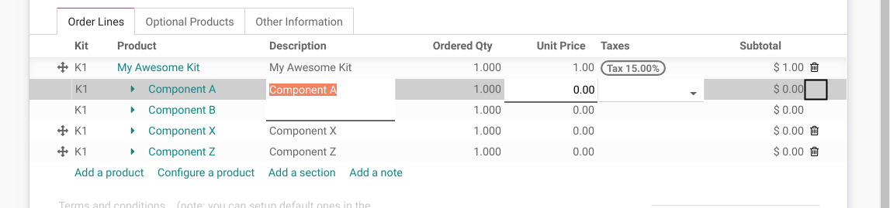

You may neither change the product, nor the quantity:

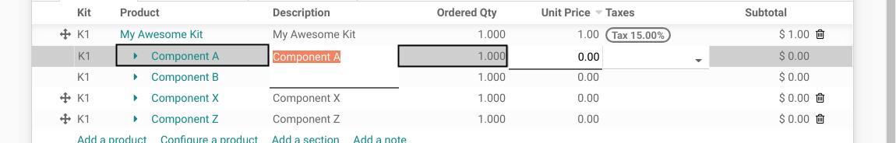

You may not move the line:

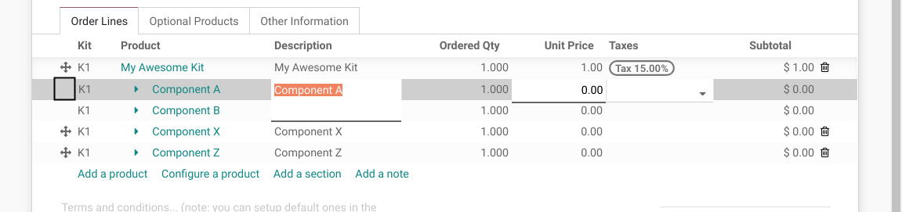

Non-Important Components
~~~~~~~~~~~~~~~~~~~~~~~~
You may delete a non-important component:

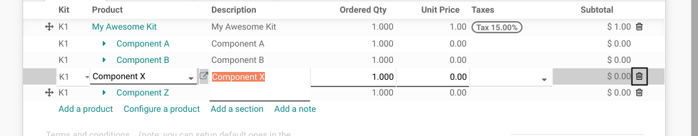

You may change its product and quantity:

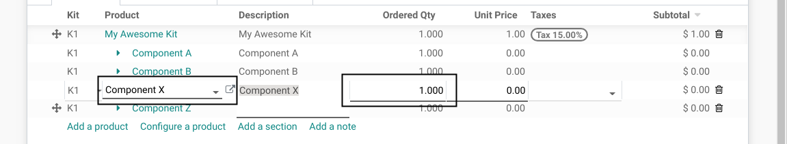

You may move it:

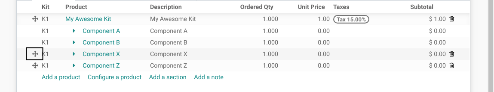

You may move the line to another kit:

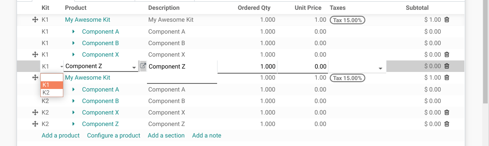

Moving a Kit
~~~~~~~~~~~~
A kit can me moved.

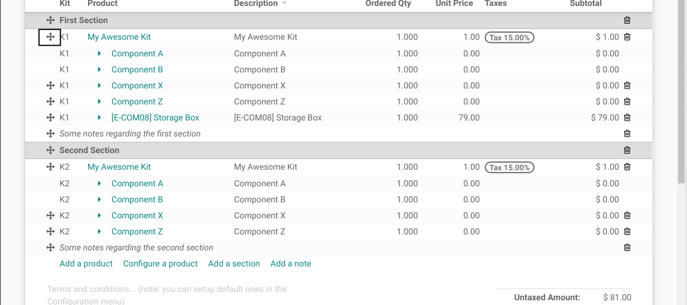

When moving a kit, all components are automatically moved as well.

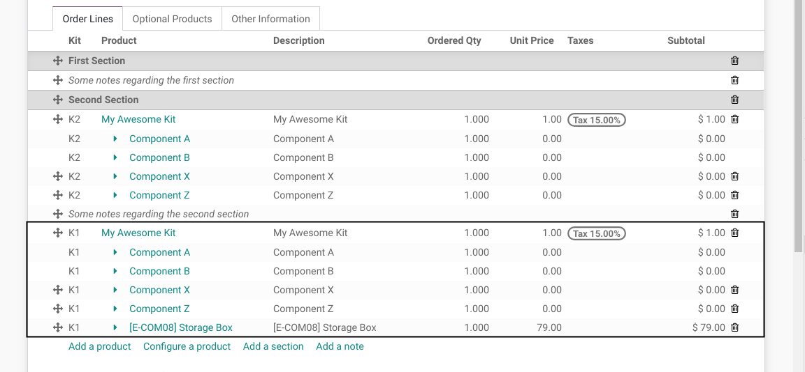

Adding a Component
~~~~~~~~~~~~~~~~~~
To add a component to a kit, you have to select the proper ``Kit Reference``.

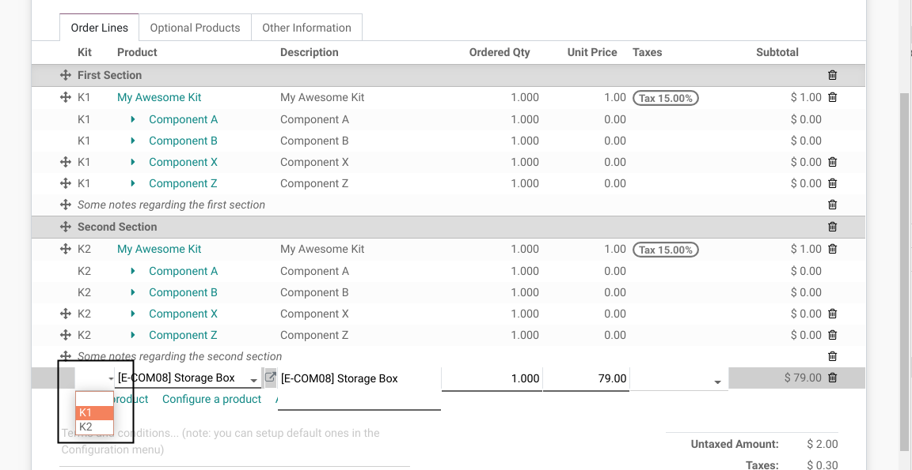

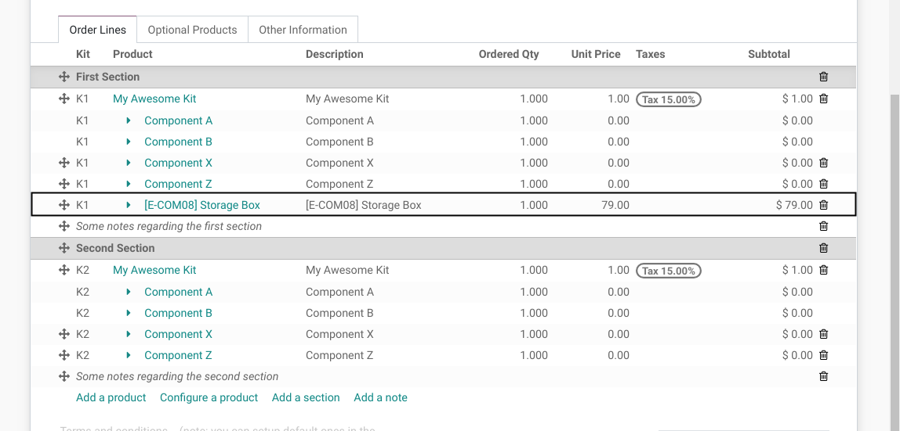

Contributors
------------
* Numigi (tm) and all its contributors (https://bit.ly/numigiens)

More information
----------------
* Meet us at https://bit.ly/numigi-com
