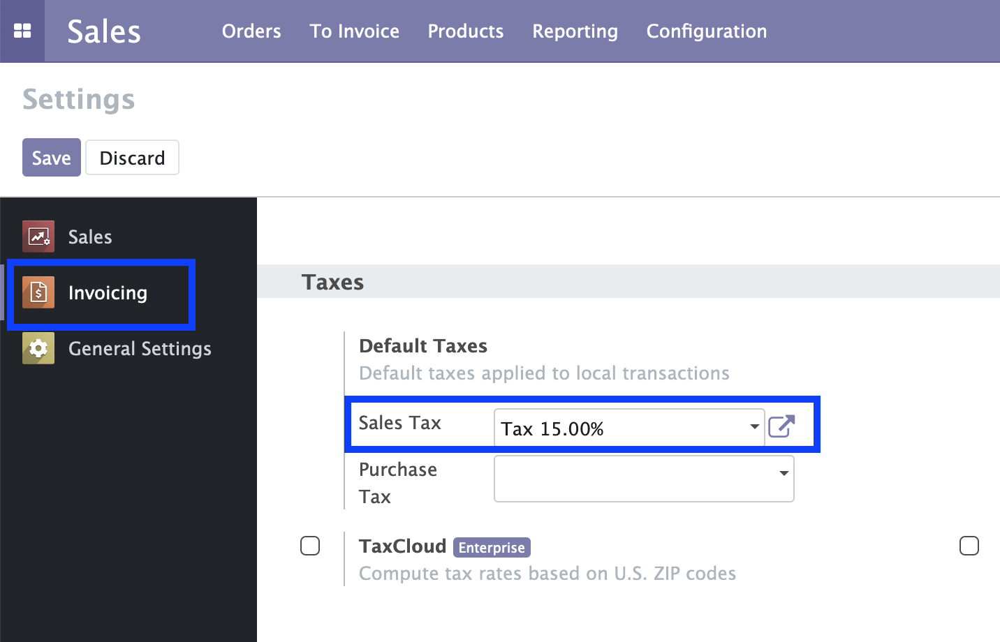
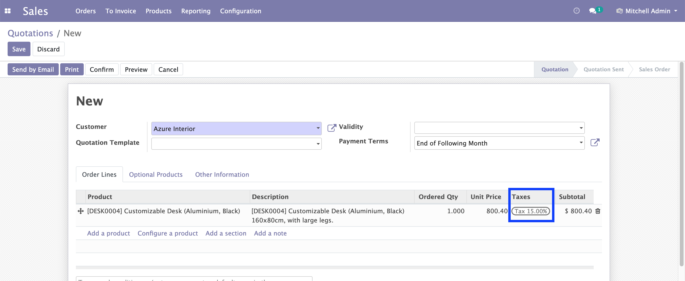

Sale Order Default Taxes
========================
This module adds a feature to suggest a default Sale Tax when the user creates Sale Order Lines.
The default Sale Tax is configured in the Company Settings and can be overwritten on the product form.

Usage
-----
To config default sale order tax, I go to the Company Settings, on Invoicing section, I select a tax for Default Taxes: Sales Tax

I create a Sale Order, after select a product, I see that the tax is set automatically with the value I had configured

Contributors
------------
* Numigi (tm) and all its contributors (https://bit.ly/numigiens)
* Komit (https://komit-consulting.com)

More information
----------------
* Meet us at https://bit.ly/numigi-com
