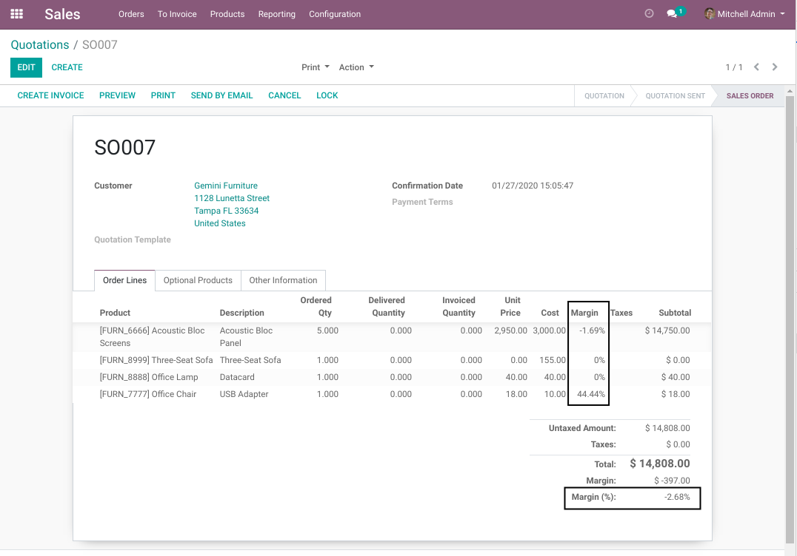

Sale Order Margin Percent
=========================
This module adds a margin in percentage to sale orders.

The margin is added to the sale order as well as to the sale order lines.

It is computed as follow: ``(Sale Price - Cost) / Sale Price``.

Contributors
------------

* The `Numigi <https://numigi.com/r/home>`_ team is the contributor to this project. We help Quebec companies implement Odoo and Konvergo ERP.

