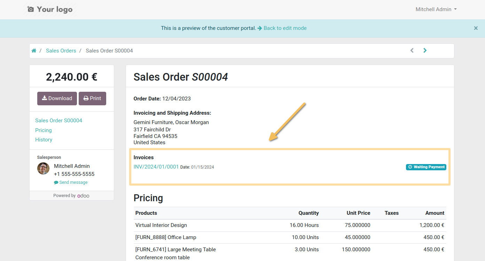
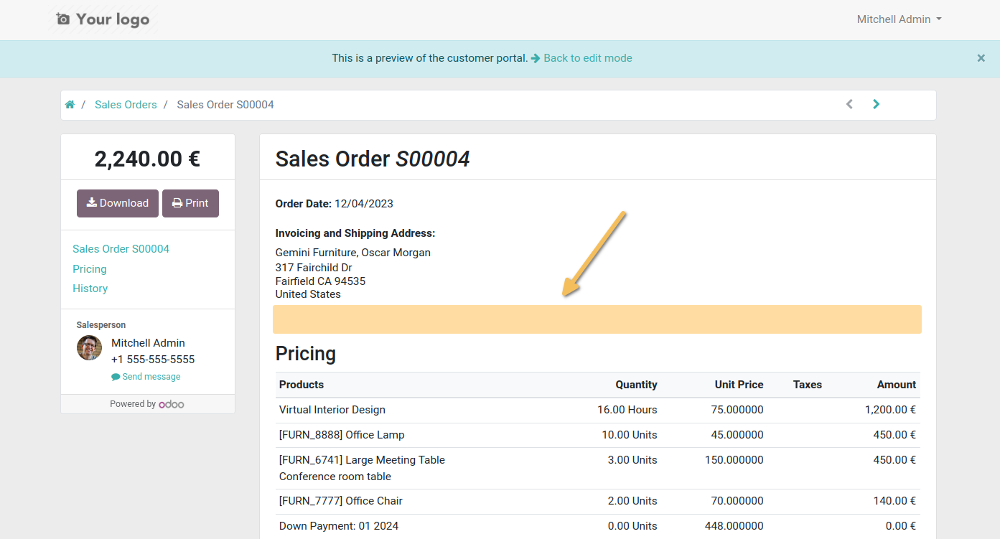

Sale Order Portal Hide Invoices
===============================
This module allows, on the customer portal view of sales orders, to remove the section which displays the list of associated invoices and credit notes.

Usage
-----
*Before installing the module

*After installing the module

As a portal user, I go to the portal and navigate to Orders (/my/orders). When I click on an order, I notice that the invoices and credit notes are no longer displayed.

Contributors
------------
* Numigi (tm) and all its contributors (https://bit.ly/numigiens)
