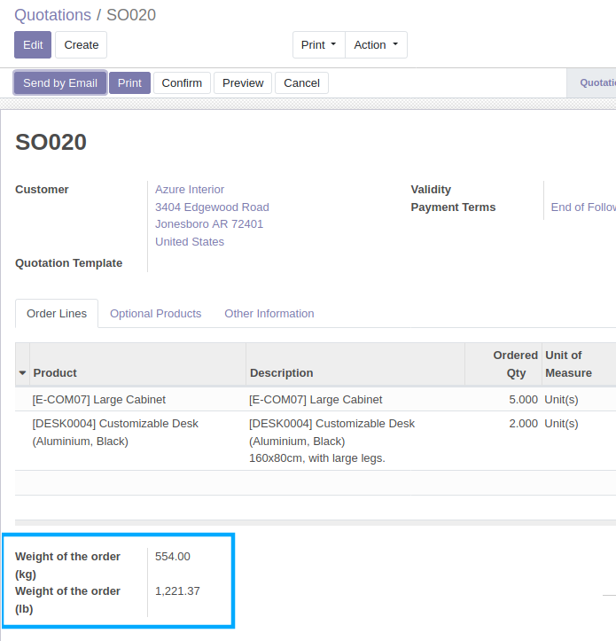

Sale Order Weight
=================
This module adds two field to the records of the model Sale Order:

- weight_in_kg: Weight of the order (kg)
- weight_in_lb: Weight of the order (lb)

These two fields will be computed every time a user creates/updates a sale order line.

The weights are computed per sale order line, then summed to get the weitghts of the order.

Per Sale order Line, the weights are computed with the following steps:

- convert the sold quantity to the product's UoM: qty_in_product_uom
- get the weights from the products: weight_kg, weight_in_uom
- if the products already has it's weight defined in ``lb`` for the weight_in_uom,
  then use that value, otherwise convert from the ``kg`` weight of the product
  to a weight in ``lb``
- calculate the weights per sale order line by multiplying the
  qty_in_product_uom by the weight_kg, and qty_in_product_uom by the weight_lb

Configuration
-------------
No configuration required apart from module installation.

Contributors
------------
* Numigi (tm) and all its contributors (https://bit.ly/numigiens)
* Komit (https://komit-consulting.com)

More information
----------------
* Meet us at https://bit.ly/numigi-com
