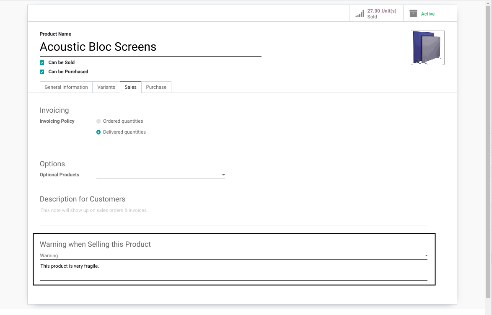
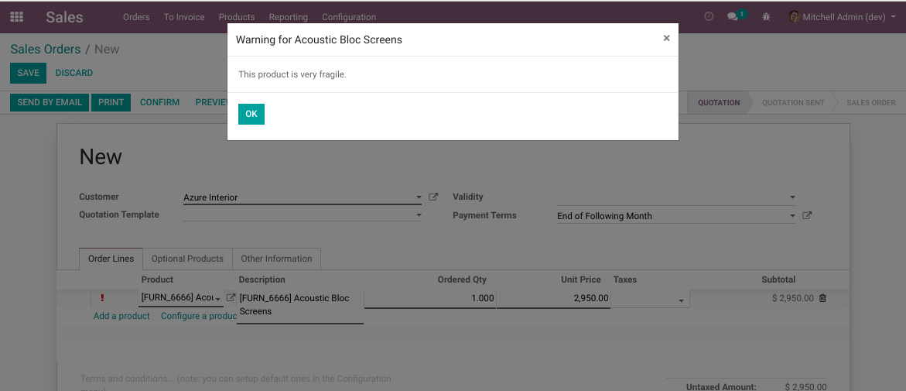
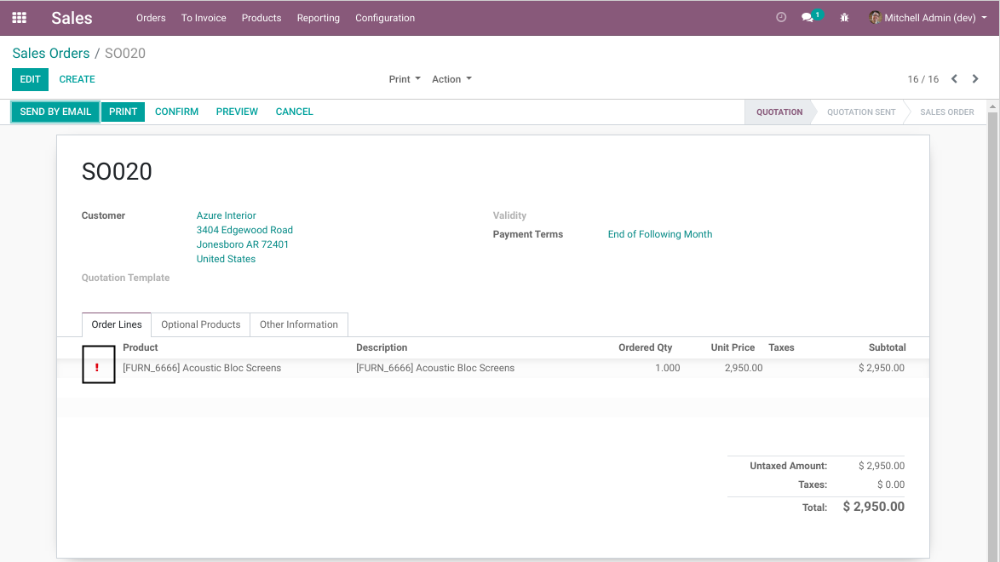
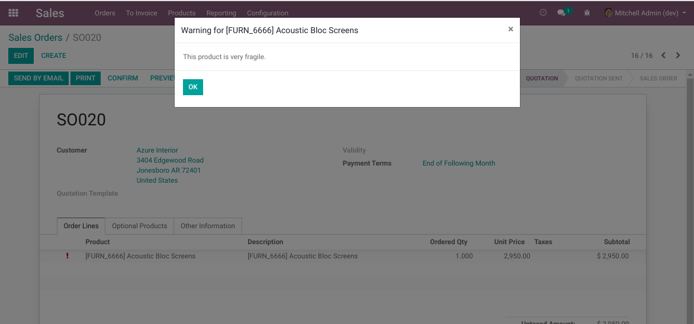

Sale Persistent Sale Warning
============================
This module adds a widget on sale order lines to visualize the warning message of the product.

.. contents:: Table of Contents

Context
-------
In vanilla Odoo, you may define a warning message for sales on a product.

When selecting the product on a sale order, the warning message appears.

Usage
-----
With this module installed, an exclamation point is added on the sale order line
if the product has a warning message defined.

When clicking on the widget, the warning message is shown to the user.

Contributors
------------

* The `Numigi <https://numigi.com/r/home>`_ team is the contributor to this project. We help Quebec companies implement Odoo and Konvergo ERP.

