Sale Privilege Level
=====================
This module adds privilege levels on partners.

.. contents:: Table of Contents

Overview
--------
This module adds the concept of a privilege level and allows to select a privilege level on a partner.

However, it does not define how the privilege level is used.

See modules ``sale_privilege_level_payment`` and ``sale_privilege_level_delivery`` for examples of usage.

Configuration
-------------
As ``Partner Manager``, I notice a new menu entry ``Contacts / Configuration / Privilege Levels``.

.. image:: static/description/privilege_level_menu.png

When I click on this menu entry, I find the list of privilege levels.

.. image:: static/description/privilege_level_list.png

Partners
--------
On the form view of a partner, I can select a single privilege level.

.. image:: static/description/partner_form.png

In the list view of partner, I see the column ``Privilege Level``

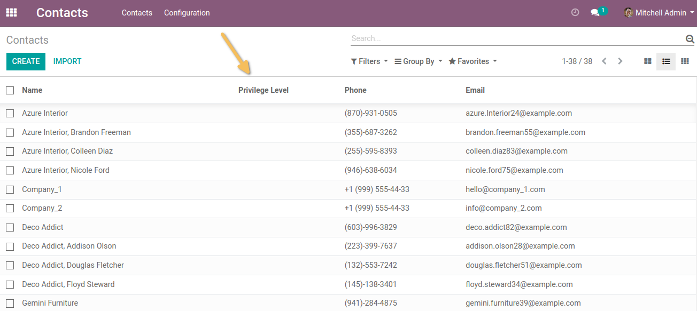

I can see that the ``Privilege Level`` field is avalaible on search panel.

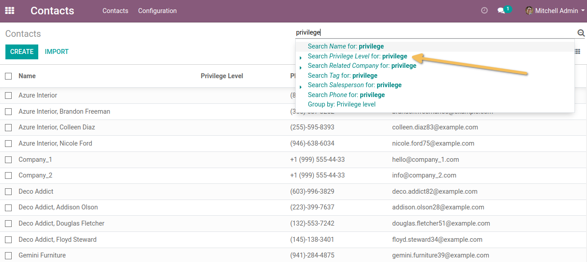

The group by on ``Privilege Level`` field is also available on list view.

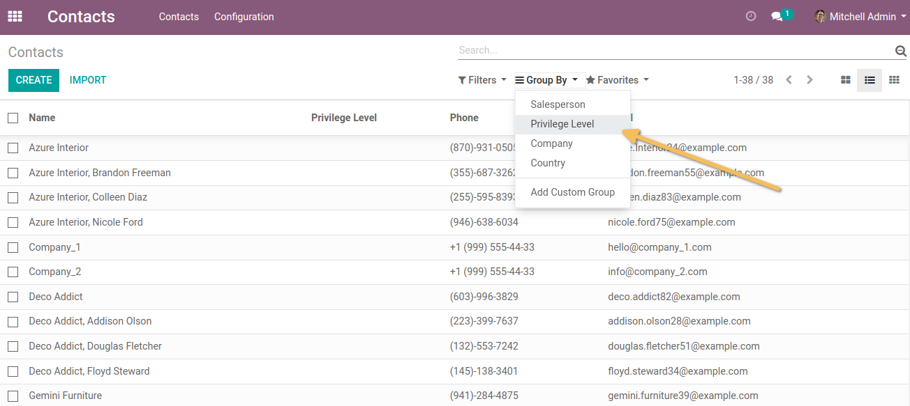

Default Privilege Level
-----------------------
It is possible to define a default privilege level for new partners.

.. image:: static/description/default_privilege_level.png

When a partner is created on user signup, this privilege level is automatically assigned.

This setting is customizable per company.

Related Company
---------------

Behavior when default level set
~~~~~~~~~~~~~~~~~~~~~~~~~~~~~~~~
CONFIGURATION

As a Super User, I go to ``Sales > Configuration > Settings`` and set the privilege level ``Level 1`` as the default level for all new contacts.

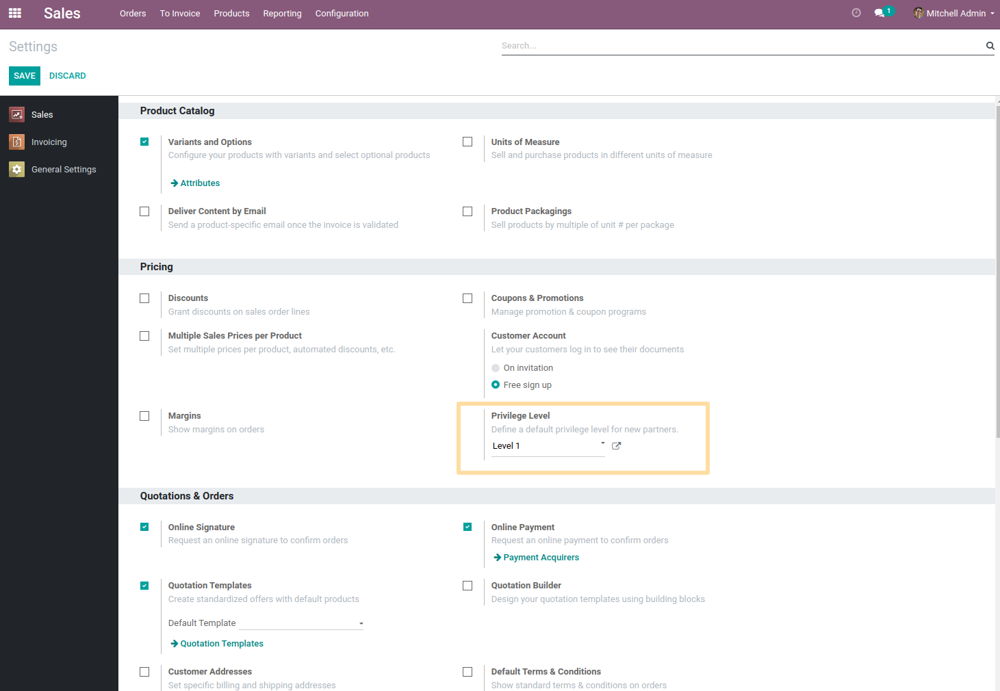

CREATION WITH NO RELATED COMPANY + ADD LATER RELATED COMPANY 

As a user with access to Contacts, I create a new ``Contact``.

I see that a the default privilege level is assigned to my new contact.

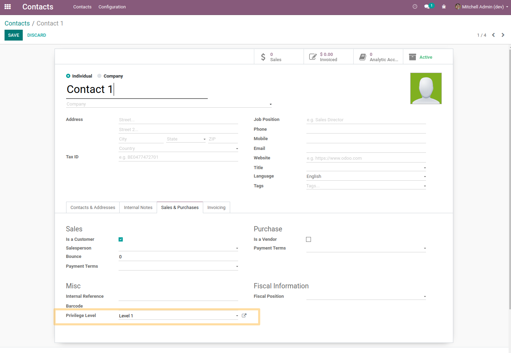

I save. I edit the Contact and assign it a related company (which has a “Level 2” privilege level) then I save.

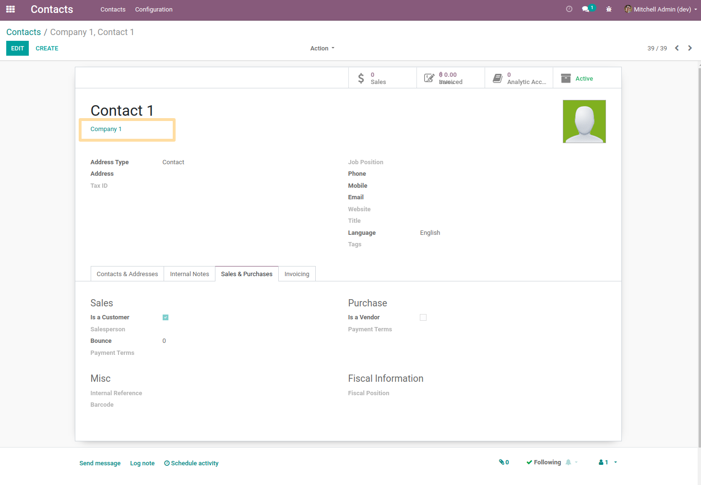

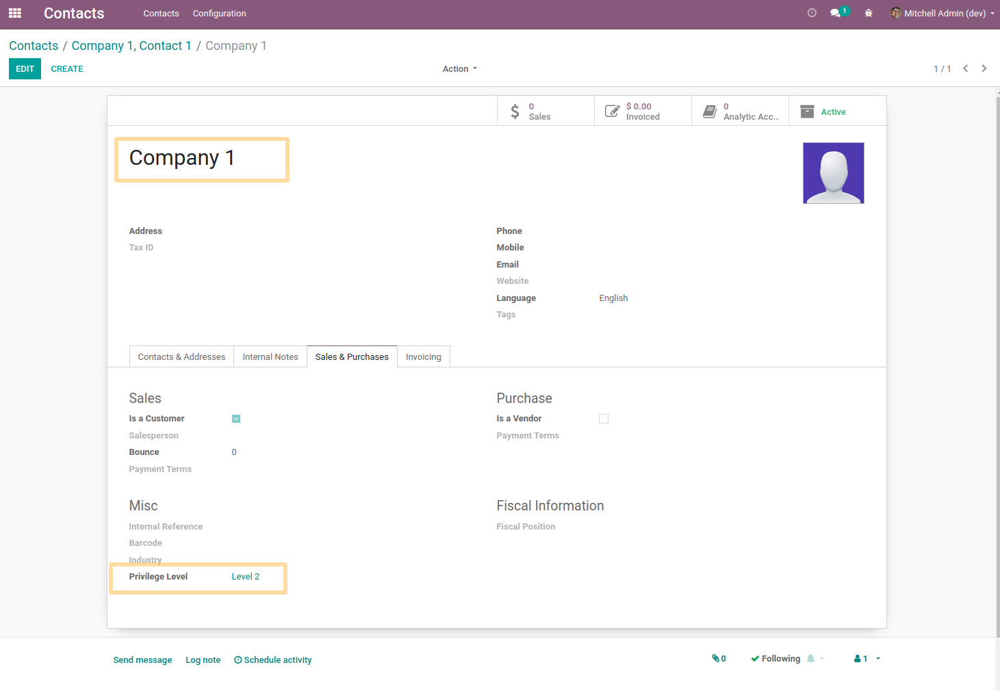

From the list view of the contacts or if I export the field, I see that the privilege level has changed to the right value.

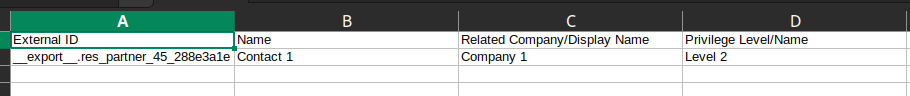

CREATION WITH RELATED COMPANY

As a user with access to contacts, I create a Contact, assign it to a Related Company (which has an initial privilege level) and save.

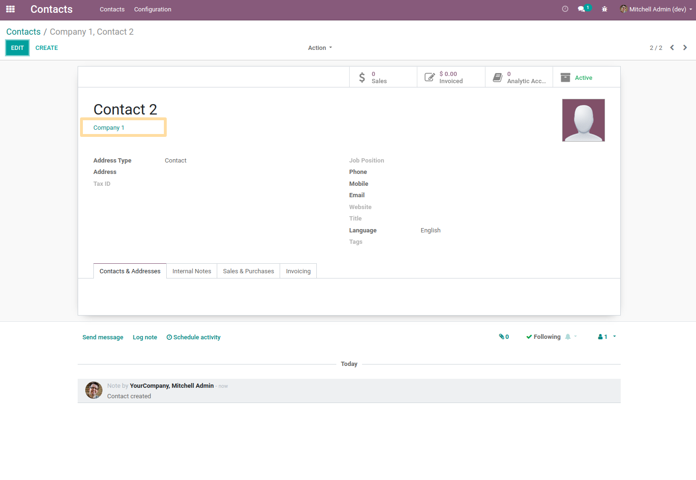

From the list view of the contacts or if I export the ``Privilege Level`` field, I see that the privilege level has the right value.

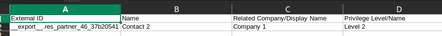

Behavior when default level NOT set
~~~~~~~~~~~~~~~~~~~~~~~~~~~~~~~~~~

CONFIGURATION

As Super User, I go to ``Sales > Configuration > Settings`` and make sure the ``Privilege Level field`` is empty.

CREATION WITH NO RELATED COMPANY + ADD LATER RELATED COMPANY

As a user with access to contacts, I create a Contact.

I see that the ``Privilege Level`` is empty.

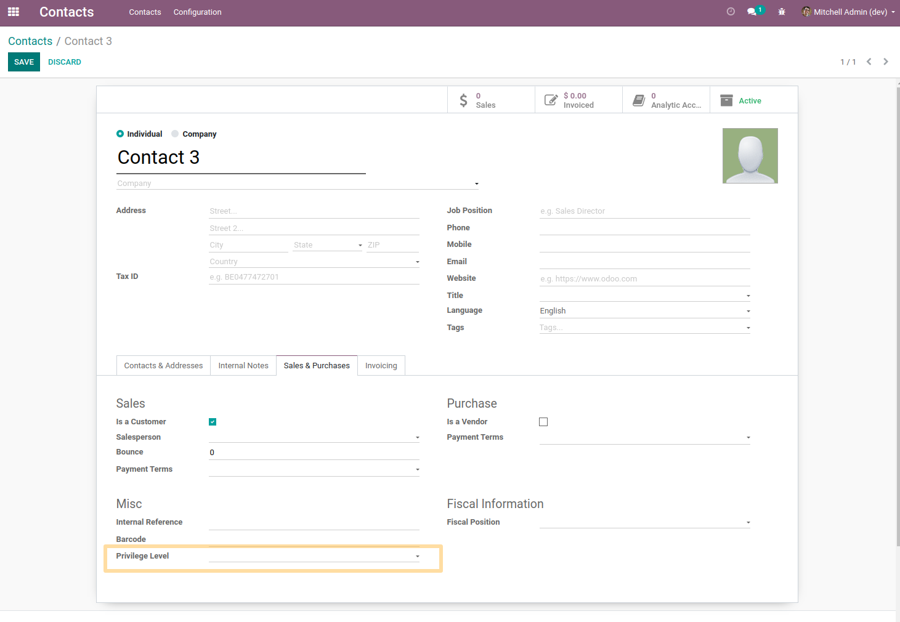

I assign a new privilege level and save.

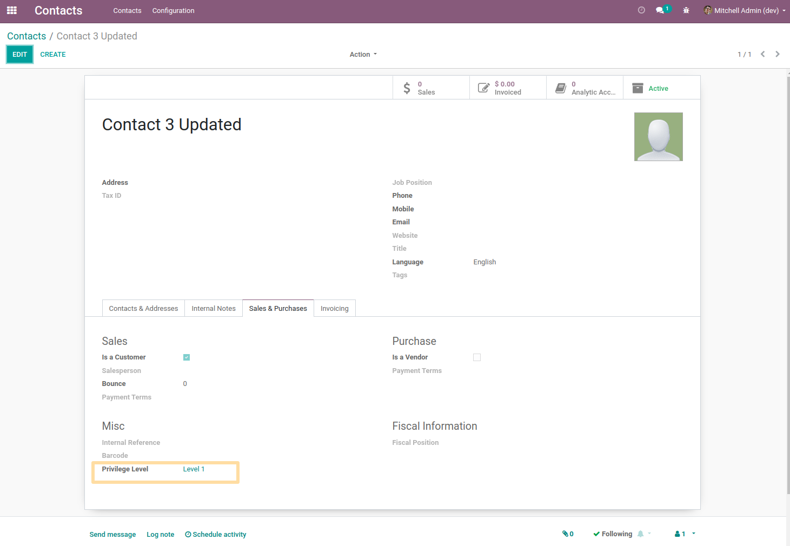

I edit the contact and assign it a Related Company (which has a different privilege level) then I save.

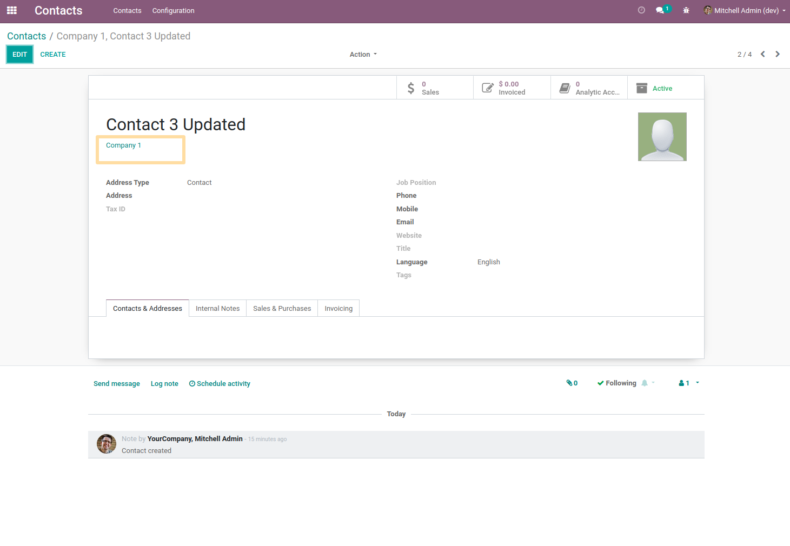

From the list view of the contacts or if I export the ``Privilege Level`` field, I see that the privilege level has the right value.

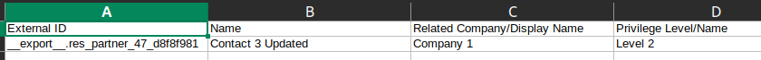

CREATION WITH RELATED COMPANY

As a user with access to Contacts, I create a Contact, assign it to a Related Company (which has a different privilege level) and save.

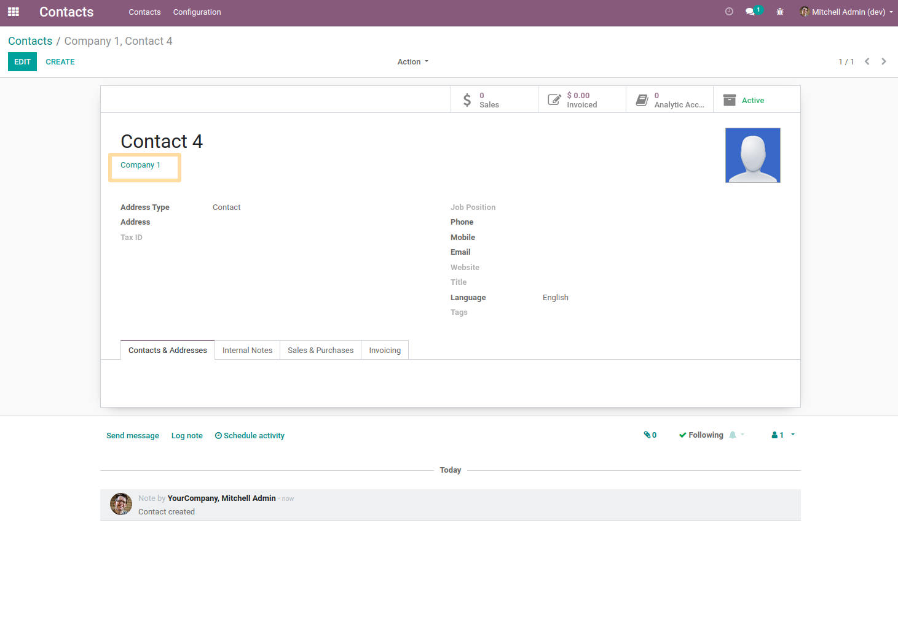

From the list view of the contacts or if I export the ``Privilege Level`` field, I see that the privilege level has the right value.

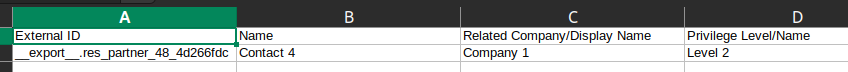

Contributors
------------
* Numigi (tm) and all its contributors (https://bit.ly/numigiens)

More information
----------------
* Meet us at https://bit.ly/numigi-com
