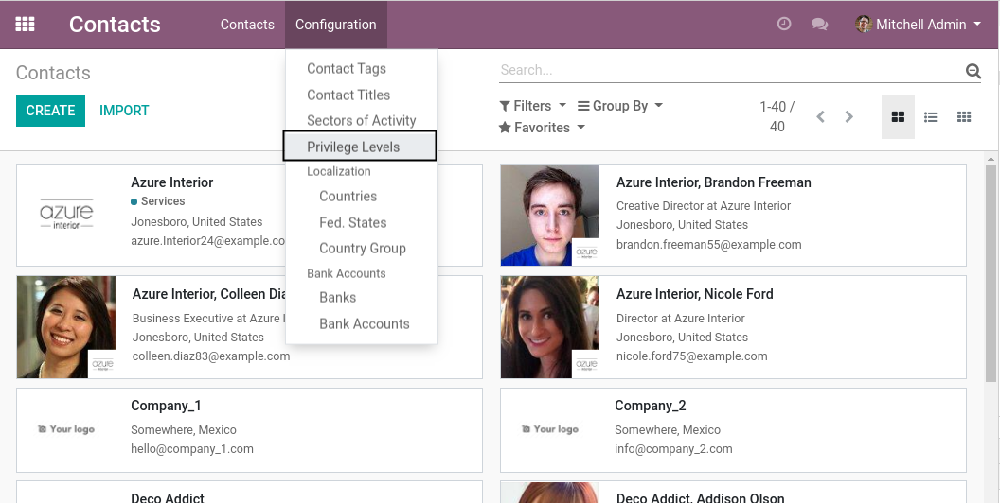
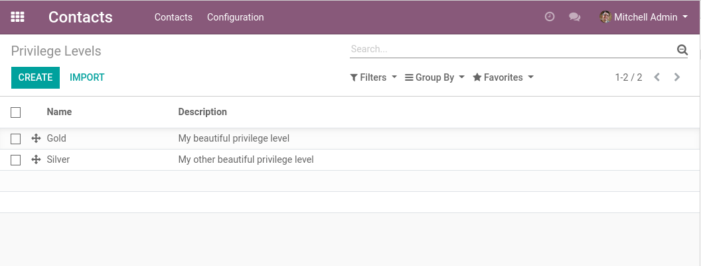
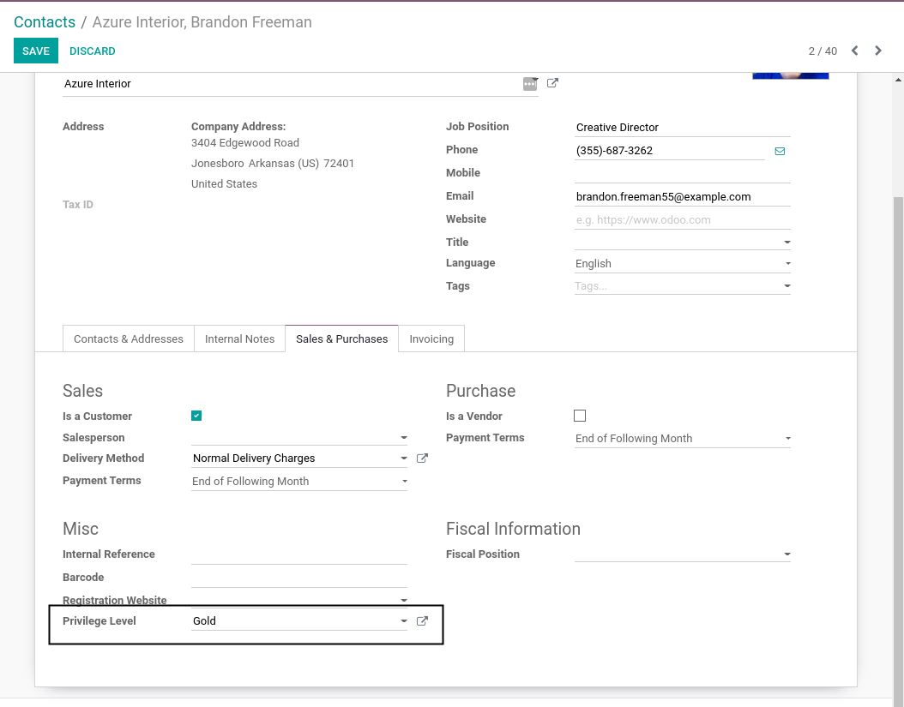
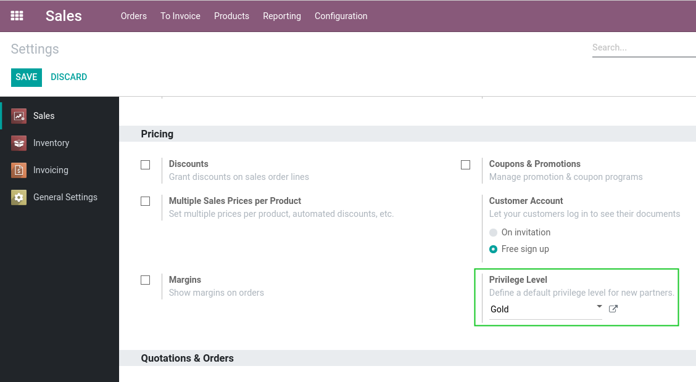

Sale Privilege Level
====================
This module adds privilege levels on partners.

.. contents:: Table of Contents

Overview
--------
This module adds the concept of a privilege level and allows to select a privilege level on a partner.

However, it does not define how the privilege level is used.

See modules ``sale_privilege_level_payment`` and ``sale_privilege_level_delivery`` for examples of usage.

Configuration
-------------
As ``Partner Manager``, I notice a new menu entry ``Contacts / Configuration / Privilege Levels``.

When I click on this menu entry, I find the list of privilege levels.

Partners
--------
On the form view of a partner, I can select a single privilege level.

Default Privilege Level
-----------------------
It is possible to define a default privilege level for new partners.

When a partner is created on user signup, this privilege level is automatically assigned.

This setting is customizable per company.

Contributors
------------
* Numigi (tm) and all its contributors (https://bit.ly/numigiens)

More information
----------------
* Meet us at https://bit.ly/numigi-com
