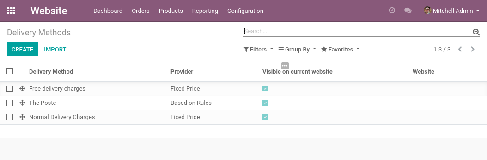
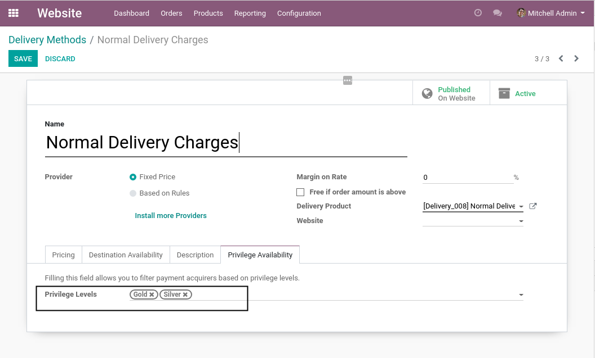
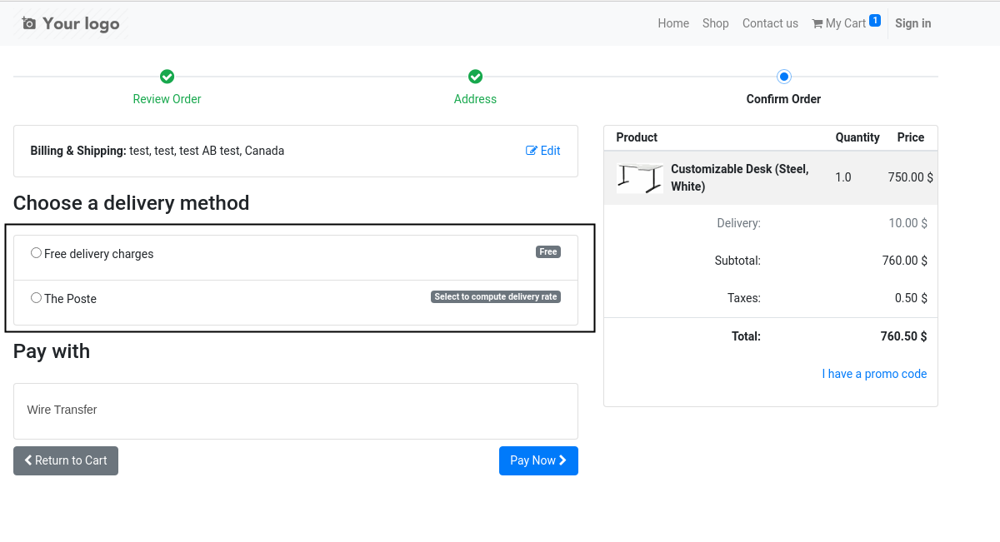

Sale Privilege Level Delivery
=============================
This module allows to filter delivery methods on the e-commerce based on privilege levels.

.. contents:: Table of Contents

Configuration
-------------
As ``Website Manager``, I go to the list of delivery methods.

In the form view of a delivery method, I notice a new tab ``Privilege Availability``.

The field ``Privilege Levels`` allows to filter the delivery methods based on the privilege level.

If one or many privilege levels are selected, the delivery method is only selectable for
customers with one of these privilege levels.

If the field is empty, it is selectable by any customer.

Usage
-----
As a customer, I checkout my order.

In the payment step, I see only delivery methods enabled for my privilege level.

Contributors
------------
* Numigi (tm) and all its contributors (https://bit.ly/numigiens)

More information
----------------
* Meet us at https://bit.ly/numigi-com
