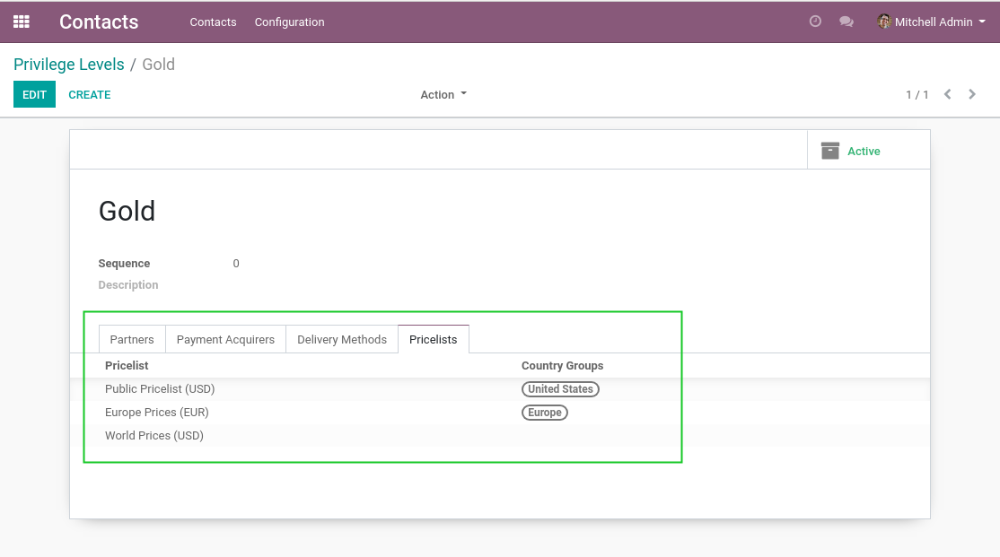
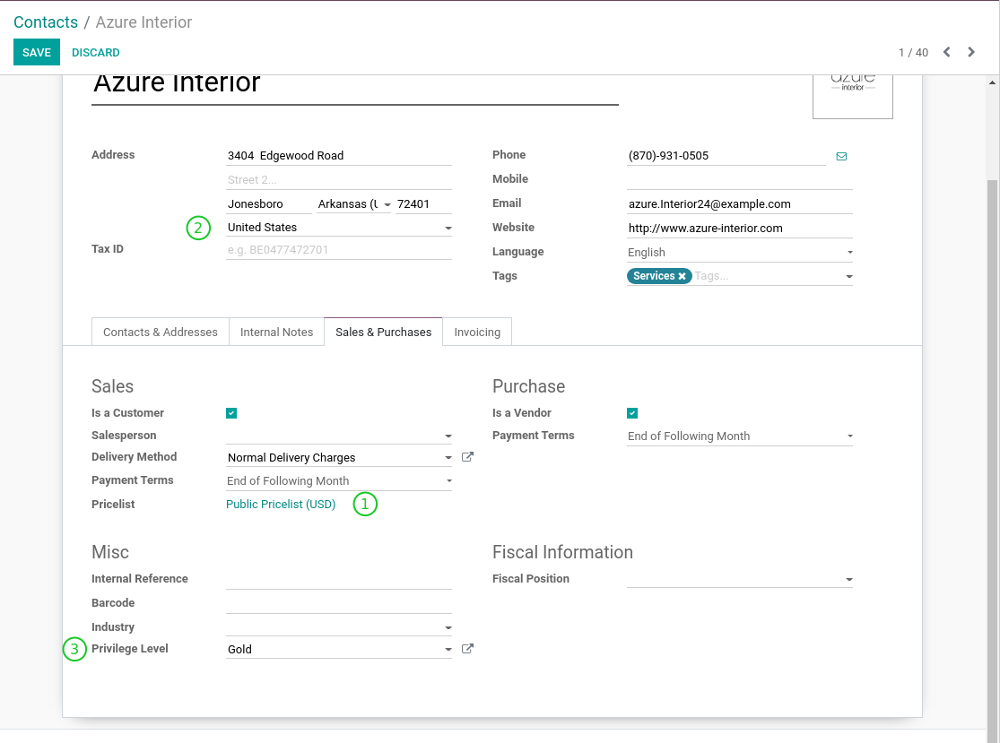

Sale Privilege Level Pricelist
==============================
This module allows to set the default pricelist of a customer based on its privilege level.

.. contents:: Table of Contents

Privilege Levels
----------------
In the form view of a privilege level, I notice a new tab ``Pricelists``.

It contains a list of pricelists available for this privilege level.

The first pricelist from this list matching the country of a partner will be used.
A pricelist with no country group will match any partner.

Partners
--------
In the form view of a partner, I notice that the ``Sale Pricelist`` is readonly (1).

It is computed based on the partner's country (2) and privilege level (3).

Known Issues
------------
If a customer does not have a privilege level defined, its sale pricelist will be empty.

Otherwise, we would have to use a fallback mechanism for finding a matching pricelist,
thus making the system harder to reason about.

Contributors
------------
* Numigi (tm) and all its contributors (https://bit.ly/numigiens)

More information
----------------
* Meet us at https://bit.ly/numigi-com
