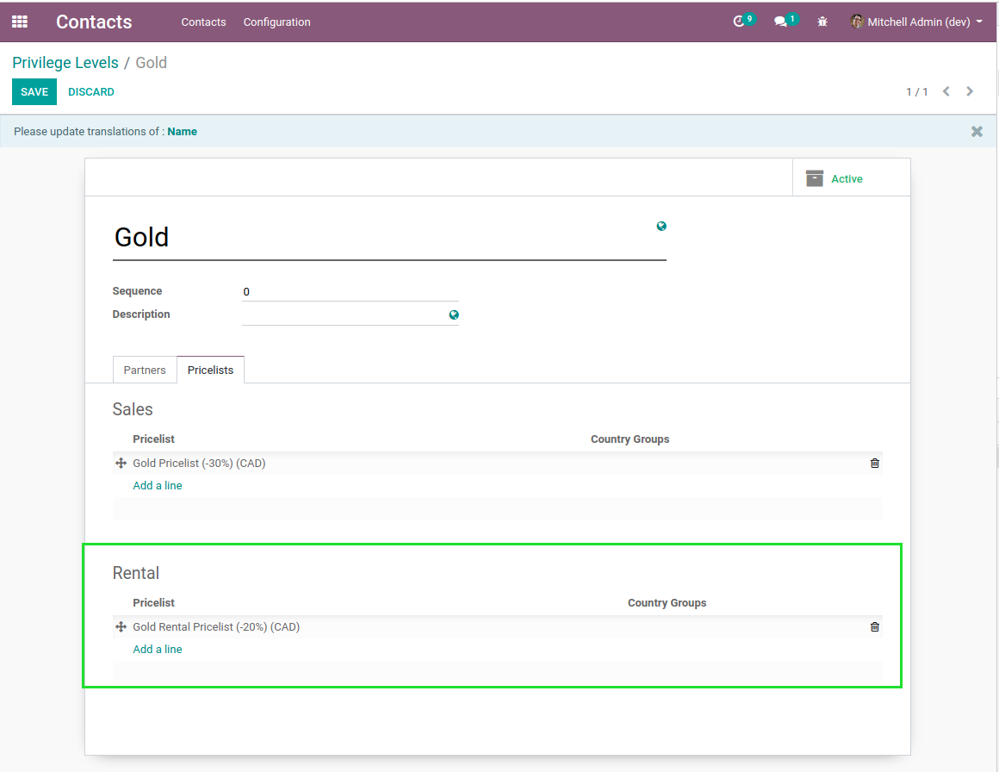
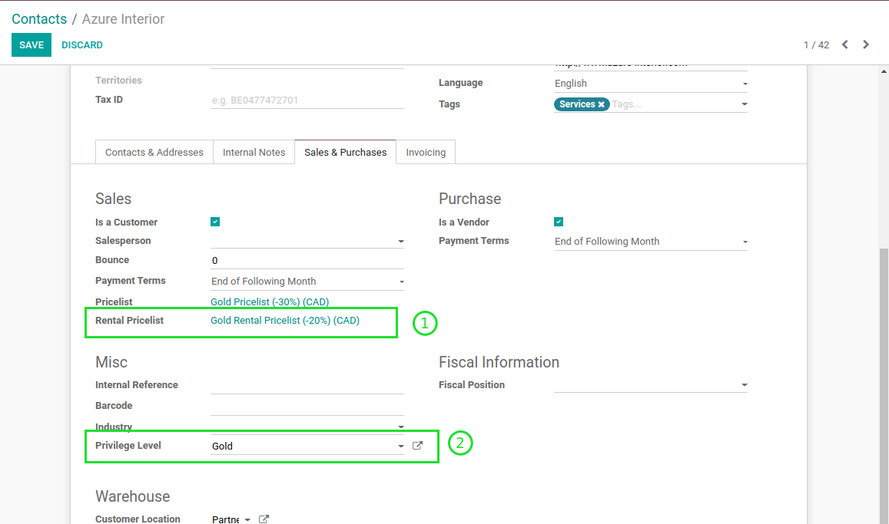
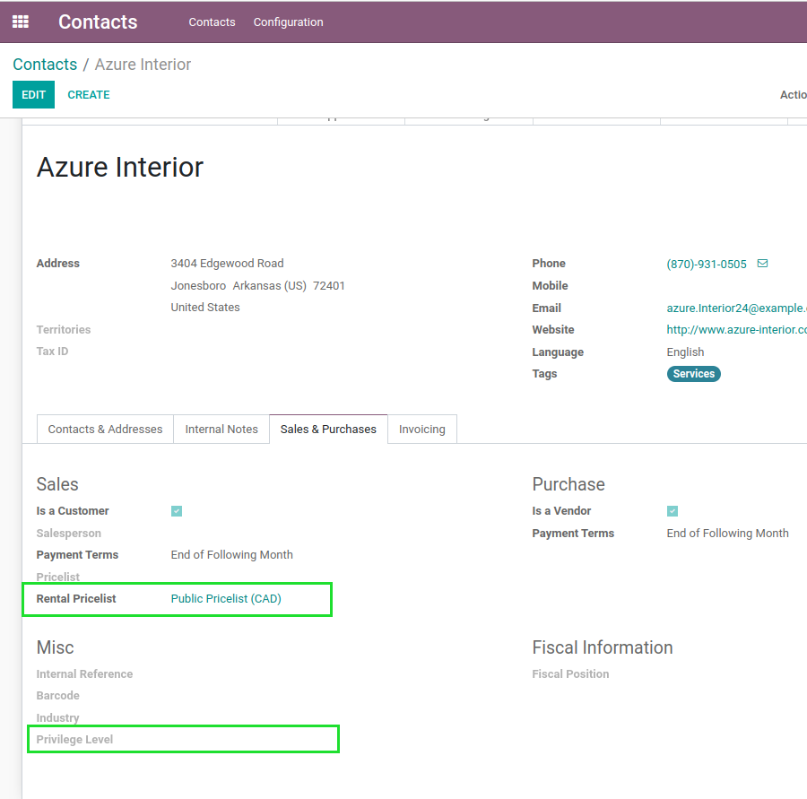

Sale Privilege Level Rental Pricelist
=====================================
This module allows to set the rental pricelist of a customer based on its privilege level.

.. contents:: Table of Contents

Context
-------
The module `sale_privilege_level_pricelist <https://github.com/Numigi/odoo-sale-addons/tree/12.0/sale_privilege_level_pricelist>`_
allows to define a pricelist to use for a partner based on his privilege level.

The module `sale_rental_pricelist <https://github.com/Numigi/odoo-sale-addons/tree/12.0/sale_rental_pricelist>`_
allows to define a rental pricelist on partners.

This module integrates the two functionalities together.

Privilege Levels
----------------
In the form view of a privilege level, I notice a new table in the tab ``Pricelists``.

This table contains a list of pricelists to use for rental orders.

This table works the same way as sale pricelists.
The first pricelist in the table matching the customer's country is used.

Partners
--------
In the form view of a partner, I notice that the ``Rental Pricelist`` is readonly (1).

It is computed based on the partner's privilege level (2).

Default Pricelist
~~~~~~~~~~~~~~~~~
By default, if a partner has no privilege level defined, the public pricelist is used for rental.

Known Issues
------------
If a customer does not have a privilege level defined, its rental pricelist will be empty.

This is the same behavior as for sales pricelists.

Contributors
------------
* Numigi (tm) and all its contributors (https://bit.ly/numigiens)

More information
----------------
* Meet us at https://bit.ly/numigi-com
