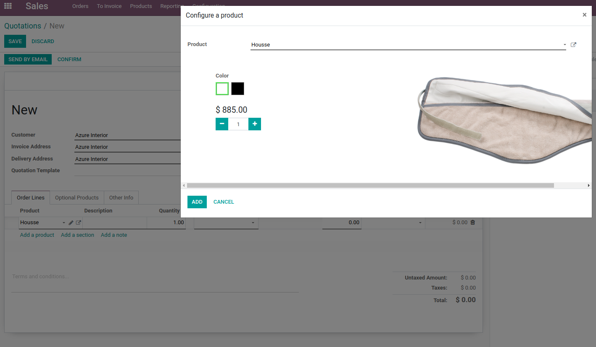
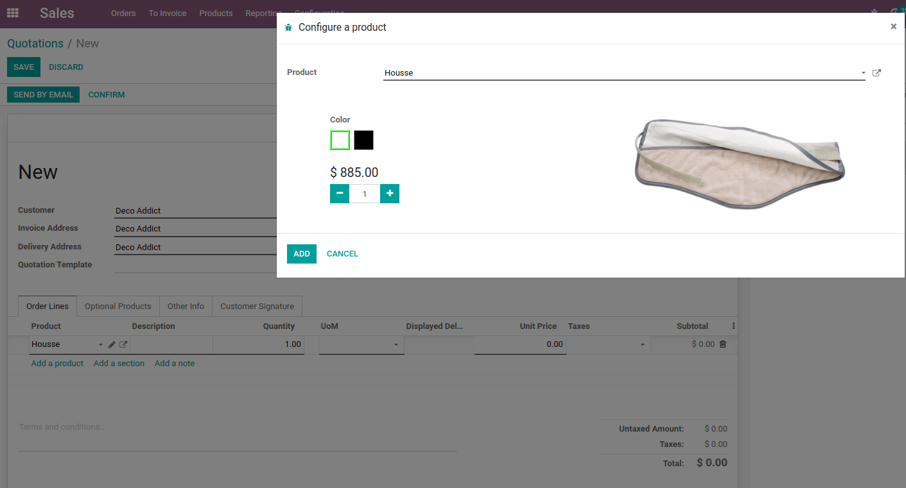

Sale Product Configurator Img Width
===================================

Overview
---------

This module sets the max-width for product configuration image.

Description
-----------

This module prevents product images from overloading the product configurator popup by setting a maximum width.

Before Installing the Module:
------------------------------

When a large-sized image is inserted for a product, the product image may appear in the product configurator popup like this:

After Installing the Module:
-----------------------------

The product image will now fit within the popup:

Contributors
------------

- Numigi™ and all its contributors (https://bit.ly/numigiens)

More Information
----------------

- Visit us at https://bit.ly/numigi-com
