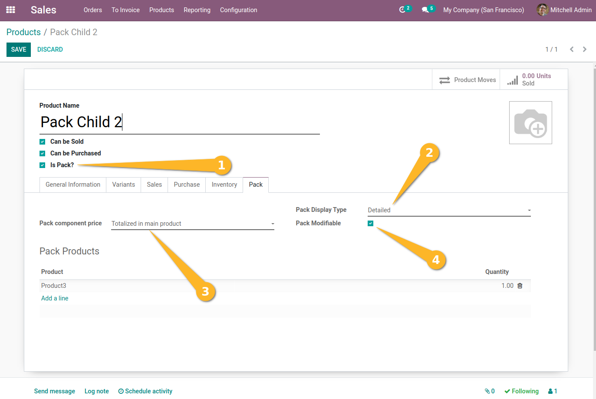
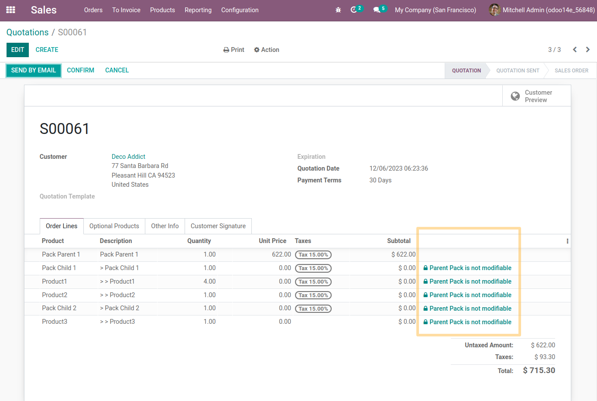
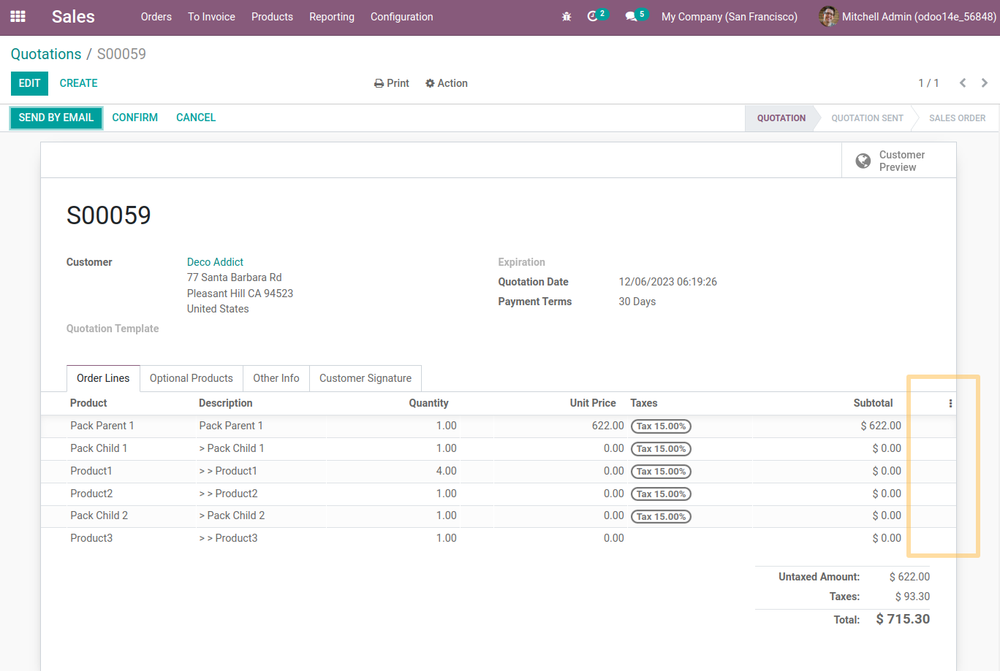
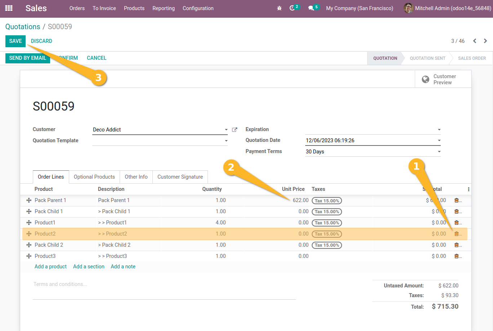
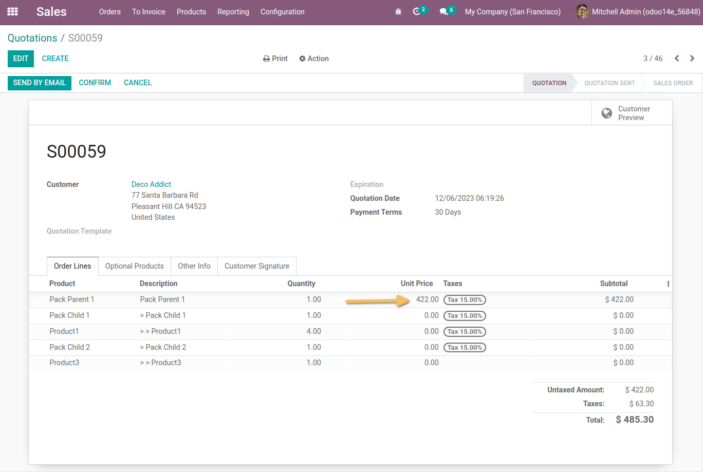

Sale Product Pack Modifiable
============================
This module allows to recompute the total price of the quotation when a sales user removes a pack line.

Usage
-----
*Configuration*
As a user with access to the product, I create a new pack. I check `Is a pack`.
Then, on the pack tab:
Pack display Type : `Detailed`
Pack component price : `Totalized in main product`
I see that the `Pack Modifiable` checkbox is available. And I check the option.

*User notice*
If a parent is marked as `Pack Modifiable`, then the child sub-packs belonging to it must also have this option checked manually to be able to be removed on the submission lines.

I create a submission with the item `Pack Modifiable`.
On submission, I detect that the pack lock is not present and I can modify the pack sales lines.

Before :

After :

I remove a children’s Pack line (or a children pack) and see that the unit price of the main parent pack is updated.

Contributors
------------
* Numigi (tm) and all its contributors (https://bit.ly/numigiens)
