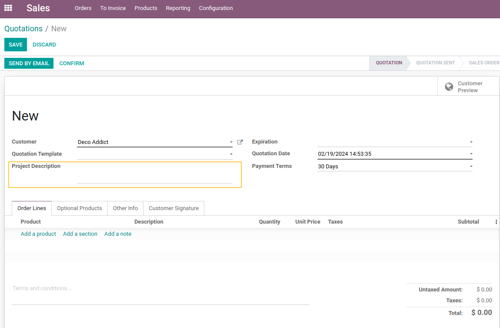
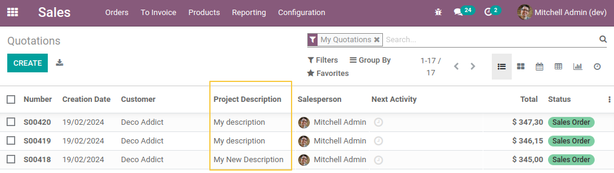
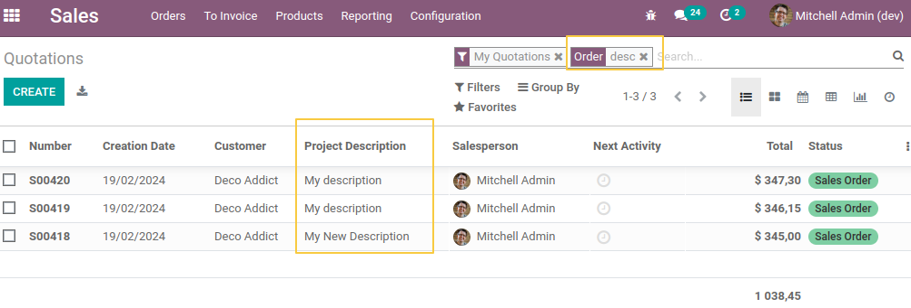
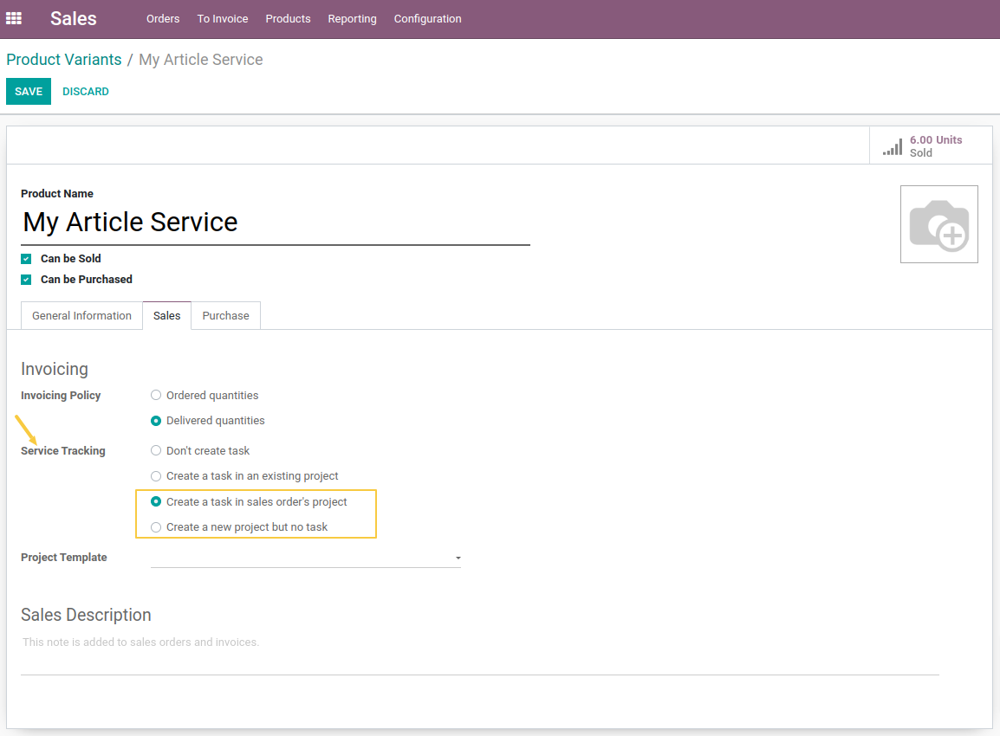
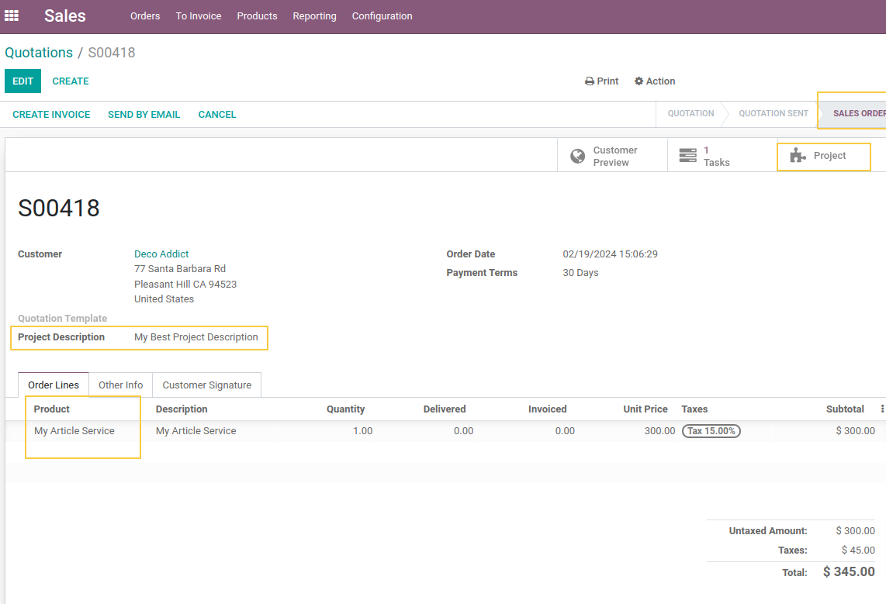
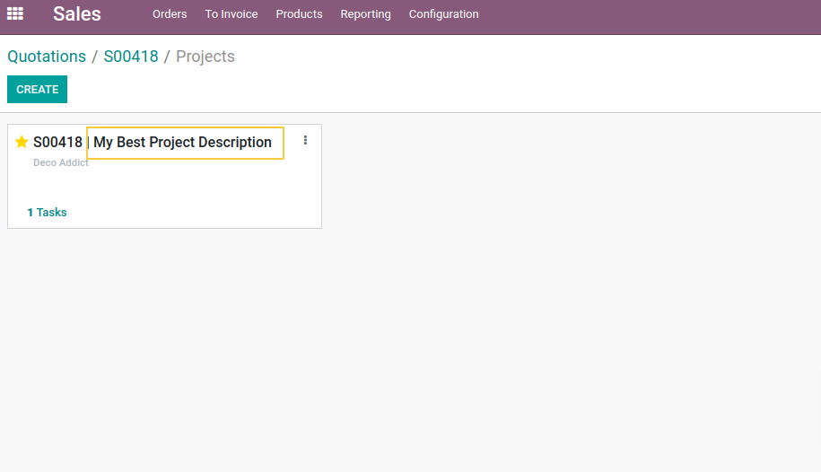
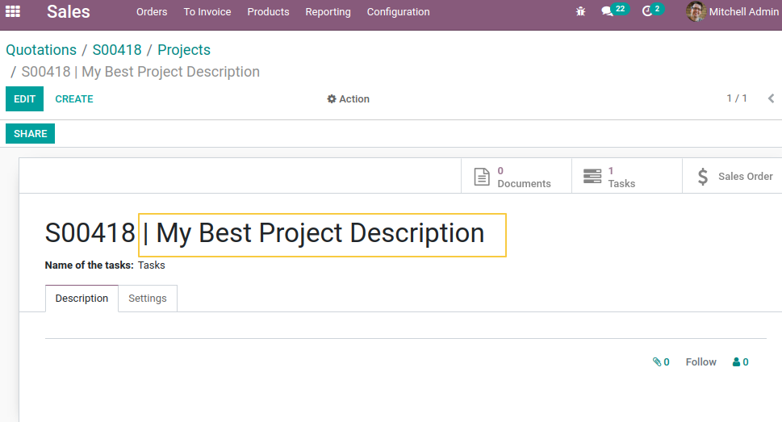
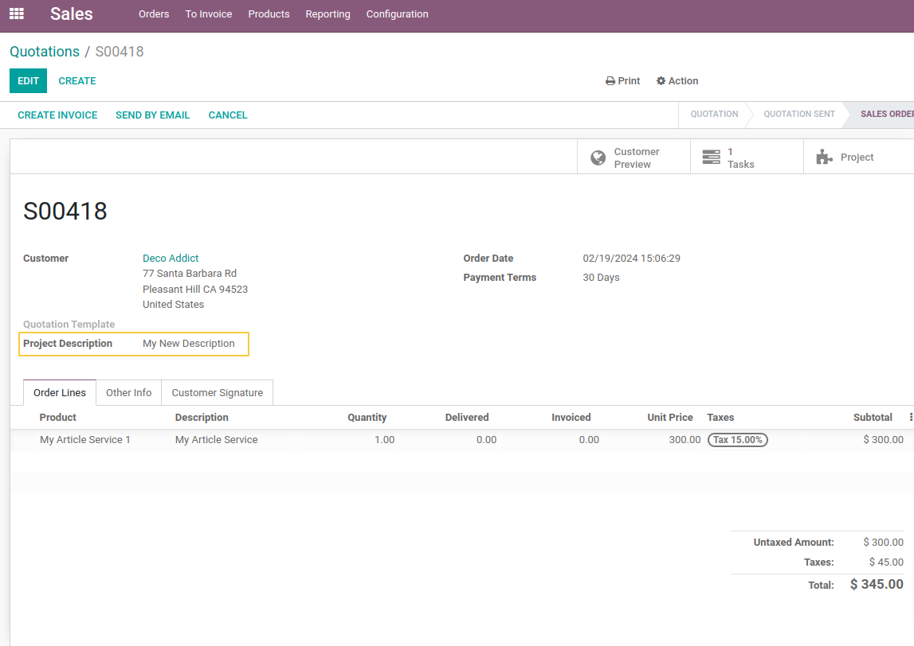
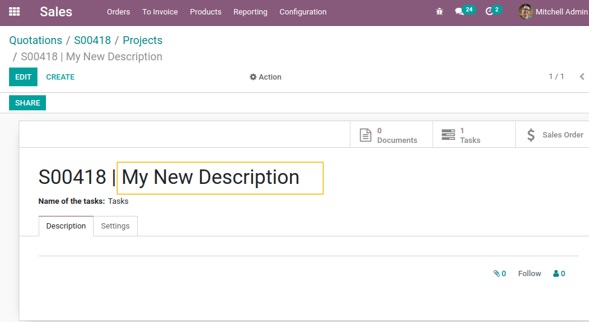

Sale Project Description
========================

.. contents:: Table of Contents

Context
-------
The possibility to add a description to a sale order that can be passed on to the project.

Description
-----------
This module adds the `Project Description` field in Sale Order Form View and Tree View.

From the search bar, I can search the project description in Order:

Usage
-----
Create a new service article with `Service Tracking` set to "Create a task in sales order's project" ou "Create a new project but no task".

Create a new Sale Order, then fill the field `Project Description`
Add the service article to the Sale Order Line and confirm it.

Click on the Smart Button `Project` from the Sale Order. The project description will be added to the project name:

From the previews Sale Order, change the `Project Description`. You will notice that the name of the linked project is updated.

Contributors
------------
* Numigi (tm) and all its contributors (https://bit.ly/numigiens)

More information
----------------
* Meet us at https://bit.ly/numigi-com
